```{=typst}
#set par(justify: true)
#show figure.caption: set text(size: 8.5pt, fill: rgb("#52514e"))
#show figure: set block(above: 1.2em, below: 1.4em)
#show heading.where(level: 2): set text(size: 13pt)
#show heading.where(level: 3): set text(size: 11pt)

#align(center)[
  #grid(columns: 4, column-gutter: 1.1cm, align: horizon,
    image("figures/logos/lemonde.svg", height: 0.80cm),
    image("figures/logos/lefigaro.svg", height: 0.52cm),
    image("figures/logos/lesechos.svg", height: 0.66cm),
    image("figures/logos/mediapart.svg", height: 0.58cm))
]
#v(0.4cm)
```

Configurations candidates, choisies pour offrir plus de données que
l'optimale de la campagne (8 764 fenêtres, Le Monde hebdo) à concentration
comparable, mesurée par **K50_frac** (part du rang total qu'il faut pour
atteindre 50 % de la variance — comparable entre tailles de fenêtre,
contrairement à K50 ou cum6 bruts). Les courbes reprennent la couleur de
charte de chaque média (Le Monde : noir sobre ; Le Figaro : bleu marine du
logo ; Les Échos : rouge sombre, « la ligne rouge » ; Mediapart :
rouge-orangé du logo).

Le Figaro est retenu dans les deux grilles : la journalière, qui le rend
directement comparable aux Échos et à Mediapart, et celle par blocs de
3 jours, qui reprend exactement la géométrie du Monde (même largeur de
fenêtre, seul le seuil change) et isole donc le média de tout autre effet.
Son corpus est le plus court des quatre — 6 764 jours du 17/12/2004 au
01/03/2024 — mais le plus dense au jour le jour (114 951 tokens en médiane,
contre 57 099 pour Le Monde) ; à seuil égal il rend donc moins de fenêtres
que Le Monde malgré un volume quotidien deux fois supérieur.

Dans le tableau, « Seuil » est le seuil de surprise retenu et « Nettoyage »
le plancher de tokens sous lequel un jour est jugé non fiable et interpolé
(n5000 : 5 000 tokens ; « — » : mécanisme désactivé, inutile sur les grilles
par blocs, où chaque point agrège trois jours de parution).

```{=typst}
#set text(size: 9pt)
```

| | Monde (s. 6) | Monde (s. 5) | Figaro (3 j) | Figaro (jour.) | Échos | Mediapart |
|---|---|---|---|---|---|---|
| Grille | blocs de 3 j | blocs de 3 j | blocs de 3 j | journalier | journalier | journalier |
| Fenêtre | ±15 blocs | ±15 blocs | ±15 blocs | ±15 jours | ±12 jours | ±5 jours |
| Seuil | 6 | 5 | 4 | 5 | 5 | 4 |
| Nettoyage | — | — | — | n5000 | n5000 | n5000 |
| Fenêtres | 14 102 | 24 593 | 18 375 | 17 939 | 21 073 | 20 237 |
| K50 | 7 | 8 | 9 | 9 | 7 | 2 |
| K50_frac | 0,23 | 0,27 | 0,30 | 0,30 | 0,29 | 0,20 |
| cum6 | 47,6 % | 43,3 % | 40,1 % | 42,1 % | 46,6 % | 84,0 % |

```{=typst}
#set text(size: 10.5pt)
```

```{=typst}
#v(0.6cm)
```

## La forme des sauts, comparée

```{=typst}
#v(1fr)
```

{height=17.6cm}

```{=typst}
#v(1fr)
#pagebreak()
```

## Le Monde — blocs de 3 jours

```{=typst}
#block(above: 0.4em, below: 1.0em, grid(columns: (auto, 1fr), align: horizon, column-gutter: 0.7em,
  image("figures/logos/lemonde.svg", height: 0.70cm),
  line(length: 100%, stroke: 0.5pt + rgb("#c3c2b7"))))
```

### Seuil 6 — 14 102 fenêtres

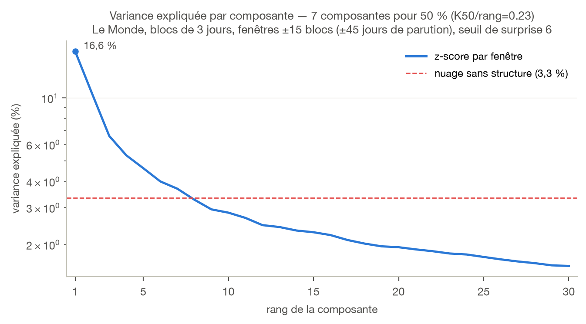{height=5.8cm}

```{=typst}
#v(1fr)
```

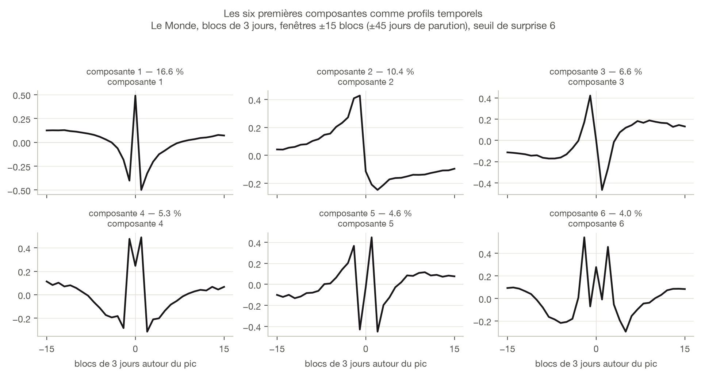{height=8.2cm}

```{=typst}
#v(1fr)
```

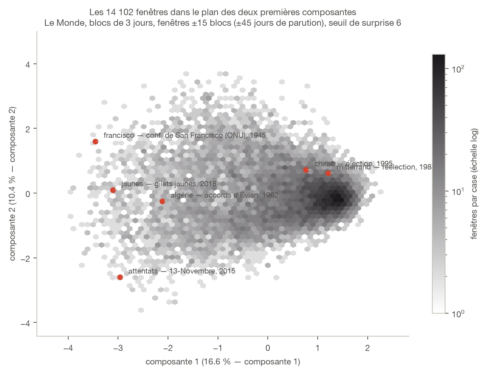{height=7.2cm}

```{=typst}
#pagebreak()
#v(1fr)
```

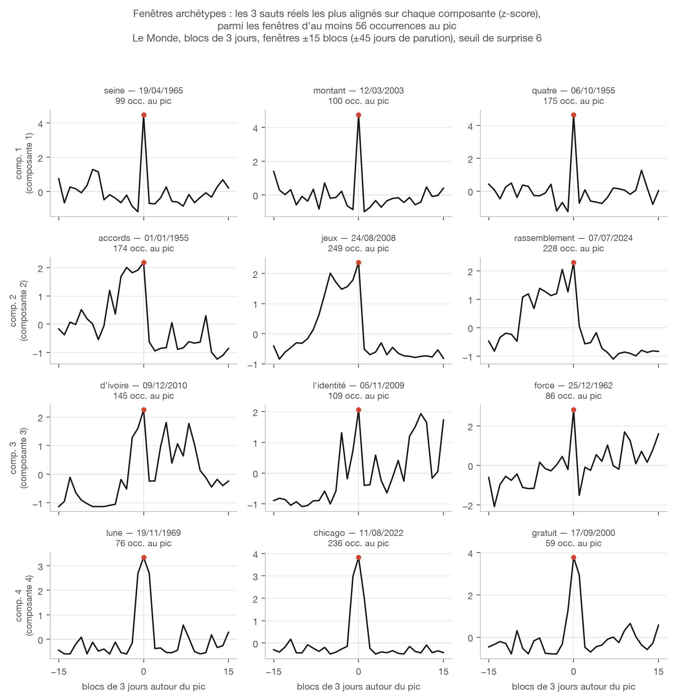{height=17cm}

```{=typst}
#v(1fr)
```

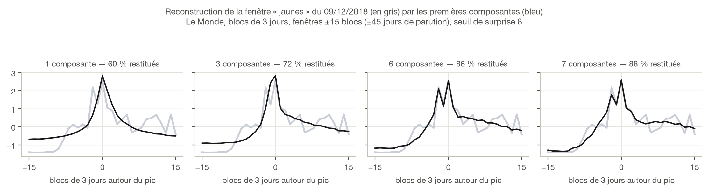{width=100%}

```{=typst}
#pagebreak()
```

### Seuil 5 — 24 593 fenêtres

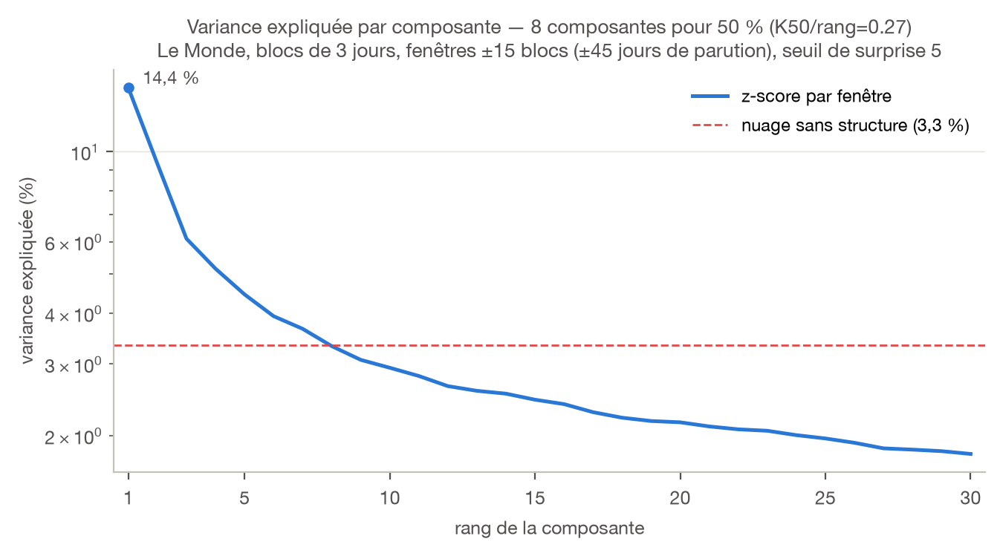{height=5.8cm}

```{=typst}
#v(1fr)
```

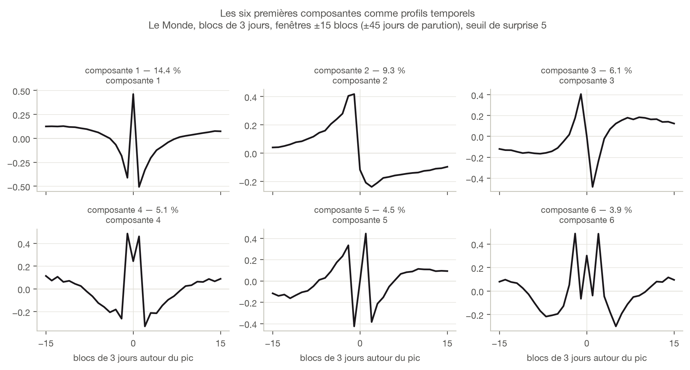{height=8.2cm}

```{=typst}
#v(1fr)
```

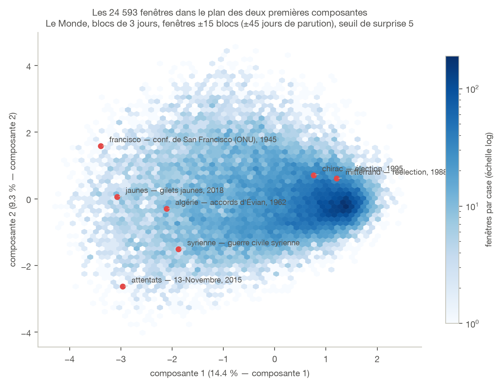{height=7.2cm}

```{=typst}
#pagebreak()
#v(1fr)
```

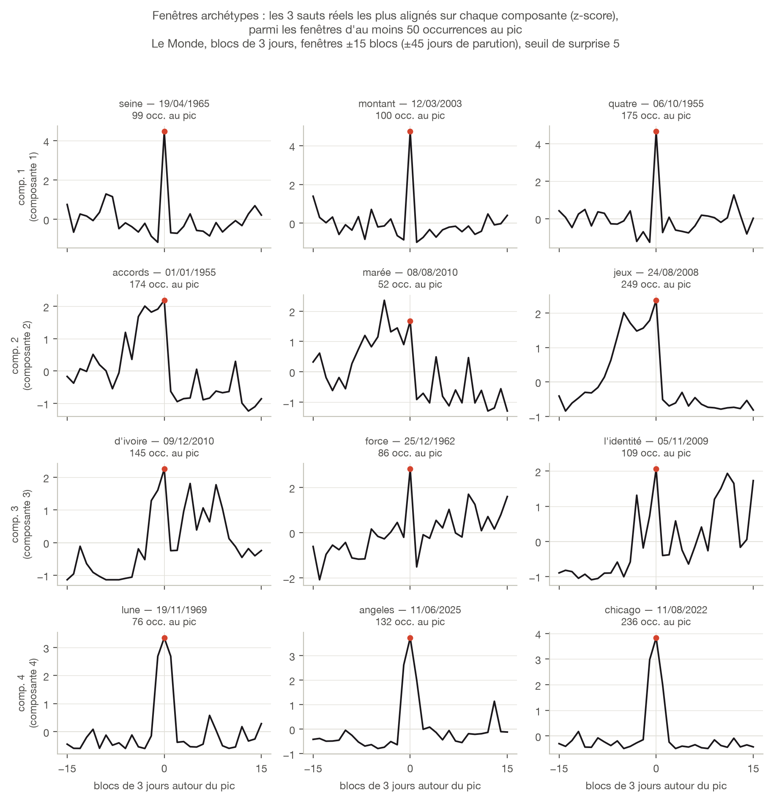{height=17cm}

```{=typst}
#v(1fr)
```

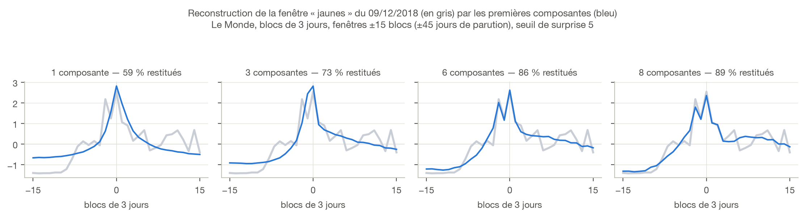{width=100%}

```{=typst}
#pagebreak()
```

## Le Figaro

```{=typst}
#block(above: 0.4em, below: 1.0em, grid(columns: (auto, 1fr), align: horizon, column-gutter: 0.7em,
  image("figures/logos/lefigaro.svg", height: 0.44cm),
  line(length: 100%, stroke: 0.5pt + rgb("#c3c2b7"))))
```

Réserve commune aux deux grilles : la composante 2 est portée par des
marches d'escalier (« source », « service ») : le mot s'effondre d'un coup
et ne revient plus, signature d'un changement de gabarit du site et non d'un
événement éditorial. Même boilerplate que celui signalé pour Mediapart, non
nettoyé ici. Un filtre de volume (occurrences au pic ≥ médiane du journal,
plancher 50) écarte par ailleurs les mots d'interface les plus rares — le
texte anglais du 12/10/2005 et le mot « lefigaro » lui-même, qui remontaient
sans lui.

Seconde réserve, propre au Figaro : la composante 1 ne fait pas un pic au
centre mais une **encoche** — −0,54 au jour 0 sur la grille journalière,
−0,34 au bloc central sur celle par blocs — encadrée de deux bosses. Le
motif résiste donc à l'agrégation par blocs de 3 jours, ce qui écarte un
simple accident d'un jour isolé. Reste à trancher entre un décalage
systématique de la date attribuée aux articles et un creux réel de la
collecte au moment des pics : à vérifier avant d'exploiter ces
configurations.

### Blocs de 3 jours, seuil 4 — 18 375 fenêtres

{height=5.8cm}

```{=typst}
#v(1fr)
```

{height=8.2cm}

```{=typst}
#v(1fr)
```

{height=7.2cm}

```{=typst}
#pagebreak()
#v(1fr)
```

{height=17cm}

```{=typst}
#v(1fr)
```

{width=100%}

```{=typst}
#pagebreak()
```

### Journalier, seuil 5 — 17 939 fenêtres

{height=5.8cm}

```{=typst}
#v(1fr)
```

{height=8.2cm}

```{=typst}
#v(1fr)
```

{height=7.2cm}

```{=typst}
#pagebreak()
#v(1fr)
```

{height=17cm}

```{=typst}
#v(1fr)
```

{width=100%}

```{=typst}
#pagebreak()
```

## Les Échos — journalier, seuil 5

```{=typst}
#block(above: 0.4em, below: 1.0em, grid(columns: (auto, 1fr), align: horizon, column-gutter: 0.7em,
  image("figures/logos/lesechos.svg", height: 0.60cm),
  line(length: 100%, stroke: 0.5pt + rgb("#c3c2b7"))))
```

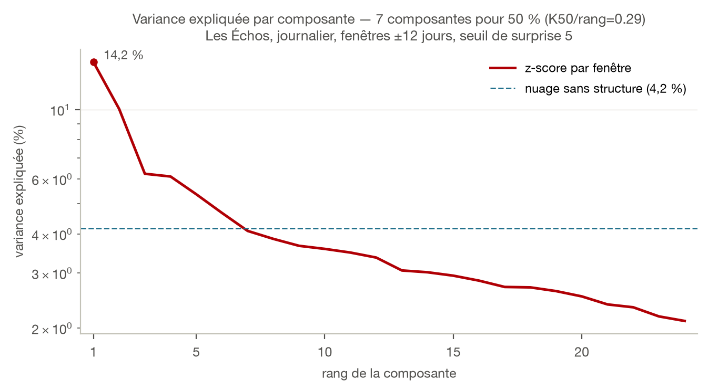{height=5.8cm}

```{=typst}
#v(1fr)
```

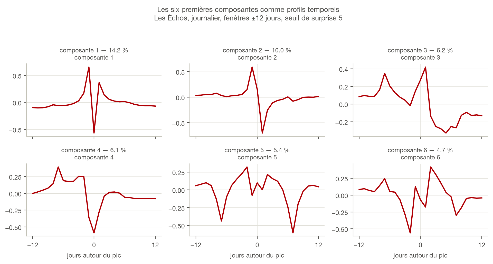{height=8.2cm}

```{=typst}
#v(1fr)
```

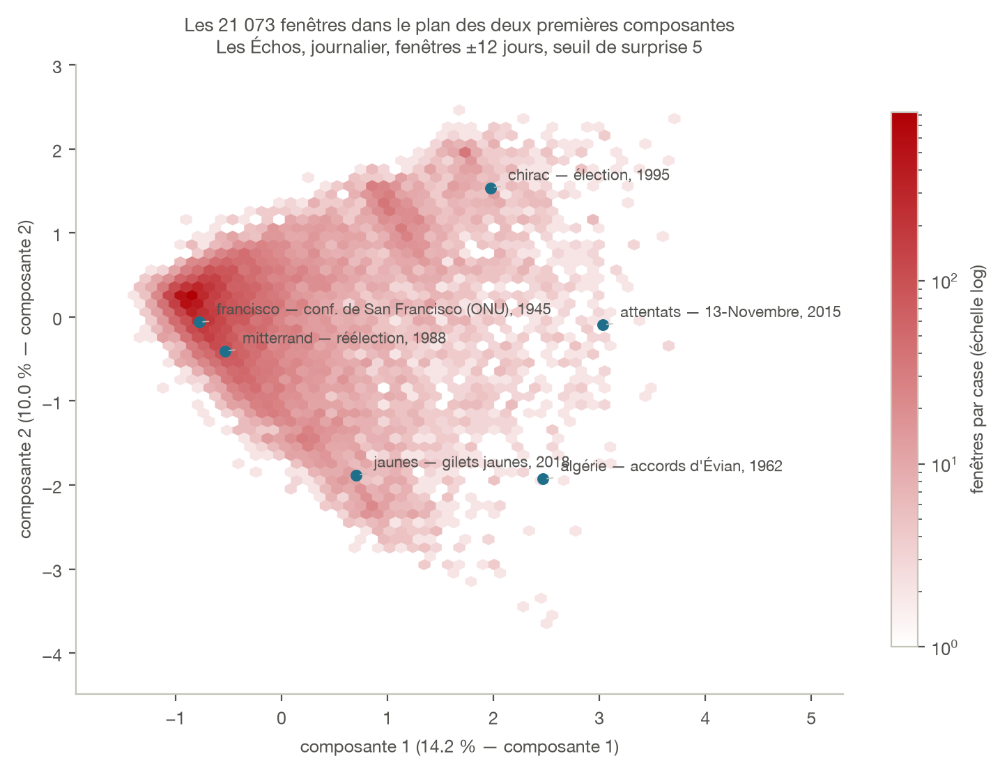{height=7.2cm}

```{=typst}
#pagebreak()
#v(1fr)
```

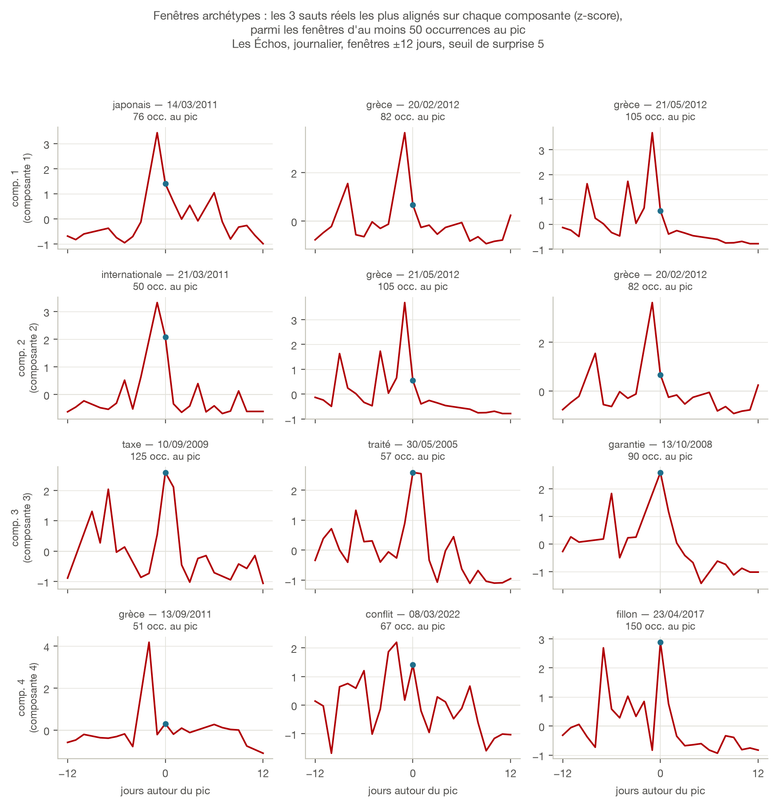{height=17cm}

```{=typst}
#v(1fr)
```

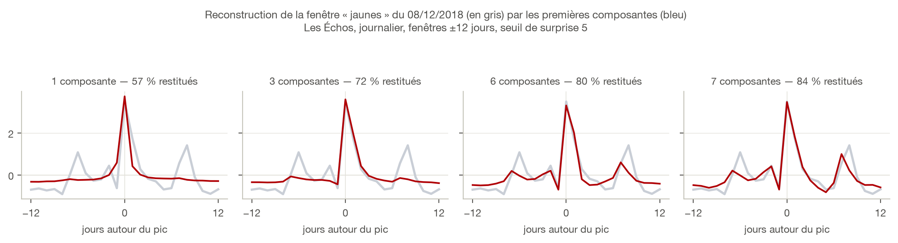{width=100%}

```{=typst}
#pagebreak()
```

## Mediapart — journalier, seuil 4

```{=typst}
#block(above: 0.4em, below: 1.0em, grid(columns: (auto, 1fr), align: horizon, column-gutter: 0.7em,
  image("figures/logos/mediapart.svg", height: 0.55cm),
  line(length: 100%, stroke: 0.5pt + rgb("#c3c2b7"))))
```

Réserve : le boilerplate Mediapart déjà signalé dans `rapport.pdf` (mots
d'interface « articles », « phrases ») n'est pas nettoyé ici, mais le filtre
de volume (occurrences au pic ≥ médiane, plancher 50) suffit à l'écarter des
archétypes affichés — Mediapart a le corpus le plus court des quatre
journaux, donc le plus sensible à ce filtre.

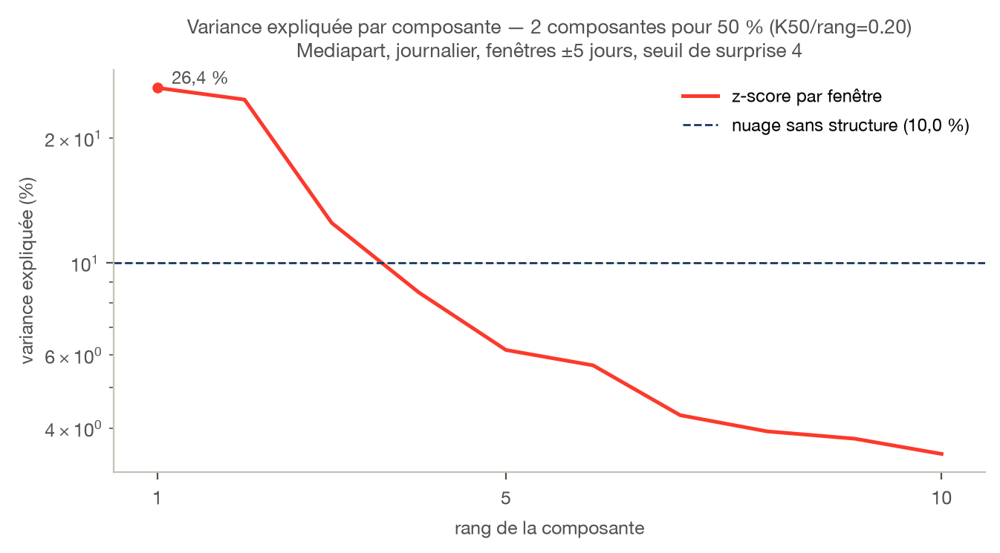{height=5.6cm}

```{=typst}
#v(1fr)
```

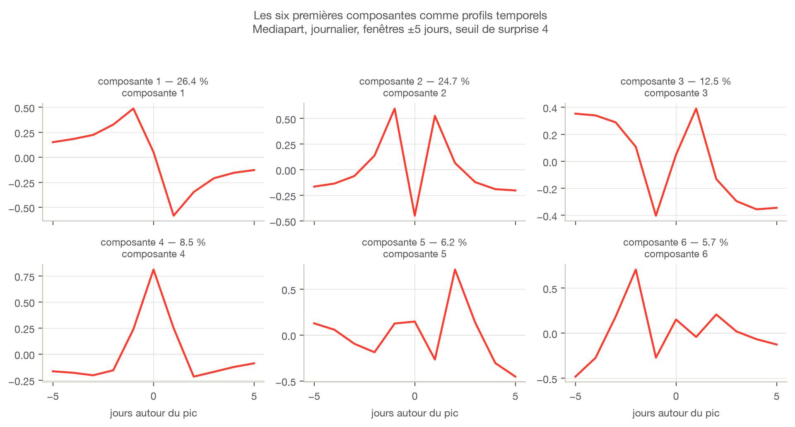{height=8.0cm}

```{=typst}
#v(1fr)
```

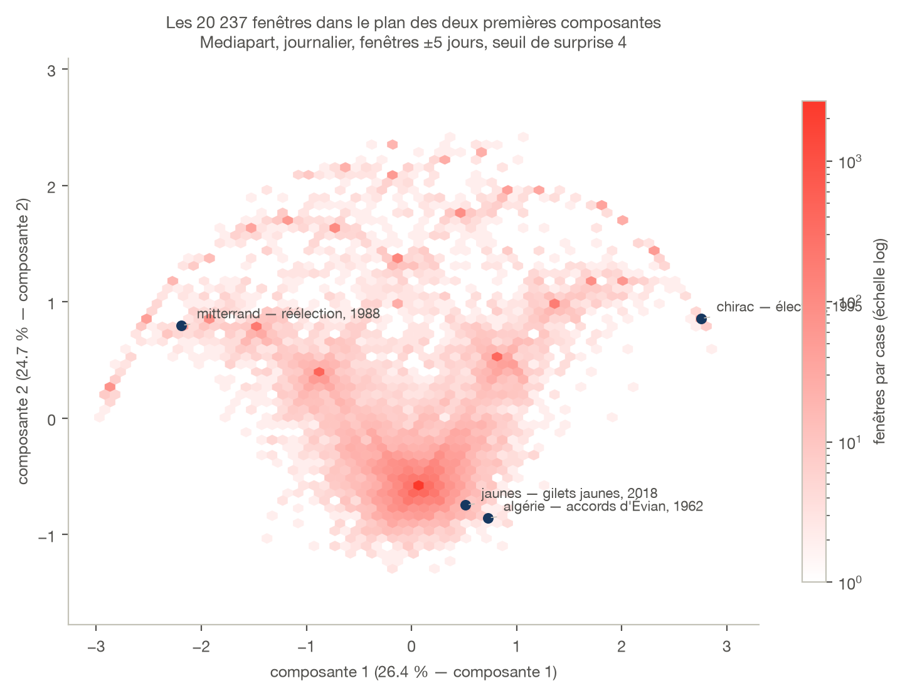{height=7.0cm}

```{=typst}
#pagebreak()
#v(1fr)
```

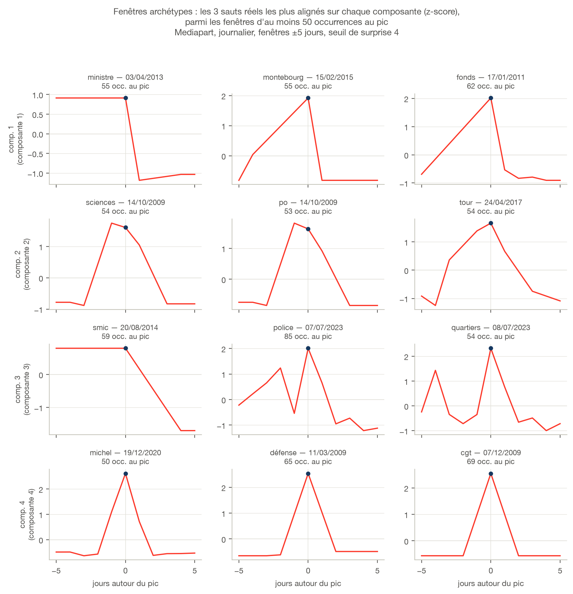{height=17cm}

```{=typst}
#v(1fr)
```

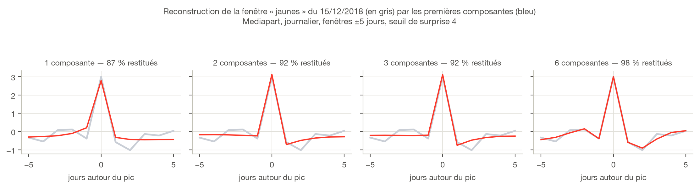{width=100%}

```{=typst}
#v(0.8cm)
#line(length: 100%, stroke: 0.5pt + rgb("#c3c2b7"))
#v(0.2cm)
#text(size: 8.5pt, fill: rgb("#52514e"), style: "italic")[
  Figures produites par `campagne_pca/figures.py` (commandes `config` et
  `comparaison --jeu medias`). Logos officiels via Wikimedia
  Commons. Méthode complète : `campagne_pca/rapport.pdf`.
]
```
