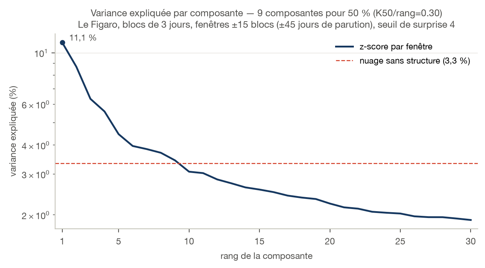
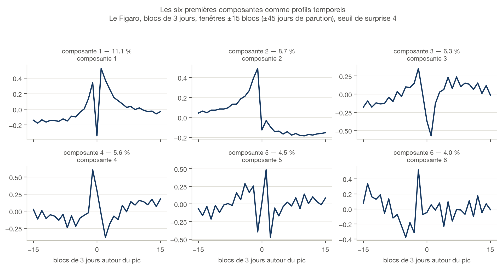
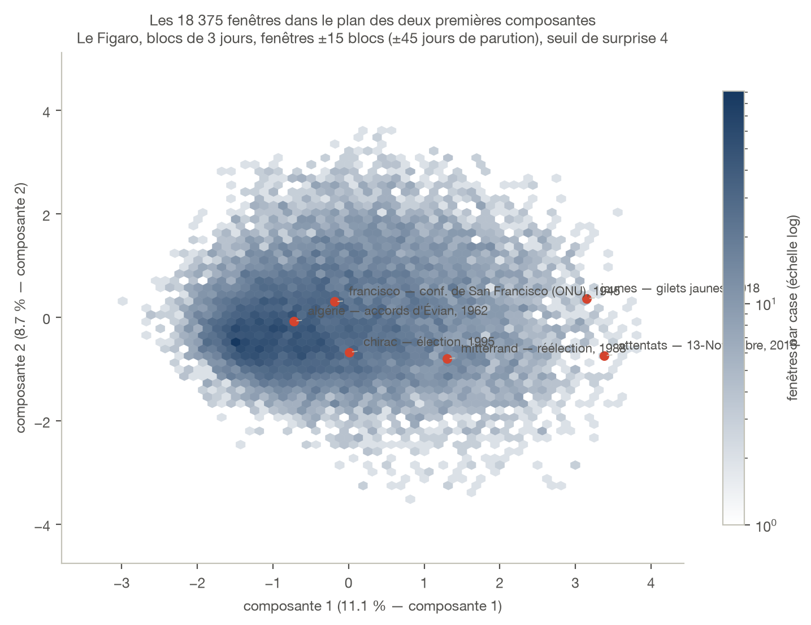
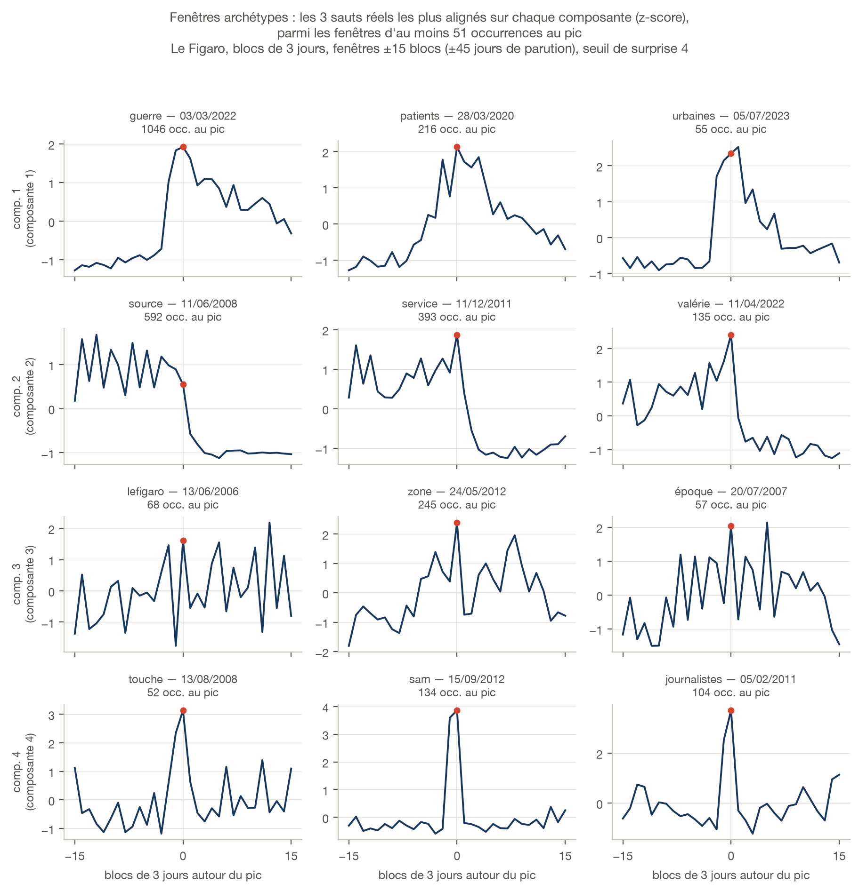
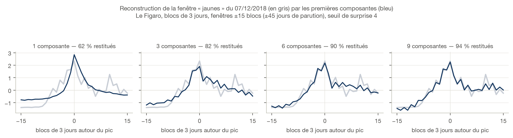
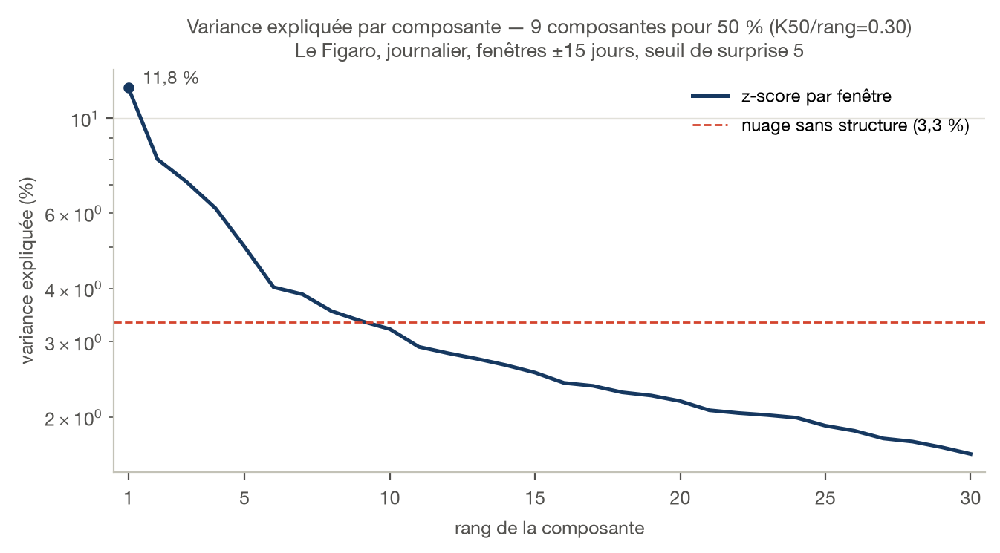
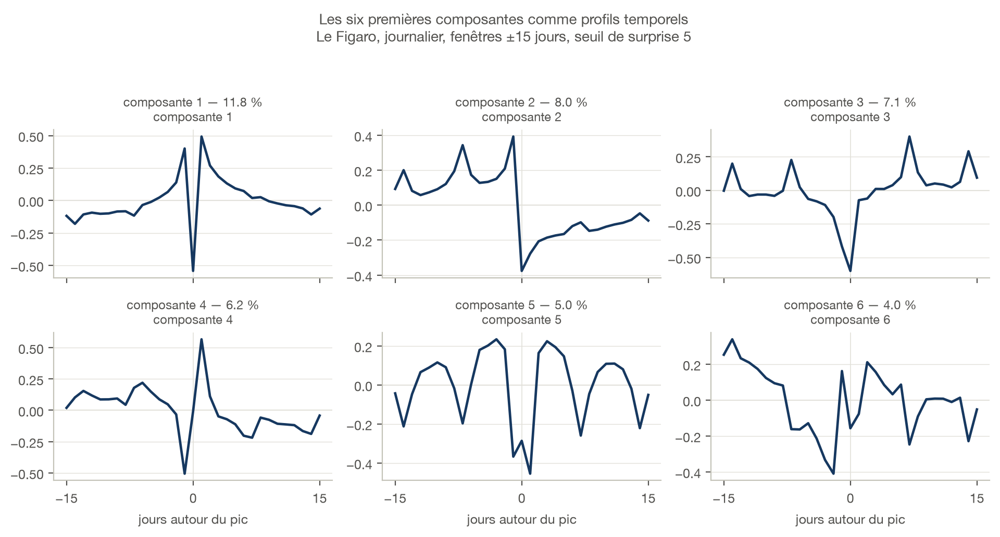
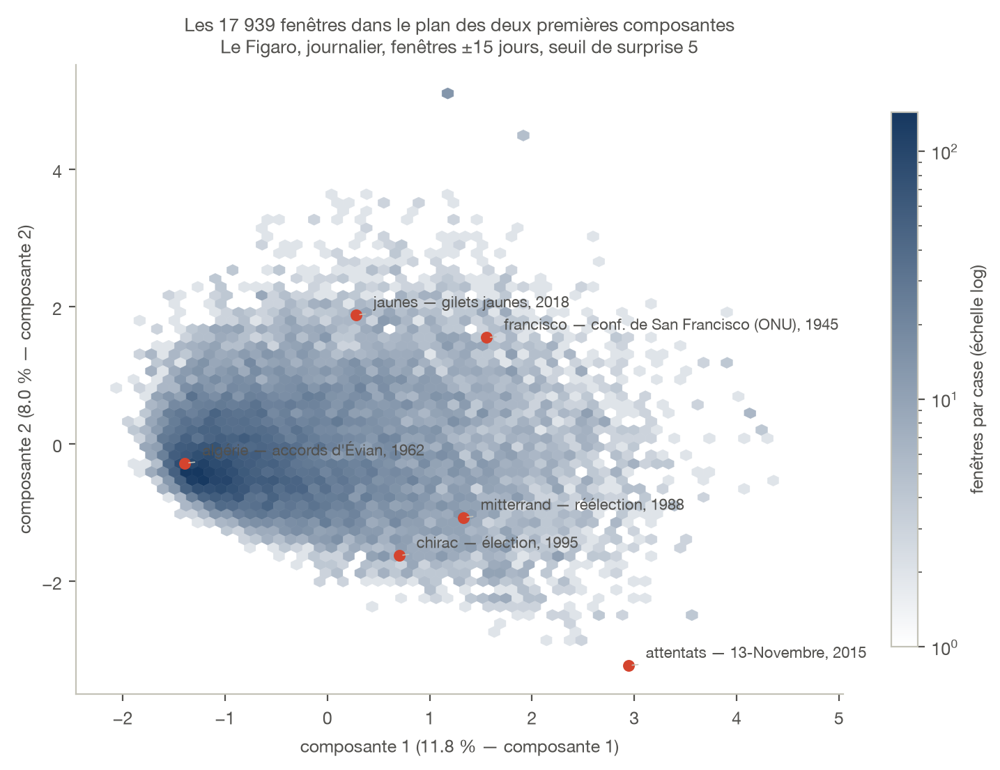
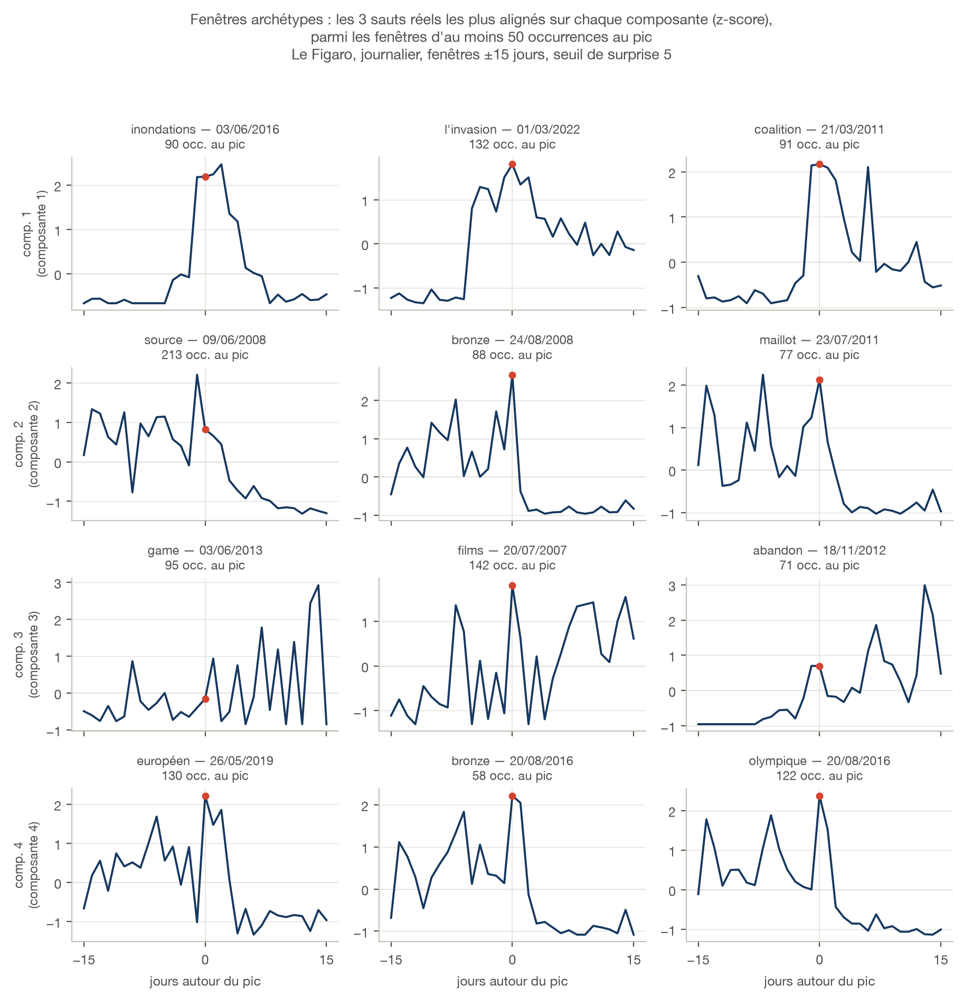
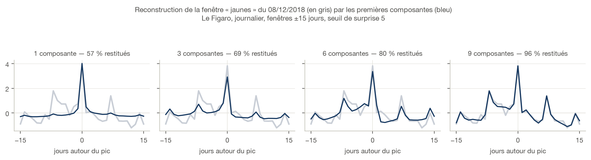

```{=typst}
#set par(justify: true)
#show figure.caption: set text(size: 8.5pt, fill: rgb("#52514e"))
#show figure: set block(above: 1.2em, below: 1.4em)
#show heading.where(level: 2): it => text(size: 13pt, fill: rgb("#163860"), it.body)
#show heading.where(level: 3): set text(size: 11pt)

#align(center)[
  #image("figures/logos/lefigaro.svg", height: 0.95cm)
]
#v(0.5cm)
```

| | Blocs de 3 jours | Journalier |
|---|---|---|
| Fenêtre | ±15 blocs (±45 j de parution) | ±15 jours |
| Seuil de surprise | 4 | 5 |
| Nettoyage | — | n5000 |
| Fenêtres | 18 375 | 17 939 |
| Mots distincts | 7 232 | 6 486 |
| Période couverte | 09/2005 – 01/2024 | 10/2005 – 02/2024 |
| K50 (sur un rang de 30) | 9 | 9 |
| K50_frac | 0,30 | 0,30 |
| cum3 | 26,1 % | 26,9 % |
| cum6 | 40,1 % | 42,1 % |
| Variances 1 à 6 | 11,1 / 8,7 / 6,3 / 5,6 / 4,5 / 4,0 % | 11,8 / 8,0 / 7,1 / 6,2 / 5,0 / 4,0 % |

```{=typst}
#v(0.4cm)
```

```{=typst}
#v(0.5cm)
```

## Blocs de 3 jours, seuil 4 — 18 375 fenêtres

```{=typst}
#block(above: 0.4em, below: 1.0em, grid(columns: (auto, 1fr), align: horizon, column-gutter: 0.7em,
  image("figures/logos/lefigaro.svg", height: 0.44cm),
  line(length: 100%, stroke: 0.5pt + rgb("#c3c2b7"))))
```

La géométrie du Monde appliquée au Figaro ; seul le seuil descend à 4, pour
compenser un corpus plus court.

{height=5.8cm}

```{=typst}
#v(1fr)
```

{height=8.2cm}

```{=typst}
#v(1fr)
```

{height=7.2cm}

```{=typst}
#pagebreak()
#v(1fr)
```

{height=17cm}

```{=typst}
#v(1fr)
```

{width=100%}

```{=typst}
#pagebreak()
```

## Journalier, seuil 5 — 17 939 fenêtres

```{=typst}
#block(above: 0.4em, below: 1.0em, grid(columns: (auto, 1fr), align: horizon, column-gutter: 0.7em,
  image("figures/logos/lefigaro.svg", height: 0.44cm),
  line(length: 100%, stroke: 0.5pt + rgb("#c3c2b7"))))
```

La grille comparable aux Échos et à Mediapart, avec le même nettoyage
`n5000`.

{height=5.8cm}

```{=typst}
#v(1fr)
```

{height=8.2cm}

```{=typst}
#v(1fr)
```

{height=7.2cm}

```{=typst}
#pagebreak()
#v(1fr)
```

{height=15.6cm}

```{=typst}
#v(1fr)
```

{width=94%}

```{=typst}
#v(0.5cm)
#line(length: 100%, stroke: 0.5pt + rgb("#c3c2b7"))
#v(0.2cm)
#text(size: 8.5pt, fill: rgb("#52514e"), style: "italic")[
  Figures produites par `campagne_pca/figures_config.py` ; courbes au bleu de
  charte du titre (\#163860), logo via Wikimedia Commons. Mêmes planches avec
  les trois autres médias dans `campagne_pca/configurations_A_C.pdf`.
  Méthode : `campagne_pca/rapport.pdf`.
]
```
