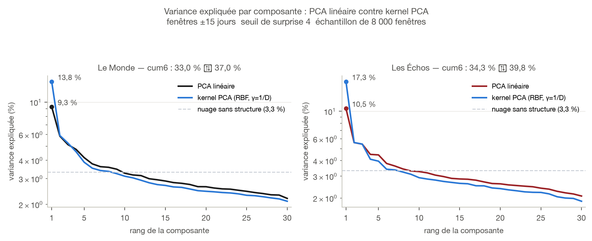

```{=typst}
#set par(justify: true)
#show figure.caption: set text(size: 8.5pt, fill: rgb("#52514e"))
#show figure: set block(above: 1.2em, below: 1.4em)
#show heading.where(level: 2): set text(size: 13pt)

#align(center)[
  #grid(columns: 2, column-gutter: 1.1cm, align: horizon,
    image("figures/logos/lemonde.svg", height: 0.80cm),
    image("figures/logos/lesechos.svg", height: 0.66cm))
]
#v(0.4cm)
```

## La question

La PCA linéaire des fenêtres de sauts laisse la variance très étalée : sur la
configuration de référence (fenêtres ±15 jours, seuil de surprise 4), les six
premières composantes n'expliquent que 33,0 % de la variance au Monde et
34,3 % aux Échos, là où un nuage sans aucune structure en donnerait 20 %. La
question posée : une **kernel PCA** — qui projette d'abord les fenêtres dans
un espace plus riche, où des structures courbes deviennent des directions
droites — resserrerait-elle ce spectre ?

Réponse courte : **non**. Le noyau RBF étale la variance au lieu de la
concentrer, et l'écart se creuse à mesure que le noyau devient plus non
linéaire. Le détour par un premier résultat trompeur, corrigé plus bas, vaut
d'être raconté : il tient à une erreur de dénominateur facile à commettre.

## Le protocole

Même chaîne que les autres configurations de la campagne — pics filtrés au
seuil de surprise, NMS de portée 2d+1, découpe des fenêtres, z-score le long
de chaque fenêtre — puis, sur la **même matrice** de fenêtres z-scorées, deux
décompositions comparées : la PCA linéaire habituelle et une kernel PCA à
noyau gaussien (RBF), dont on balaie le paramètre de largeur γ sur deux
ordres de grandeur.

Une contrainte de calcul impose un échantillonnage : la kernel PCA repose sur
la matrice de Gram, de taille N×N, qui compare chaque fenêtre à toutes les
autres. Sur les 123 310 fenêtres du Monde, cette matrice pèserait environ
120 Go. Le test porte donc sur un **échantillon aléatoire de 8 000 fenêtres**,
le même pour les deux méthodes afin que la comparaison reste honnête.

S'ajoute un **témoin** : 8 000 fenêtres de bruit blanc, z-scorées comme les
vraies, sans aucune structure temporelle. Toute « concentration » que la
méthode y trouverait ne mesurerait rien de réel.

## Le piège du dénominateur

Le premier passage concluait à un gain net : la composante 1 passait de 9,3 %
à 13,8 % au Monde, de 10,5 % à 17,3 % aux Échos, et le gain grandissait avec
γ jusqu'à plus de 40 %. Ce résultat était **faux**.

En kernel PCA, on ne demande qu'un nombre fixé de composantes — ici 30, le
rang d'une fenêtre z-scorée de dimension 31. La bibliothèque ne renvoie alors
que ces 30 valeurs propres. Les diviser par leur propre somme donne « la part
de la composante 1 **parmi les 30 retenues** », et non sa part de la variance
totale : dans l'espace induit par le noyau, le rang ne s'arrête pas à 30, il
monte jusqu'à N. Le bon dénominateur est la trace de la matrice de Gram
centrée, qui vaut ici `trace(K) − somme(K)/N`.

L'écart n'est pas anecdotique. Au Monde, à γ = 1/D, les 30 composantes
retenues ne pèsent que **67 %** de la variance totale ; à γ = 1, plus que
**4,6 %**. Diviser par leur somme revient à ignorer les 95 % de variance
partis dans les rangs supérieurs — exactement la variance que la question
cherchait à mesurer.

![À gauche, la lecture fautive : la variance cumulée des six premières composantes semble grimper avec γ et dépasser largement la PCA linéaire (pointillés). À droite, le même calcul rapporté à la variance totale : la courbe descend, et le noyau ne fait jamais mieux que le linéaire. Le témoin de bruit blanc (gris) tranche : à gauche il reste plat autour de 21 % et tend vers 20 %, soit exactement 6/30 — la valeur qu'on obtient quand les 30 valeurs propres retenues sont égales et que le rapport ne mesure donc plus rien. À droite, le même témoin s'effondre vers 0 comme il se doit.](figures/kernel_piege.png){width=100%}

## Le résultat corrigé

Avec le bon dénominateur, la kernel PCA ne bat la PCA linéaire sur aucun des
deux journaux.

```{=typst}
#set text(size: 9pt)
```

| | Le Monde | Les Échos |
|---|---|---|
| Composante 1 — linéaire | 9,3 % | 10,5 % |
| Composante 1 — kernel (γ=1/D) | 9,3 % | 11,8 % |
| cum6 — linéaire | **33,0 %** | **34,3 %** |
| cum6 — kernel (γ=1/D) | 24,9 % | 27,2 % |
| cum6 — kernel (γ=0,1) | 16,3 % | 20,2 % |
| cum6 — kernel (γ=1) | 2,5 % | 5,6 % |

```{=typst}
#set text(size: 10.5pt)
```

La composante 1 est au mieux marginalement meilleure — identique au Monde,
+1,3 point aux Échos — mais dès la deuxième composante le noyau décroche, et
la variance cumulée est systématiquement inférieure. Plus γ grandit, plus
l'écart se creuse.

{width=100%}

## Pourquoi c'était prévisible

Le noyau RBF projette implicitement les données dans un espace de dimension
infinie, où les points s'éloignent les uns des autres. La variance s'y
répartit donc sur beaucoup plus de directions qu'en dimension 31 — c'est
l'inverse d'une concentration. Une kernel PCA ne resserre le spectre que si
les données vivent réellement sur une surface courbe de basse dimension : un
nuage enroulé en spirale, deux groupes séparés par une frontière incurvée. Le
noyau « déplie » alors cette surface.

Rien de tel ici. Le nuage des fenêtres reste le même continuum d'un plan à
l'autre : une masse dense d'un côté, une traîne qui s'étire vers les sauts les
plus marqués, sans groupe distinct ni structure enroulée que le noyau
révélerait.

{width=100%}

## Ce que ça coûterait, même en cas de gain

Un point mérite d'être noté indépendamment du résultat : la kernel PCA
n'aurait pas été gratuite à adopter. Ses composantes vivent dans l'espace
induit par le noyau, pas dans celui des 31 jours de la fenêtre. Elles ne se
tracent donc pas comme des **profils temporels**, et trois des cinq figures
qui font l'interprétation de la campagne — profils des composantes, fenêtres
archétypes, reconstruction progressive d'une fenêtre réelle — n'ont pas
d'équivalent direct. Il aurait fallu un gain franc pour justifier de perdre
l'interprétabilité ; il n'y a pas de gain du tout.

## Réserves

- **Échantillon.** Le test porte sur 8 000 fenêtres tirées au hasard, contre
  123 310 (Monde) et 48 336 (Échos) pour la PCA linéaire de la campagne. Les
  chiffres linéaires du tableau sont recalculés sur ce même échantillon, donc
  comparables ; ils diffèrent de quelques dixièmes de ceux du rapport
  principal.
- **Une seule famille de noyaux.** Seul le RBF a été balayé. Un noyau
  polynomial de degré 2 ou 3, qui n'envoie pas en dimension infinie, se
  comporterait différemment — mais rien dans la forme du nuage ne le rend
  prometteur.
- **Le z-score reste en amont.** La normalisation par fenêtre efface déjà
  l'échelle et une partie de la non-linéarité ; c'est un choix acté de la
  chaîne, pas une variable de ce test.

## Conclusion

Le spectre étalé de la PCA des fenêtres n'est pas un artefact de linéarité :
il reflète une vraie diversité de formes de sauts. Passer à un noyau ne le
resserre pas, l'étale davantage, et coûterait l'interprétabilité des
composantes. La PCA linéaire reste le bon outil pour cette chaîne.

```{=typst}
#v(0.8cm)
#line(length: 100%, stroke: 0.5pt + rgb("#c3c2b7"))
#v(0.2cm)
#text(size: 8.5pt, fill: rgb("#52514e"), style: "italic")[
  Figures produites par `campagne_pca/figures.py` (commande `kernel`). Logos officiels via
  Wikimedia Commons. Méthode complète de la chaîne :
  `campagne_pca/rapport.pdf`.
]
```
