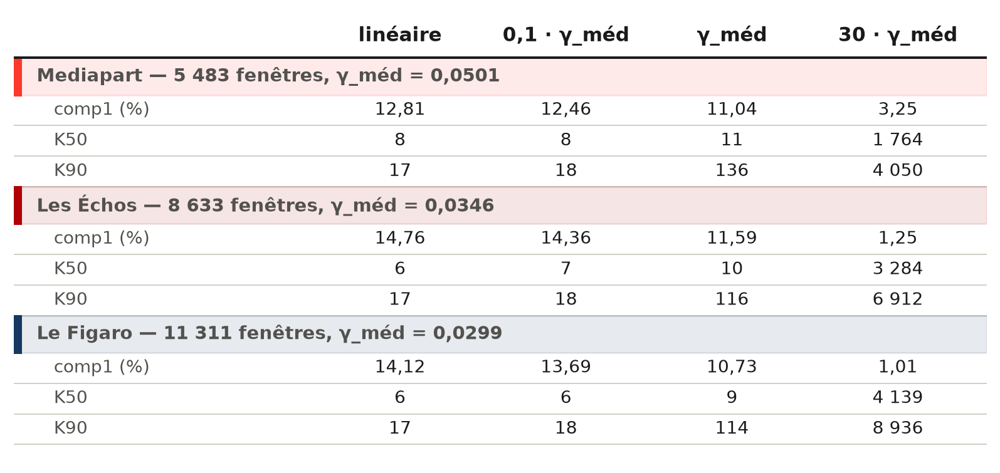

```{=typst}
#set par(justify: true)
#show figure.caption: set text(size: 8.5pt, fill: rgb("#52514e"))
#show figure: set block(above: 1.2em, below: 1.4em)
#show heading.where(level: 2): set text(size: 13pt)
```

## La méthode

En entrée, la matrice $Z$ de la campagne : $n$ fenêtres de sauts z-scorées,
$D = 21$ blocs chacune. La PCA linéaire diagonalise sa covariance
($D \times D$). La kernel PCA diagonalise à la place la matrice de Gram

$$K_{ij} = \exp\left(-\gamma \lVert z_i - z_j \rVert^2\right),$$

doublement centrée, de taille $n \times n$ : les fenêtres sont comparées dans
un espace de dimension infinie où des structures courbes deviendraient des
directions droites, sans jamais calculer cet espace.

Deux points à garder en tête. La part de variance se rapporte à la trace de la
Gram centrée, pas à la somme des valeurs propres calculées — le rang n'y est
plus $D-1$ mais $n$. Et le coût est en $n^2$ : 120 Go sur la grille
journalière, d'où l'échantillon de 8 000 fenêtres du premier test ; 0,2 à 6 Go
sur les grilles hebdomadaire et à 3 jours, ce qui donne toutes les fenêtres et
le spectre entier.

## Le paramètre $\gamma$

$\gamma$ fixe à partir de quelle distance deux fenêtres cessent de se
ressembler. Petit, $\exp(-\gamma d^2) \approx 1 - \gamma d^2$ : on retombe sur
la PCA linéaire. Grand, $K$ tend vers l'identité, chaque fenêtre ne ressemble
plus qu'à elle-même et le spectre s'aplatit — K90 passe de 17 composantes à
plusieurs milliers.

Il n'a donc de sens qu'en regard des distances réelles, d'où le calage
$\gamma_{\text{méd}} = 1 / (2 \cdot \text{médiane}(\lVert z_i - z_j \rVert^2))$,
médiane estimée sur 4 millions de paires tirées au hasard. Elle vaut 6 à 17
selon le média, contre $2D = 42$ pour des fenêtres décorrélées : elles se
ressemblent beaucoup plus que ça. La grille balaie
$\gamma_{\text{méd}} \times [0{,}1 \dots 30]$, lue sur comp1, cum6 et K50/K90.

{width=100%}
