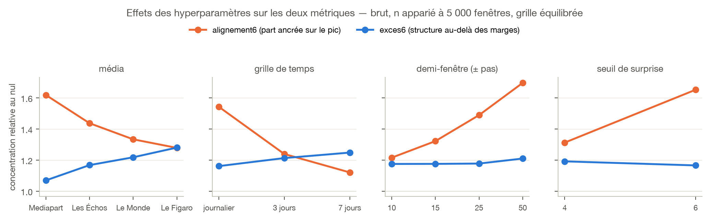
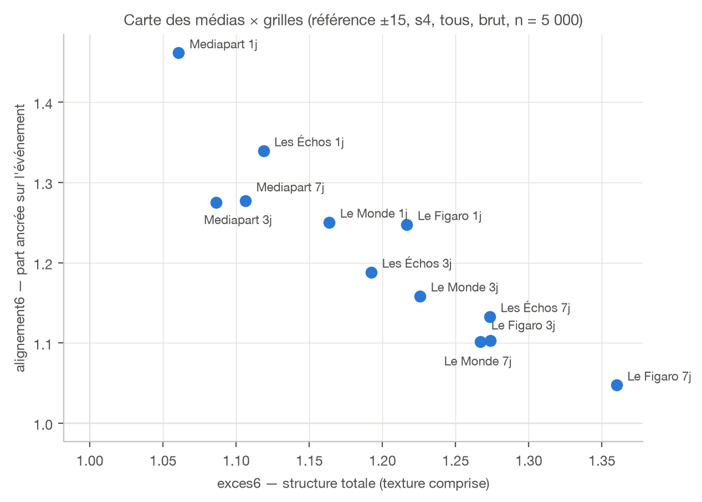
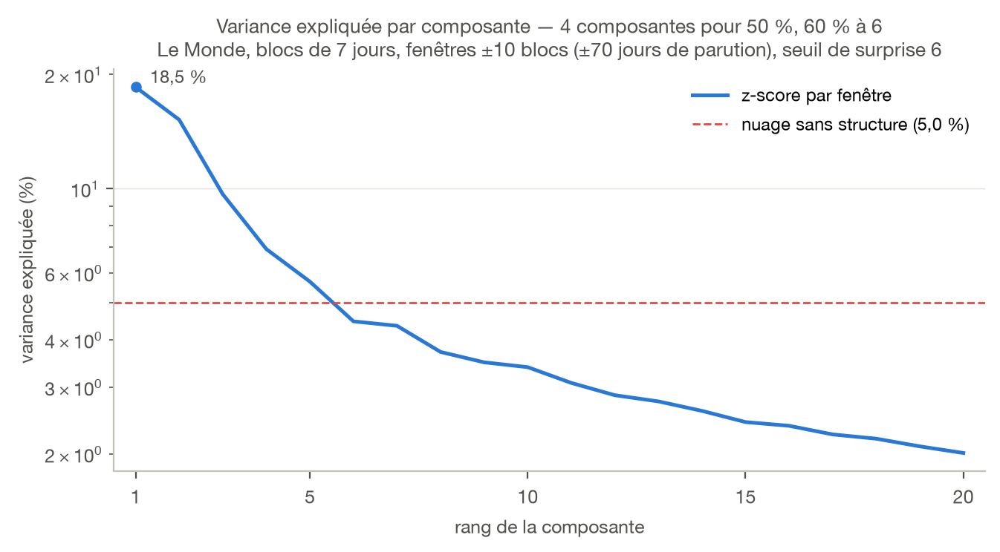
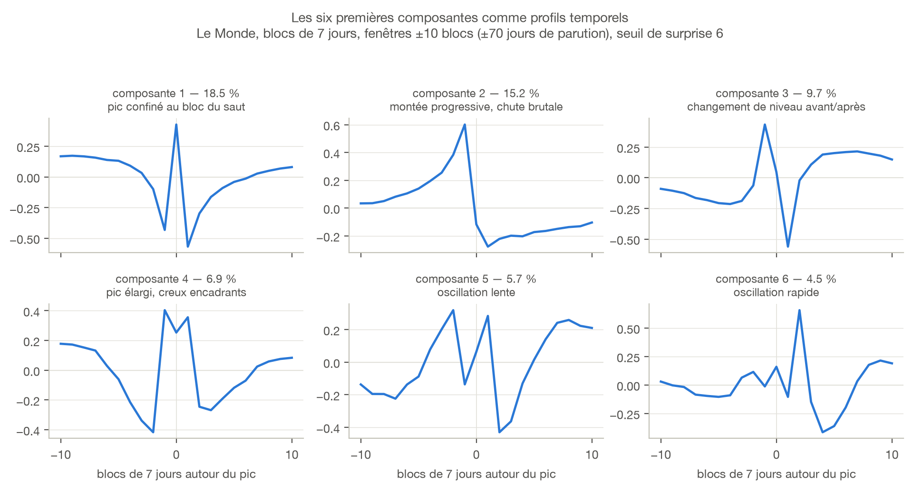
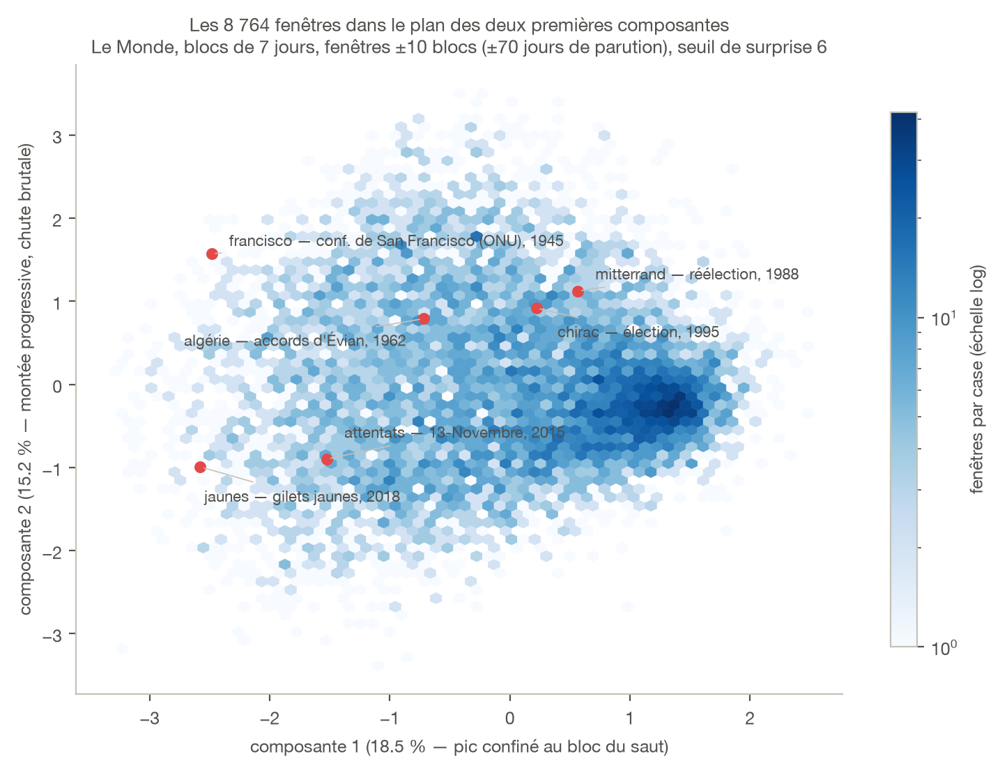
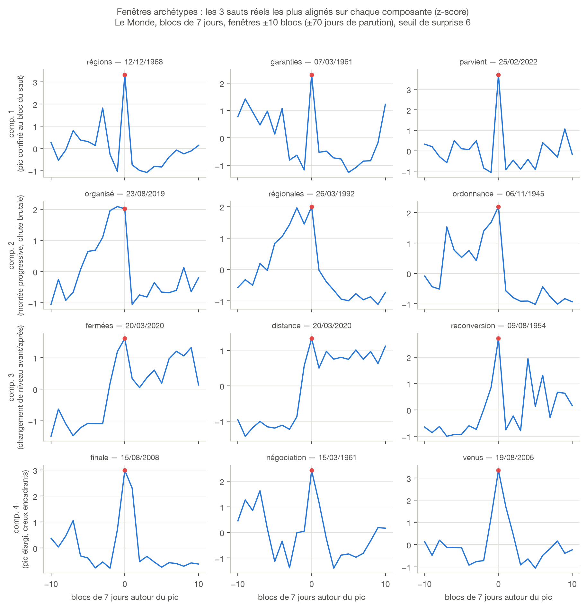
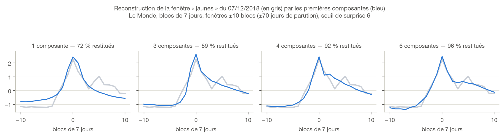

## La question et le dispositif

La PCA du modèle zéro (Le Monde, fenêtres ±15 jours, seuil de surprise 4)
donnait un spectre plat : 33 % de variance à 6 composantes. La campagne
évalue une fonction `PCA(média, grille, fenêtre, seuil, filtre, vocabulaire,
transformation) → qualité du spectre` sur tout l'espace des réglages :

| Axe | Valeurs explorées |
|---|---|
| média | Le Monde, Le Figaro, Les Échos, **Mediapart** (base ngram construite pour l'occasion, 53 095 articles 2008→2026) |
| grille | journalier, blocs de 3 jours, blocs de 7 jours de parution |
| demi-fenêtre | ±5, ±10, ±15, ±25, ±35, ±50, ±70 pas de grille |
| seuil de surprise | 3, 4, 5, 6 (pics recalculés à s ≥ 3 partout) |
| filtre grammatical | tous, sans verbes, noms seulement, noms propres (Lexique383 + spaCy sur les vocabulaires) |
| vocabulaire | top-10 000 par jours actifs ; variante ≥ 1 000 jours actifs (39 316 mots) |
| transformation | fréquences brutes ; log(1+f) |

Le runner (`rupture/campagne.py`) rejoue la fin de chaîne en mémoire
(pics filtrés → NMS à portée 2d+1 → fenêtres → nettoyage V2 → z-score par
fenêtre → PCA) en 2 à 10 s par configuration. 1 753 configurations au
balayage principal, 2 304 au balayage final à double témoin, toutes
journalisées (`resultats.csv`, `resultats_rotation.csv`).

## Ce que donnent les PCA : les chiffres bruts

Avant toute correction, voici la mesure demandée au départ — le nombre de
composantes pour atteindre 50 % de variance (`K50`) et la variance expliquée
à nombre de composantes fixé. Toutes les valeurs ci-dessous sont à
**n apparié (5 000 fenêtres)**, fréquences sans transformation, moyennées sur
les trois graines de tirage.

**Effet de la taille de fenêtre** (D = 2d+1 colonnes) :

| Fenêtre | D | K50 | variance à 3 comp. | à 6 comp. | à 10 comp. | comp. 1 |
|---|---|---|---|---|---|---|
| ±10 | 21 | **6,4** | 33,2 % | **50,4 %** | 67,6 % | 14,2 % |
| ±15 | 31 | 9,2 | 27,0 % | 40,5 % | 54,0 % | 12,1 % |
| ±25 | 51 | 14,8 | 21,0 % | 31,2 % | 41,2 % | 9,9 % |
| ±50 | 101 | 29,5 | 15,0 % | 22,0 % | 28,6 % | 7,4 % |

Les petites fenêtres dominent — mais **mécaniquement**, puisqu'elles ont
moins de dimensions à couvrir (piège 1 ci-dessous). Ce classement ne dit
donc rien sur la richesse réelle du signal ; il faut comparer à fenêtre
fixée.

**À fenêtre fixée (±15, D = 31), effet de chaque axe :**

| Axe | Valeur | K50 | variance à 6 comp. | à 10 comp. |
|---|---|---|---|---|
| **seuil** | 6 | **7,8** | **45,2 %** | 58,4 % |
| | 4 | 10,0 | 37,8 % | 51,6 % |
| **grille** | 7 jours | 8,3 | 43,3 % | 56,6 % |
| | 3 jours | 9,3 | 40,2 % | 53,8 % |
| | journalier | 9,5 | 39,2 % | 52,9 % |
| **média** | Le Figaro | 8,3 | 43,3 % | 57,1 % |
| | Le Monde | 8,7 | 42,3 % | 55,7 % |
| | Les Échos | 9,5 | 39,1 % | 52,7 % |
| | Mediapart | 11,0 | 34,9 % | 48,2 % |
| **filtre** | noms propres | 9,0 | 41,6 % | 55,3 % |
| | tous | 9,3 | 40,1 % | 53,6 % |

**Le seuil de surprise est le levier le plus fort** : passer de 4 à 6 gagne
7,4 points de variance à 6 composantes et fait tomber `K50` de 10 à 7,8.
Viennent ensuite l'agrégation temporelle (+4 points en hebdomadaire) et le
média (8 points d'écart entre Le Figaro et Mediapart). Le filtre grammatical
reste marginal (1,5 point).

**Les meilleures configurations**, en cumulant ces effets :

| Configuration | D | K50 | à 6 comp. | à 10 comp. |
|---|---|---|---|---|
| Le Monde, hebdo, ±10, seuil 6 | 21 | **4** | **60,8 %** | 76,3 % |
| Le Monde, hebdo, ±15, seuil 6 | 31 | 6 | 50,9 % | 63,7 % |
| Le Figaro, 3 jours, ±15, seuil 6 | 31 | 6 | 50,1 % | 63,3 % |
| Le Monde, 3 jours, ±15, seuil 6 | 31 | 7 | 48,4 % | 61,2 % |
| Le Figaro, journalier, ±15, seuil 6 | 31 | 7 | 46,3 % | 60,0 % |

À comparer au modèle zéro (Le Monde, journalier, ±15, seuil 4) : `K50` = 11,
33,3 % à 6 composantes. **Le meilleur réglage divise donc `K50` par plus de
deux et fait passer la variance à 6 composantes de 33 % à 61 %.**

**Le log dégrade ces chiffres bruts**, contrairement à ce que sa lecture en
ratio suggère : la variance à 6 composantes tombe de 40,5 % à 33,1 % (±15)
et de 22,0 % à 15,9 % (±50). Il aplatit le spectre tout en le rendant plus
concentré *relativement à son propre témoin nul* — les deux lectures
s'opposent, et c'est précisément ce qu'analyse la section suivante.

## Mesurer honnêtement : les trois pièges

Le score naïf — la variance cumulée à 6 composantes — s'est révélé faux
trois fois, et sa correction est le premier résultat de la campagne.

1. **La dimension.** Une fenêtre ±5 vit dans 10 dimensions, une ±50 dans
   100 : à structure égale, la petite fenêtre « gagne » mécaniquement. Sous
   l'hypothèse nulle « la variance se répartit également entre les
   composantes », le nombre de composantes disponibles dépend
   structurellement de la taille de la fenêtre, et la variance cumulée à
   6 composantes n'est donc plus une mesure comparable d'une fenêtre à
   l'autre. On utilise à la place `gain6` = cum6 / cum6 attendu sous cette
   hypothèse nulle, qui compare le ratio entre ce qui est observé et ce
   qu'on attendrait sous l'hypothèse nulle : plus ce ratio est élevé, plus
   la variance réellement expliquée dépasse la variance attendue.
2. **Les marges et la petite matrice.** Une seconde hypothèse nulle : « les
   jours d'une même fenêtre ne sont pas réellement liés entre eux, seuls
   certains jours sont, en moyenne, plus ou moins variables que d'autres »
   (le jour du pic, par construction, plus agité que les bords). Si c'est
   vrai, on peut échanger au hasard les valeurs d'un même jour entre
   fenêtres différentes — par exemple le `j+3` de la 14ᵉ fenêtre avec le
   `j+3` de la 5ᵉ. La variance de chaque colonne ne bouge pas (on ne
   permute des valeurs qu'au sein d'une même colonne), mais la structure
   temporelle — le lien entre jours voisins d'une même fenêtre — est
   détruite. Si cette structure n'apportait aucune information, la
   variance cumulée resterait semblable avec ou sans ce mélange : on
   définit `exces6` = cum6/cum6~nul~, où plus ce ratio est élevé, plus le
   lien réel entre jours pèse au-delà de cette simple inégalité de
   variance. Les scores spectaculaires des petites configurations
   (900 fenêtres, gain6 ≈ 6) retombent ainsi à 1,05 : c'était du bruit de
   petite matrice et des variances marginales, pas une vraie forme.
3. **La composition.** Mécaniquement, exiger une surprise plus élevée ou
   restreindre le vocabulaire (par exemple ne garder que les noms propres)
   réduit drastiquement le nombre de fenêtres disponibles : sur Le Monde,
   ±15 jours, tous les mots, on a 342 787 fenêtres à seuil 3 contre
   seulement 31 232 à seuil 6 — un facteur 11 rien qu'en changeant le
   seuil ; ne garder que les noms propres (à seuil 4) descend à
   9 647 fenêtres. Comparer la moyenne d'`exces6` par axe mélange donc,
   sans le vouloir, l'effet de l'axe étudié et celui de la taille
   d'échantillon qui varie avec lui. Les comparaisons se font donc **à
   n apparié** : on ramène systématiquement *toute* configuration à
   5 000 fenêtres (tirage seedé) — une taille fixe, inférieure à la plus
   restrictive rencontrée (les 9 647 des noms propres), pour que tous les
   axes, pas seulement deux niveaux d'un même axe, restent comparables
   entre eux. Trois graines de tirage donnent une dispersion inter-graines
   médiane de 0,0045 : tous les écarts commentés dans le rapport sont
   significatifs au regard de ce bruit.

Enfin un second témoin, le **décalage circulaire de chaque fenêtre**
(l'autocorrélation de la série est préservée, l'alignement sur le pic est
détruit), sépare deux choses que `exces6` confond : la **texture** (de
l'autocorrélation générique, présente n'importe où dans la série) et la
**part ancrée sur l'événement** (`alignement6` = cum6/cum6~rotation~).

## Résultats par axe

- **Média — l'effet le plus fort, et il s'inverse selon la métrique.**
  Texture : Figaro 1,28 > Monde 1,22 > Échos 1,17 > Mediapart 1,07.
  Part ancrée : **Mediapart 1,62** > Échos 1,44 > Monde 1,33 > Figaro 1,28.
- **Grille.** L'agrégation (3 j, 7 j) ajoute de la texture mais **floute
  l'alignement** : la part ancrée passe de 1,54 (journalier) à 1,12 (hebdo).
- **Fenêtre.** La part ancrée **croît fortement avec la fenêtre** (1,22 à
  ±10 → 1,70 à ±50) à texture quasi constante : autour d'un grand pic, la
  série porte des formes longues — les composantes montrent des **marches
  de régime** (plateau avant, pic, plateau après).
- **Seuil.** Même logique : s6 porte plus de forme ancrée que s4 (1,65
  contre 1,31), à texture égale. Les grands pics ont de vraies silhouettes.
- **Filtre grammatical : quasi plat** à n apparié (1,36–1,39). Le filtre
  noms propres avait un léger avantage sur Le Monde seul ; il ne se
  généralise pas. Non décisif.
- **Vocabulaire : la queue dilue.** La variante ≥ 1 000 jours actifs
  (39 316 mots) fait perdre 0,084 ± 0,026 d'exces6 sur 76 paires appariées.
  Le top-10 000 est le bon choix.
- **Log : un levier, mais pour la texture seulement.** log(1+f) ajoute
  jusqu'à +0,76 d'exces6 (Figaro ±50 : 1,61 → 2,37) mais ramène
  l'alignement à ~1,0 partout : il révèle l'autocorrélation lente et **noie
  les formes d'événement**.

## La carte des médias

Deux profils de médias se dégagent. **Mediapart** : peu de structure totale,
mais presque toute ancrée sur l'événement — ses composantes sont des pics
« secs », sans montée ni retombée (90-100 % de l'énergie au centre). **Le
Figaro** (et Le Monde agrégé) : beaucoup de structure, majoritairement de la
texture lente. Les Échos journalier est le meilleur compromis des deux axes.

## La configuration optimale en détail

Les vues du modèle zéro, rejouées sur la configuration qui concentre le plus
la variance : **Le Monde, blocs de 7 jours, fenêtres ±10 blocs (±70 jours de
parution), seuil de surprise 6**, fréquences sans transformation, z-score par
fenêtre. La chaîne donne **8 764 fenêtres** de 21 blocs
(`campagne_pca/figures_optimale.py`).

{width=80%}

Le spectre n'est plus plat : la première composante porte **18,5 %** de la
variance contre 9,2 % dans le modèle zéro, et il suffit de **4 composantes
pour atteindre 50 %** (contre 11). Le prix à payer est un échantillon quatorze
fois plus petit — 8 764 fenêtres contre 123 310 — puisque le seuil 6 et
l'agrégation hebdomadaire écartent beaucoup d'événements.

{width=100%}

Les quatre premières formes sont lisibles et se rattachent à celles du modèle
zéro, transposées à l'échelle de la semaine. La composante 1 (18,5 %) oppose
le bloc du saut à ses deux voisins immédiats — *l'activité tient-elle dans une
seule semaine, ou déborde-t-elle ?* La composante 2 (15,2 %) monte
progressivement jusqu'au pic puis s'effondre — *un sujet qui s'installe puis
retombe d'un coup*. La composante 3 (9,7 %) est un **changement de niveau** :
plateau bas avant, plateau haut après. La composante 4 (6,9 %) est un pic
élargi encadré de deux creux ; les composantes 5-6 sont des oscillations
génériques, comme en journalier.

{width=88%}

{width=92%}

Les archétypes valident les lectures et tombent sur des dates
reconnaissables. Composante 1 : « parvient » au 25/02/2022 (invasion de
l'Ukraine) — un pic net d'une semaine. Composante 2 : « régionales » au
26/03/1992, montée de campagne puis chute au lendemain du scrutin.
Composante 3 : **« fermées » et « distance » au 20/03/2020** — le
confinement, exemple manuel d'un changement de niveau durable, exactement la
forme que la question des rachats cherchera.

{width=100%}

La reconstruction chiffre le gain : **72 % de la forme restitués avec une
seule composante, 89 % avec trois, 96 % avec six**, là où le modèle zéro
demandait quinze composantes pour atteindre 89 %.

**Réserve.** Cette configuration est optimale au sens de la concentration de
variance, pas de l'ancrage sur l'événement : son `alignement6` ne vaut que
1,18, contre 1,70 pour les grandes fenêtres journalières. Une partie de ce
que capte son spectre est de la texture lente — ce qui est cohérent avec la
composante 3, un changement de régime plutôt qu'un pic.

## Recommandations

La « meilleure PCA » dépend de la question — c'est le message central. Et
les deux lectures ne pointent pas au même endroit : ce qui concentre le plus
de variance en valeur brute n'est pas ce qui capte le mieux les formes
d'événement.

| Axe | Meilleur en variance brute (K50, cum6) | Meilleur en part ancrée (alignement6) |
|---|---|---|
| seuil | **6** | **6** |
| fenêtre | ±10 à ±15 | ±50 |
| grille | hebdomadaire | journalier |
| média | Le Monde, Le Figaro | Mediapart, Les Échos |
| transformation | sans log | sans log |

**Seuls le seuil 6 et l'absence de log font consensus** — ce sont les deux
réglages à retenir quelle que soit la suite. Les trois autres axes doivent
être choisis selon l'objectif.

**Pour un spectre compact** (objectif : réduire la dimension, décrire chaque
saut par peu de coordonnées) : **hebdomadaire, ±10 à ±15, seuil 6**, Le
Monde ou Le Figaro, sans log — `K50` = 4 à 6 et 51 à 61 % de variance à
6 composantes. Attention : à cette échelle, une partie de la concentration
vient de la texture lente, pas de la forme du pic (`alignement6` ≈ 1,17 à
1,24 seulement).

**Pour les formes d'événement** (objectif : le dataset de sauts et leur
classification) : **journalier, ±25 à ±50, seuil 6**, sans log, top-10 000.
C'est la configuration qui maximise la part ancrée (Mediapart :
alignement6 = 2,58 ; Échos : 2,07), au prix d'un spectre nettement plus
étalé (`K50` ≈ 30 à ±50). Le seuil 4 en variante pour l'effectif (× 3), les
filtres grammaticaux en option d'interprétation.

**Pour la texture et les régimes** (objectif : les ruptures durables — la
question des rachats) : **log(1+f), grilles agrégées, grandes fenêtres**,
Figaro en tête. Ce qui était un « défaut » pour les formes d'événement est
exactement le signal qu'un détecteur de breakpoints voudra — en acceptant
que le spectre brut y soit le plus plat de tous (16 % à 6 composantes).

## Réserves et chantiers ouverts

- **Boilerplate Mediapart** : les extrêmes de ses composantes sont pollués
  par des mots d'interface (« articles », « phrases »…). Contrôle fait : les
  exclure ne change presque rien à la métrique (2,55 → 2,48), mais un
  nettoyage s'impose avant toute interprétation fine (chantier commun avec
  les stop words).
- **NMS couplé à la fenêtre** : la portée du dédoublonnage vaut la largeur
  de fenêtre ; comparer des fenêtres compare donc aussi des datasets. Le
  n apparié neutralise l'effet de taille, pas celui de sélection.
- **n apparié fixé à 5 000 : conservateur, mais sans coût mesuré.** Cette
  cible est bien en dessous de la plupart des configurations (jusqu'à
  342 787 fenêtres à seuil 3) — une cible plus généreuse (8 000-9 000)
  aurait préservé plus de données. Contrôle fait sur la référence :
  `exces6` ne bouge que de 1,170 (n complet, 121 805) à 1,155 (n = 5 000),
  un écart négligeable face aux effets rapportés (0,05 à 0,7) — aucune
  conclusion n'aurait changé avec une cible plus haute. Les configurations
  les plus extrêmes (jusqu'à 79 fenêtres, Mediapart ±70/seuil 6/noms
  propres) restent de toute façon sous 5 000 et sont exclues des
  comparaisons plutôt que gonflées artificiellement.
- **Kernel PCA** : non exploré — la priorité est allée aux témoins nuls, et
  la PCA linéaire n'est pas épuisée (les formes longues viennent d'être
  découvertes). À reprendre si la classification bute sur du non-linéaire.
- **Fenêtres par mot** (remarque Bouchot) et **périodes d'activité
  anormale** : hors périmètre, notées au to_do.

## Reproduction

Tout est versionné dans `campagne_pca/` (GitHub) : runner
(`rupture/campagne.py`), scripts de salves (`salve*.sh`), journal complet
(`suivi.md`), récoltes (`resultats.csv`, 1 753 configs ;
`resultats_rotation.csv`, 2 304 configs au double témoin), figures et
scripts de figures. Les données intermédiaires (pics s3, séries 40k, base
ngram Mediapart) sont sur gallica dans `data/`.
