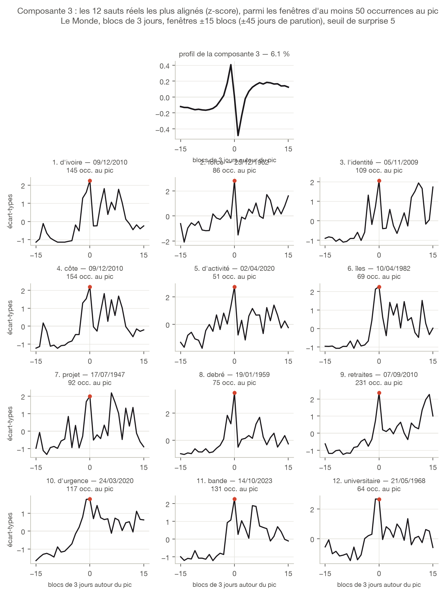

```{=typst}
#set par(justify: true)
#show figure.caption: set text(size: 8.5pt, fill: rgb("#52514e"))
#show figure: set block(above: 1.0em, below: 1.2em)

#align(center)[#image("figures/logos/lemonde.svg", height: 0.80cm)]
#v(0.3cm)
```

## Configuration A — seuil 6, 14 102 fenêtres

Support : la configuration A, la grille Le Monde la plus
sélective des candidates. La composante 3 y pèse 6,6 % de la variance. Son
profil n'est ni un pic ni une bascule mais un **doublet serré** — montée juste
avant le pic, décrochage brutal au pic même, puis plateau haut : elle corrige
les fenêtres dont le maximum tombe un bloc *avant* la date retenue et dont la
couverture repart ensuite sans redescendre. Les douze fenêtres ci-après sont les
douze sauts réels les mieux projetés sur elle (contre trois dans la figure 5 des
autres planches) : Côte d'Ivoire fin 2010 (« d'ivoire » et « côte », même date),
l'identité nationale en novembre 2009, le confinement de mars 2020, mai 1968.

{height=16.0cm}

```{=typst}
#pagebreak()
```

## Configuration C — seuil 5, 24 593 fenêtres

Abaisser le seuil de 6 à 5 fait entrer 10 491 fenêtres de plus, donc des sauts
moins nets. La composante 3 y survit presque à l'identique : 6,1 % de la
variance au lieu de 6,6 %, même profil en doublet (trois croisements de zéro,
49 % de l'énergie au centre dans les deux cas). Dix des douze archétypes sont
les mêmes, dans un ordre voisin ; les deux entrants — « nettoyage » (avril 1999,
Kosovo) et « îles » (avril 1982, Malouines) — remplacent « horizon » et
« universitaire » sans changer la signature. Cette composante n'est donc pas un
artefact du seuil : elle
décrit une forme de couverture qui se retrouve dans les deux jeux de fenêtres.

{height=17.4cm}
