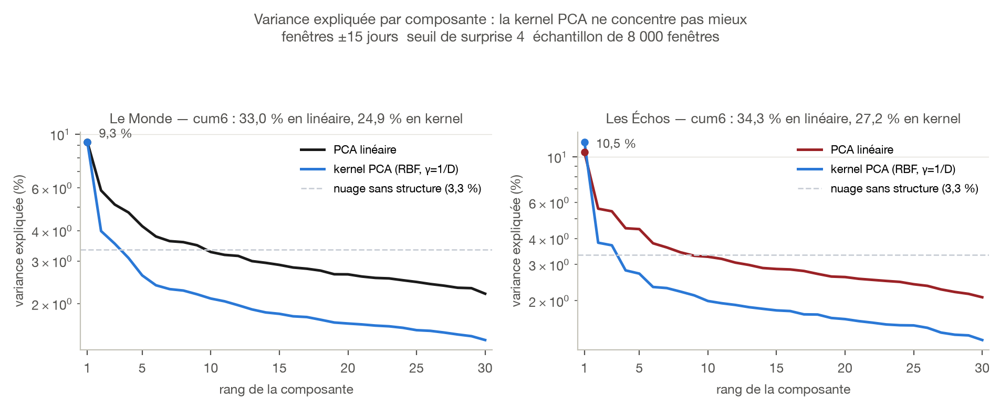
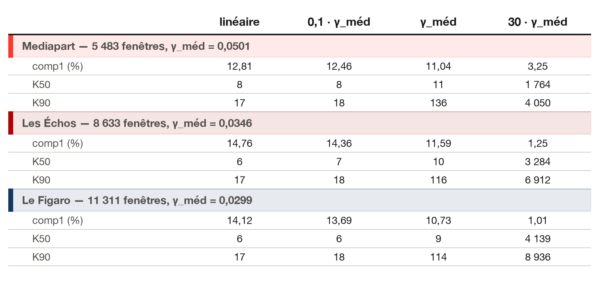
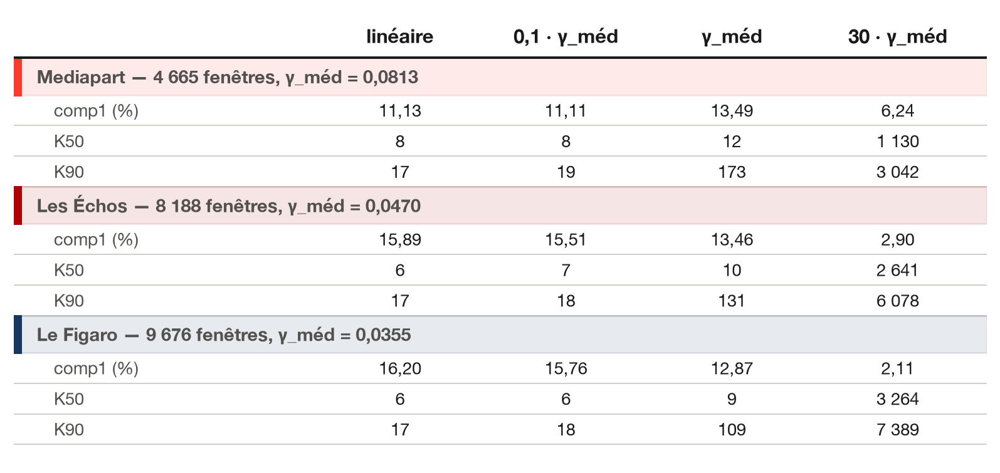

```{=typst}
#set par(justify: true)
#show figure.caption: set text(size: 8.5pt, fill: rgb("#52514e"))
#show figure: set block(above: 1.2em, below: 1.4em)
#show heading.where(level: 2): set text(size: 13pt)

#align(center)[
  #grid(columns: 4, column-gutter: 1.0cm, align: horizon,
    image("figures/logos/lemonde.svg", height: 0.75cm),
    image("figures/logos/lefigaro.svg", height: 0.50cm),
    image("figures/logos/lesechos.svg", height: 0.62cm),
    image("figures/logos/mediapart.svg", height: 0.55cm))
]
#v(0.4cm)
```

## La question

La PCA linéaire des fenêtres de sauts laisse un spectre étalé : sur la
configuration de référence (±15 jours, seuil 4), six composantes n'expliquent
que 33 % de la variance au Monde et 34 % aux Échos, contre 20 % pour un
nuage sans structure. Une **kernel PCA** — qui projette d'abord les fenêtres
dans un espace plus riche, où des structures courbes deviennent des
directions droites — resserrerait-elle ce spectre ?

Réponse : **non**, sur les quatre journaux et les trois grilles testées
(journalière, 3 jours, 7 jours). Le noyau RBF étale la variance au lieu de
la concentrer, et l'écart se creuse à mesure qu'il devient plus non linéaire.

## Méthode

Même chaîne que le reste de la campagne (pics filtrés au seuil de surprise,
NMS, découpe des fenêtres, z-score par fenêtre), puis deux décompositions
comparées sur la même matrice : la PCA linéaire habituelle, et une kernel
PCA à noyau gaussien $K_{ij} = \exp(-\gamma \lVert z_i - z_j\rVert^2)$,
doublement centrée. Le noyau compare chaque fenêtre à toutes les autres —
coût en $n^2$, jusqu'à 120 Go sur la grille journalière du Monde
(123 310 fenêtres). D'où un échantillon de 8 000 fenêtres sur cette grille ;
les grilles hebdomadaire et à 3 jours, bien plus petites, passent en entier.

$\gamma$ fixe la distance à partir de laquelle deux fenêtres cessent de se
ressembler : petit, on retombe sur la PCA linéaire ; grand, chaque fenêtre
ne ressemble plus qu'à elle-même et le spectre s'aplatit. Il est calé sur
l'échelle réelle des distances,
$\gamma_{\text{méd}} = 1 / (2 \cdot \text{médiane}(\lVert z_i - z_j\rVert^2))$,
médiane estimée sur 4 millions de paires tirées au hasard, puis balayé sur
$\gamma_{\text{méd}} \times [0{,}1 \dots 30]$. Un témoin de bruit blanc (même
z-score, aucune structure temporelle) accompagne chaque test : toute
concentration qu'il afficherait ne mesurerait rien de réel.

## Le piège du dénominateur

Le premier passage concluait à un gain net : la composante 1 passait de
9,3 % à 13,8 % au Monde, de 10,5 % à 17,3 % aux Échos, grandissant avec
γ jusqu'à plus de 40 %. Ce résultat était **faux**.

La kernel PCA ne retient qu'un nombre fixé de composantes — 30 ici, le rang
d'une fenêtre de dimension 31. Diviser leur variance par leur propre somme
donne la part de la composante 1 *parmi les 30 retenues*, pas sa part de la
variance totale : dans l'espace induit par le noyau, le rang monte jusqu'à
$n$, pas 30. Le bon dénominateur est la trace de la matrice de Gram
centrée. L'écart n'est pas anecdotique : au Monde, à γ = 1/D, les 30
composantes retenues ne pèsent que 67 % de la variance totale ; à γ = 1,
4,6 % seulement.

{width=100%}

## Résultats

### Grille journalière — Le Monde et Les Échos (échantillon de 8 000 fenêtres)

| | Le Monde | Les Échos |
|---|---|---|
| Composante 1 — linéaire | 9,3 % | 10,5 % |
| Composante 1 — kernel (γ=1/D) | 9,3 % | 11,8 % |
| cum6 — linéaire | **33,0 %** | **34,3 %** |
| cum6 — kernel (γ=1/D) | 24,9 % | 27,2 % |
| cum6 — kernel (γ=0,1) | 16,3 % | 20,2 % |
| cum6 — kernel (γ=1) | 2,5 % | 5,6 % |

La composante 1 est au mieux marginalement meilleure — identique au Monde,
+1,3 point aux Échos — mais dès la deuxième composante le noyau décroche, et
l'écart se creuse avec γ.

{width=100%}

### Grille hebdomadaire — Mediapart, Les Échos, Le Figaro

Même fenêtre (±10 blocs, D = 21) et même seuil (4) pour les trois journaux ;
γ calé par média sur la distance médiane réelle.

| | Mediapart | Les Échos | Le Figaro |
|---|---|---|---|
| Fenêtres | 5 483 | 8 633 | 11 311 |
| γ~méd~ | 0,0501 | 0,0347 | 0,0299 |

{width=100%}

### Grille à 3 jours — mêmes trois journaux

Même fenêtre (±10 blocs), seuil relevé à 5.

| | Mediapart | Les Échos | Le Figaro |
|---|---|---|---|
| Fenêtres | 4 665 | 8 188 | 9 676 |
| γ~méd~ | 0,0813 | 0,0470 | 0,0355 |

{width=100%}

Le dépassement sur Mediapart — le corpus le plus petit et le plus bruité des
trois — reste à confirmer avant d'y voir un signal plutôt qu'un effet
d'échantillon.

## Pourquoi c'était prévisible

Le noyau RBF projette les données dans un espace de dimension infinie, où
les points s'éloignent les uns des autres : la variance s'y répartit sur
beaucoup plus de directions, l'inverse d'une concentration. Il ne resserre
un spectre que si les données vivent sur une surface courbe de basse
dimension — un nuage enroulé en spirale, deux groupes séparés par une
frontière incurvée — qu'il peut « déplier ». Rien de tel ici : le nuage des
fenêtres reste le même continuum d'un journal à l'autre, une amplitude et
une largeur qui varient autour de la même forme de saut, sans groupe
distinct ni courbure à révéler.

{width=100%}

## Le coût, même en cas de gain

La kernel PCA n'aurait de toute façon pas été gratuite à adopter. Ses
composantes vivent dans l'espace induit par le noyau, pas dans celui des
jours de la fenêtre : elles ne se tracent pas comme des profils temporels,
et trois des cinq figures qui font l'interprétation de la campagne —
profils de composantes, fenêtres archétypes, reconstruction progressive —
n'ont pas d'équivalent direct. Il aurait fallu un gain franc pour justifier
de perdre l'interprétabilité ; il n'y en a pas.

## Réserves

- **Échantillon journalier.** Le test porte sur 8 000 fenêtres tirées au
  hasard, contre 123 310 (Monde) et 48 336 (Échos) pour la PCA linéaire
  complète. Les chiffres linéaires du tableau sont recalculés sur ce même
  échantillon, donc comparables entre eux ; ils diffèrent de quelques
  dixièmes de ceux du rapport principal.
- **Une seule famille de noyaux.** Seul le RBF a été balayé. Un noyau
  polynomial de degré 2 ou 3, qui n'envoie pas en dimension infinie, se
  comporterait différemment — mais rien dans la forme du nuage ne le rend
  prometteur.
- **Le z-score reste en amont** : il efface déjà l'échelle et une partie de
  la non-linéarité, un choix acté de la chaîne et non une variable de ce
  test.
- **Mediapart à 3 jours** : seul cas où le kernel dépasse le linéaire sur la
  composante 1, à confirmer sur un tirage indépendant avant d'en tirer une
  conclusion.

## Conclusion

Le spectre étalé de la PCA des fenêtres n'est pas un artefact de linéarité :
il reflète une vraie diversité de formes de sauts. Passer à un noyau ne le
resserre pas, l'étale davantage, et coûterait l'interprétabilité des
composantes — sur les quatre journaux et les trois grilles testées. La PCA
linéaire reste le bon outil pour cette chaîne.

```{=typst}
#v(0.8cm)
#line(length: 100%, stroke: 0.5pt + rgb("#c3c2b7"))
#v(0.2cm)
#text(size: 8.5pt, fill: rgb("#52514e"), style: "italic")[
  Figures produites par `campagne_pca/scripts/figures.py` (commande `kernel`) et
  `campagne_pca/scripts/kernel_grille.py`. Logos officiels via Wikimedia Commons.
  Méthode complète de la chaîne : `campagne_pca/rapport_pdf/rapport.pdf`.
]
```
