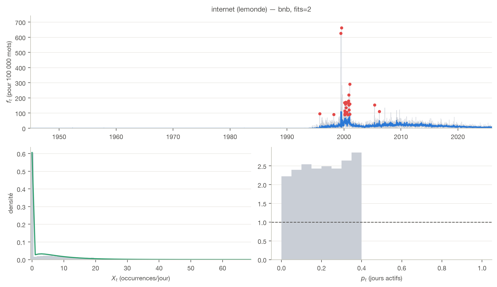
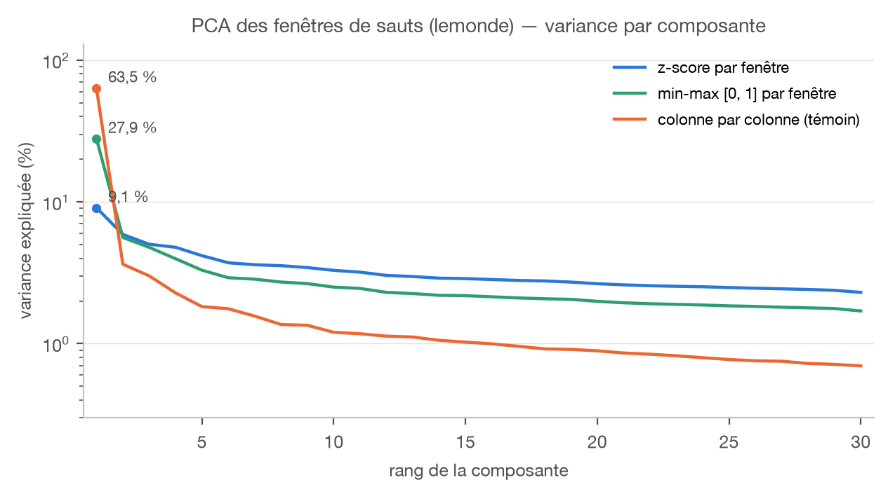
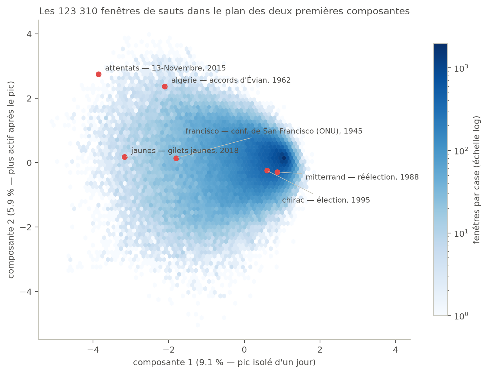
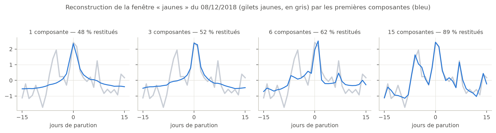
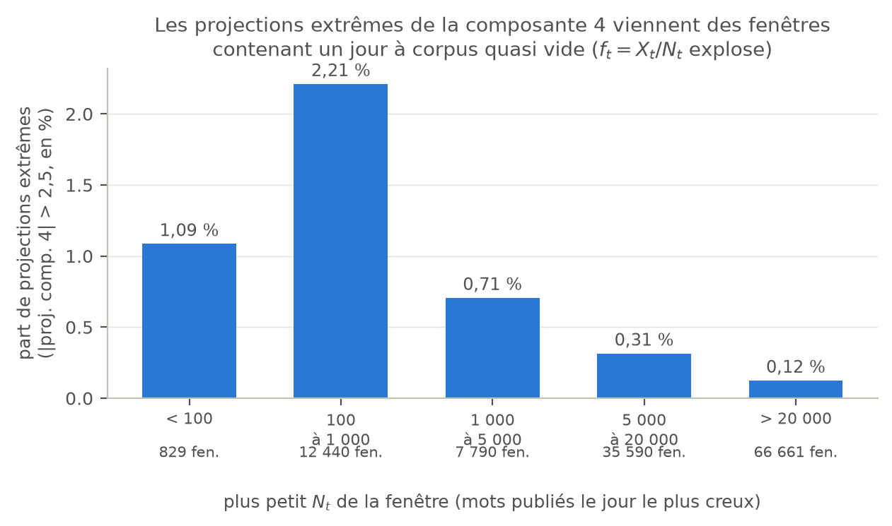

## L'objectif en une page

La question de recherche du mémoire : *les rachats de journaux français
modifient-ils la couverture thématique ?* Avant de comparer des journaux et
des dates de rachat, il faut un instrument : un moyen de repérer et de
décrire **tous** les moments où un mot « saute » dans un journal — une
élection, une catastrophe, un mouvement social font bondir certains mots
pendant quelques jours ou quelques semaines.

La phase 3 construit cet instrument sur Le Monde (26 917 jours de parution,
de décembre 1944 à 2025) : détecter les sauts de chaque mot, en faire des
*datapoints* comparables entre eux, puis regarder à l'aveugle — sans savoir
quel mot ni quelle date — quelles **formes** de sauts existent. C'est le
« modèle zéro » : les mots ne sont que des courbes, et on laisse les données
parler avant d'y remettre du sens.

## La chaîne en cinq étapes

| # | Étape | Script | Sortie | Volume |
|---|-------|--------|--------|--------|
| 1 | Choisir le vocabulaire | `scan_vocab.py` | top-10 000 mots | 441 081 mots scannés |
| 2 | Extraire les séries | `masse.py` | matrice jours × mots | 26 917 × 10 000 |
| 3 | Détecter les pics | `pics_masse.py` | liste (mot, jour, p-valeur) | 164 254 pics |
| 4 | Dédoublonner (NMS) | `nms.py` | un représentant par événement | 123 465 gardés |
| 5 | Découper les fenêtres | `fenetres_masse.py` | matrice des fenêtres ±15 j | 123 310 × 31 |

Chaque étape lit la sortie de la précédente (scripts dans `rupture/` et
`exploration/`) ; tout tourne sur le serveur en quelques secondes à quelques
minutes. Les choix de vocabulaire (unité = la graphie, top-10 000 par nombre
de jours actifs, fusion des doublons OCR) sont détaillés dans le journal des
21-22/07.

## Étape 3 — qu'est-ce qu'un « pic » ?

Pour chaque mot, on compte ses occurrences jour par jour : $X_t$ occurrences
sur $N_t$ mots publiés ce jour-là. On ajuste ensuite une loi de probabilité
qui décrit le comportement *habituel* du mot (un mélange : probabilité
$p_0$ de ne pas apparaître du tout, sinon une loi binomiale négative
proportionnelle à la taille $N_t$ du journal du jour). Un jour est déclaré
**pic** quand le comptage observé serait quasi impossible sous ce
comportement habituel : $p_t < 10^{-4}$, soit moins d'une chance sur 10 000.
On appelle **surprise** la quantité $-\log_{10}(p_t)$ : surprise 4 = seuil
de détection, surprise 40 = un jour astronomiquement anormal.

{width=95%}

Sur les 10 000 mots, cette étape détecte **164 254 pics** (9 817 mots ont au
moins un pic ; 11 mots ont un ajustement impossible et sont consignés).

## Étape 4 — un événement, un datapoint (NMS)

Un événement qui dure — une guerre, un mouvement social — produit des
dizaines de jours-pics d'affilée. Si on gardait tout, le même événement
entrerait des dizaines de fois dans l'analyse. Il faut donc **un
représentant par événement**.

L'idée naïve (fusionner de proche en proche tous les pics rapprochés, puis
garder le meilleur de chaque paquet) a un défaut connu : le **chaînage**. Il
suffit d'un pont de pics espacés de moins de 31 jours pour souder des
*années* en un seul bloc, réduit à un seul datapoint. Sur nos données, 164
« groupes géants » de ce type : « syrienne » aurait fondu 760 jours de
parution (2012-2014) en un point unique.

La solution retenue est la *non-maximal suppression* (NMS) **gloutonne**,
héritée de la détection d'objets en vision par ordinateur :

1. trier les pics du mot par surprise décroissante ;
2. garder le plus surprenant, supprimer ses voisins à moins de 31 jours
   de parution **de lui** ;
3. recommencer avec les pics restants.

Le point décisif : un pic supprimé ne supprime personne — la suppression ne
se propage pas de proche en proche, donc pas de groupe géant. Et 31 jours
étant la largeur d'une fenêtre, deux représentants gardés n'ont jamais de
fenêtres qui se chevauchent, par construction.

{width=100%}

Une contre-vérification indépendante (`scipy.signal.find_peaks`, qui
implémente le même principe) donne un résultat identique sur 9 771 mots sur
9 817 ; les écarts restants sont des égalités de surprise départagées
différemment. Bilan : **123 465 représentants** (un pic détecté sur quatre
était un doublon de fenêtre).

## Étape 5 — mettre les fenêtres à la même échelle

Autour de chaque représentant, on découpe la fenêtre des fréquences $f_t$
sur ±15 jours de parution : une courbe de 31 points, un datapoint. Mais on
ne peut pas comparer directement la fenêtre de « guerre » (mot fréquent) et
celle de « francisco » (mot rare) : l'analyse ne verrait que « certains mots
sont plus fréquents que d'autres ».

Chaque fenêtre est donc **normalisée sur elle-même** (z-score : on soustrait
sa moyenne, on divise par son écart-type — il ne reste que la *forme*).
C'était l'objet d'une mise en garde de Benoît : l'option de normalisation
intégrée des fonctions de PCA standardise *colonne par colonne*, ce qui ne
supprime pas les écarts de niveau entre fenêtres. Vérification faite : avec
cette option, la première composante capte 63,5 % de la variance et sa
projection est corrélée à 0,99 au niveau moyen brut de la fenêtre — elle
mesure « le mot est-il fréquent », pas la forme du saut.

{width=85%}

## Étape 6 — la PCA : quelles formes de sauts existent ?

La PCA (analyse en composantes principales) cherche les profils temporels
qui expliquent le mieux les différences entre les 123 310 fenêtres : la
composante 1 est la forme qui distingue le plus les fenêtres entre elles, la
2 la forme suivante, etc. Deux constats.

**Le spectre est plat** : 9,1 %, 5,9 %, 5,0 %, 4,8 %… — les six premières
composantes ne portent qu'un tiers de la variance. Il n'existe pas deux ou
trois formes archétypales qui résumeraient tous les sauts : la diversité des
fenêtres est réelle, et c'est déjà un résultat.

**Les premières formes sont simples et lisibles** :

![Les six premières composantes comme profils temporels (bleu : z-score ; vert : variante [0,1]). Composante 1 : pic isolé d'un jour. 2 : niveau durablement plus élevé après le pic. 3 : bascule avant/après. 4 : creux la veille, rebond. 5-6 : oscillations lentes.](figs/pca_lemonde_composantes.png){width=100%}

Dans le plan des deux premières composantes, les événements historiques se
placent là où on les attend : les épisodes longs et soutenus (13-Novembre,
gilets jaunes, Évian) du côté « activité durable », la masse des petits pics
isolés de l'autre.

{width=88%}

Les fenêtres réelles les plus alignées sur chaque composante confirment la
lecture — et datent des jours qu'on reconnaît :

{width=92%}

Concrètement, que reconstruit-on avec si peu de composantes ? Pour la
fenêtre « jaunes » du 8 décembre 2018 (acte IV des gilets jaunes) :

{width=100%}

## Deux contrôles qui ont appris quelque chose

**L'hypothèse « rythme hebdomadaire » est fausse.** Les composantes 5-6
ressemblaient à une paire d'oscillations calées sur la semaine. Testé : la
phase de ces oscillations n'a aucun lien avec le jour de la semaine du pic
(vecteurs moyens par jour de norme 0,01-0,14, contre une dispersion de
0,80 ; idem en se restreignant à 2000-2025). Ce sont des modes oscillants
génériques — l'hypothèse séduisante ne survit pas à la vérification, et
c'est le contrôle qui le dit.

**La composante 4 a débusqué un artefact de données.** Ses projections
extrêmes viennent de fenêtres contenant un jour à corpus quasi vide (177
mots publiés un jour de 1994, contre 57 000 en médiane) : ce jour-là, deux
occurrences suffisent à faire exploser $f_t = X_t/N_t$. 17 % des fenêtres
contiennent un jour à $N_t < 5\,000$, et la part de projections extrêmes y
est jusqu'à 18 fois plus élevée que dans les fenêtres saines. C'est un
chantier de nettoyage identifié (masquer ou plancher ces jours), noté au
to_do.

{width=80%}

## La suite

- transmettre le CSV des pics (mot, date, fréquence, p-valeur) et ses
  statistiques (co-sauts par jour, amplitudes, pics par mot) ;
- traiter les jours à corpus quasi vide dans les fenêtres ;
- comparer avec la variante « vocabulaire ≥ 1 000 jours actifs »
  (39 316 mots) ;
- puis l'objectif réel : refaire la chaîne sur les autres journaux et
  comparer les fenêtres *par journal* autour des mêmes pics — c'est là que
  la question des rachats se joue.
