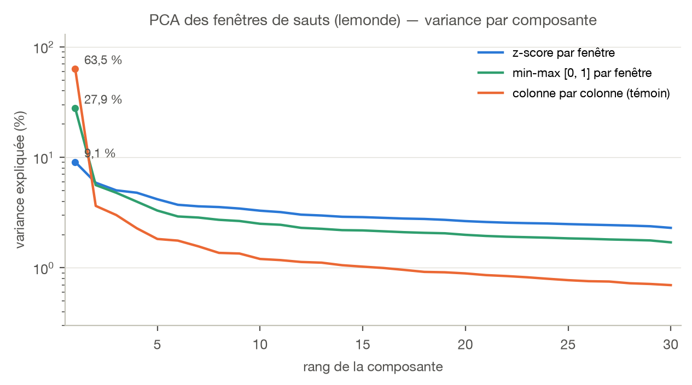
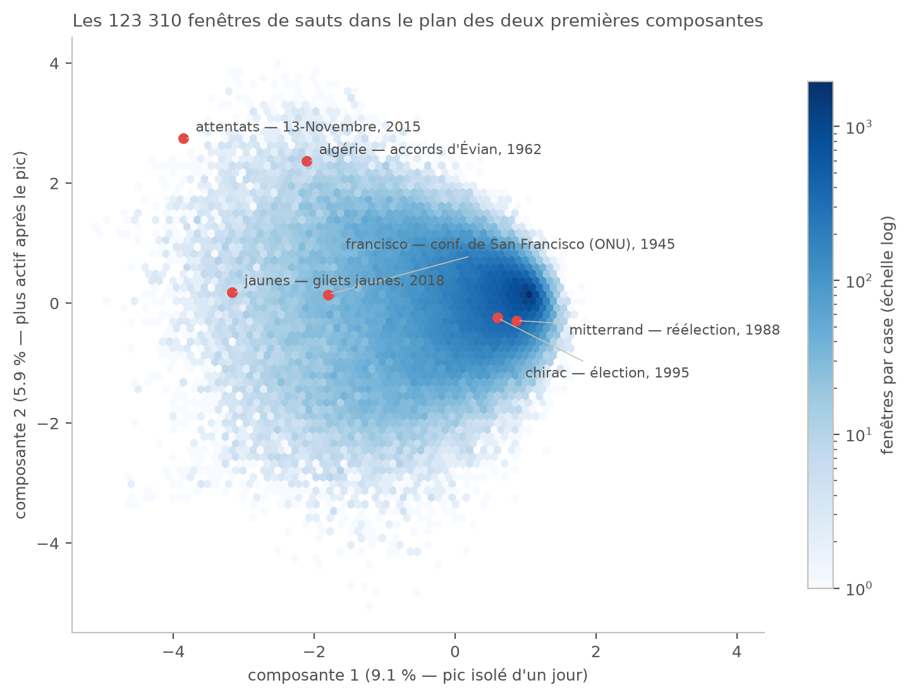
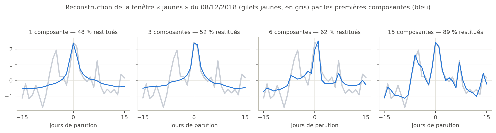
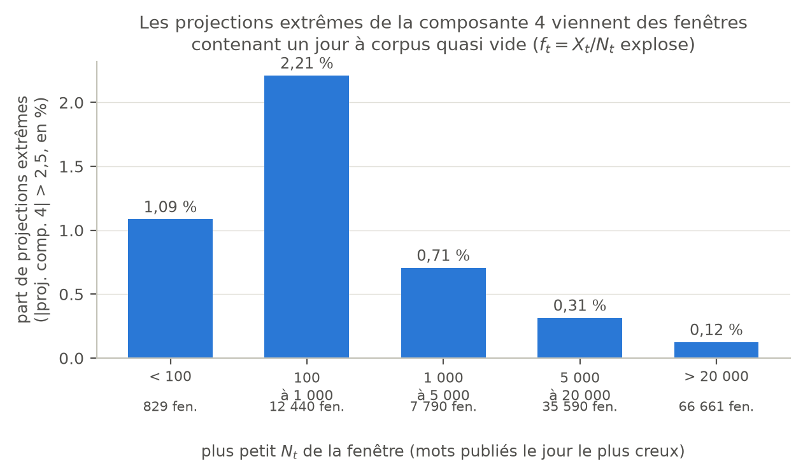
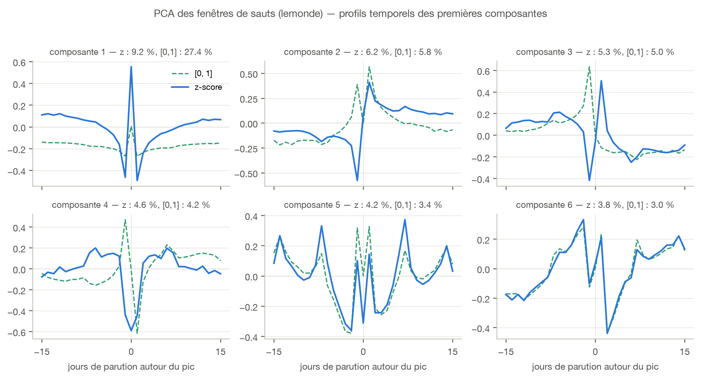
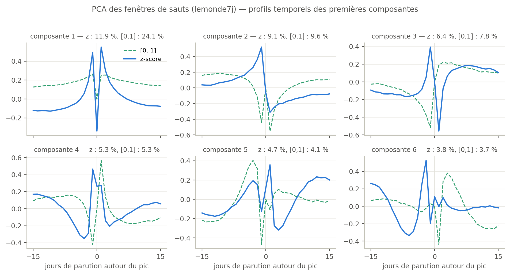

## L'objectif en une page

La question de recherche du mémoire : *les rachats de journaux français
modifient-ils la couverture thématique ?* Avant de comparer des journaux et
des dates de rachat, il faut un instrument : un moyen de repérer et de
décrire **tous** les moments où un mot « saute » dans un journal — une
élection, une catastrophe, un mouvement social font bondir certains mots
pendant quelques jours ou quelques semaines.

La phase 3 construit cet instrument sur Le Monde (26 917 jours de parution,
de décembre 1944 à 2025) : détecter les sauts de chaque mot, en faire des
*datapoints* comparables entre eux, puis regarder à l'aveugle — sans savoir
quel mot ni quelle date — quelles **formes** de sauts existent. C'est le
« modèle zéro » : les mots ne sont que des courbes, et on laisse les données
parler avant d'y remettre du sens.

## La chaîne en cinq étapes

| # | Étape | Script | Sortie | Volume |
|---|-------|--------|--------|--------|
| 1 | Choisir le vocabulaire | `scan_vocab.py` | top-10 000 mots | 441 081 mots scannés |
| 2 | Extraire les séries | `masse.py` | matrice jours × mots | 26 917 × 10 000 |
| 3 | Détecter les pics | `pics_masse.py` | liste (mot, jour, p-valeur) | 164 254 pics |
| 4 | Dédoublonner (NMS) | `nms.py` | un représentant par événement | 123 465 gardés |
| 5 | Découper les fenêtres | `fenetres_masse.py` | matrice des fenêtres ±15 j | 123 310 × 31 |

Chaque étape lit la sortie de la précédente (scripts dans `rupture/` et
`exploration/`) ; tout tourne sur le serveur en quelques secondes à quelques
minutes. Les choix de vocabulaire (unité = la graphie, top-10 000 par nombre
de jours actifs, fusion des doublons OCR) sont détaillés dans le journal des
21-22/07.

## Étape 3 — qu'est-ce qu'un « pic » ?

Pour chaque mot, on compte ses occurrences jour par jour : $X_t$ occurrences
sur $N_t$ mots publiés ce jour-là. On ajuste ensuite une loi de probabilité
qui décrit le comportement *habituel* du mot (un mélange : probabilité
$p_0$ de ne pas apparaître du tout, sinon une loi binomiale négative
proportionnelle à la taille $N_t$ du journal du jour). Un jour est déclaré
**pic** quand le comptage observé serait quasi impossible sous ce
comportement habituel : $p_t < 10^{-4}$, soit moins d'une chance sur 10 000.
On appelle **surprise** la quantité $-\log_{10}(p_t)$ : surprise 4 = seuil
de détection, surprise 40 = un jour astronomiquement anormal.

{width=95%}

Sur les 10 000 mots, cette étape détecte **164 254 pics** (9 817 mots ont au
moins un pic ; 11 mots ont un ajustement impossible et sont consignés).

## Étape 4 — un événement, un datapoint (NMS)

Un événement qui dure — une guerre, un mouvement social — produit des
dizaines de jours-pics d'affilée. Si on gardait tout, le même événement
entrerait des dizaines de fois dans l'analyse. Il faut donc **un
représentant par événement**.

L'idée naïve (fusionner de proche en proche tous les pics rapprochés, puis
garder le meilleur de chaque paquet) a un défaut connu : le **chaînage**. Il
suffit d'un pont de pics espacés de moins de 31 jours pour souder des
*années* en un seul bloc, réduit à un seul datapoint. Sur nos données, 164
« groupes géants » de ce type : « syrienne » aurait fondu 760 jours de
parution (2012-2014) en un point unique.

La solution retenue est la *non-maximal suppression* (NMS) **gloutonne**,
héritée de la détection d'objets en vision par ordinateur :

1. trier les pics du mot par surprise décroissante ;
2. garder le plus surprenant, supprimer ses voisins à moins de 31 jours
   de parution **de lui** ;
3. recommencer avec les pics restants.

Le point décisif : un pic supprimé ne supprime personne — la suppression ne
se propage pas de proche en proche, donc pas de groupe géant. Et 31 jours
étant la largeur d'une fenêtre, deux représentants gardés n'ont jamais de
fenêtres qui se chevauchent, par construction.

{width=100%}

Une contre-vérification indépendante (`scipy.signal.find_peaks`, qui
implémente le même principe) donne un résultat identique sur 9 771 mots sur
9 817 ; les écarts restants sont des égalités de surprise départagées
différemment. Bilan : **123 465 représentants** (un pic détecté sur quatre
était un doublon de fenêtre).

## Étape 5 — mettre les fenêtres à la même échelle

Autour de chaque représentant, on découpe la fenêtre des fréquences $f_t$
sur ±15 jours de parution : une courbe de 31 points, un datapoint. Mais on
ne peut pas comparer directement la fenêtre de « guerre » (mot fréquent) et
celle de « francisco » (mot rare) : l'analyse ne verrait que « certains mots
sont plus fréquents que d'autres ».

Chaque fenêtre est donc **normalisée sur elle-même** (z-score : on soustrait
sa moyenne, on divise par son écart-type — il ne reste que la *forme*).
C'était l'objet d'une mise en garde de Benoît : l'option de normalisation
intégrée des fonctions de PCA standardise *colonne par colonne*, ce qui ne
supprime pas les écarts de niveau entre fenêtres. Vérification faite : avec
cette option, la première composante capte 63,5 % de la variance et sa
projection est corrélée à 0,99 au niveau moyen brut de la fenêtre — elle
mesure « le mot est-il fréquent », pas la forme du saut.

{width=85%}

## Étape 6 — la PCA : quelles formes de sauts existent ?

La PCA (analyse en composantes principales) cherche les profils temporels
qui expliquent le mieux les différences entre les 123 310 fenêtres : la
composante 1 est la forme qui distingue le plus les fenêtres entre elles, la
2 la forme suivante, etc. Deux constats.

**Le spectre est plat** : 9,1 %, 5,9 %, 5,0 %, 4,8 %… — les six premières
composantes ne portent qu'un tiers de la variance. Il n'existe pas deux ou
trois formes archétypales qui résumeraient tous les sauts : la diversité des
fenêtres est réelle, et c'est déjà un résultat.

**Les premières formes sont simples et lisibles** :

![Les six premières composantes comme profils temporels (bleu : z-score ; vert : variante [0,1]). Composante 1 : pic isolé d'un jour. 2 : niveau durablement plus élevé après le pic. 3 : bascule avant/après. 4 : creux la veille, rebond. 5-6 : oscillations lentes.](figs/pca_lemonde_composantes.png){width=100%}

Dans le plan des deux premières composantes, les événements historiques se
placent là où on les attend : les épisodes longs et soutenus (13-Novembre,
gilets jaunes, Évian) du côté « activité durable », la masse des petits pics
isolés de l'autre.

{width=88%}

Les fenêtres réelles les plus alignées sur chaque composante confirment la
lecture — et datent des jours qu'on reconnaît :

{width=92%}

Concrètement, que reconstruit-on avec si peu de composantes ? Pour la
fenêtre « jaunes » du 8 décembre 2018 (acte IV des gilets jaunes) :

{width=100%}

## Deux contrôles qui ont appris quelque chose

**L'hypothèse « rythme hebdomadaire » est fausse.** Les composantes 5-6
ressemblaient à une paire d'oscillations calées sur la semaine. Testé : la
phase de ces oscillations n'a aucun lien avec le jour de la semaine du pic
(vecteurs moyens par jour de norme 0,01-0,14, contre une dispersion de
0,80 ; idem en se restreignant à 2000-2025). Ce sont des modes oscillants
génériques — l'hypothèse séduisante ne survit pas à la vérification, et
c'est le contrôle qui le dit.

**La composante 4 a débusqué un artefact de données.** Ses projections
extrêmes viennent de fenêtres contenant un jour à corpus quasi vide (177
mots publiés un jour de 1994, contre 57 000 en médiane) : ce jour-là, deux
occurrences suffisent à faire exploser $f_t = X_t/N_t$. 17 % des fenêtres
contiennent un jour à $N_t < 5\,000$, et la part de projections extrêmes y
est jusqu'à 18 fois plus élevée que dans les fenêtres saines.

{width=80%}

## La V2 : corriger l'artefact sans déformer le résultat

Le second contrôle a débouché le jour même sur une **V2 de l'analyse**
(implémentée dans `rupture/pca.py`, désormais le défaut ; la V1 reste
reproductible). Deux gestes, volontairement minimaux :

- dans chaque fenêtre, les jours à $N_t < 5\,000$ sont remplacés par
  l'**interpolation linéaire** des jours sains voisins (38 532 jours
  corrigés dans 19 554 fenêtres — 2 par fenêtre touchée en médiane) ;
- les 1 505 fenêtres (1,2 %) dont le **jour central** est lui-même quasi
  vide sont écartées : le pic reste statistiquement valide (la détection
  tient compte de $N_t$), mais la forme de sa fenêtre n'est pas exploitable.

Le seuil de 5 000 est posé à la frontière naturelle de la population
pathologique (321 jours < 5 000 sur 26 917, puis la pente reprend), et le
résultat n'y est pas sensible : entre 2 000 et 10 000, les premières
composantes bougent de moins de 4 degrés.

Le bilan chiffré, avant/après :

| Critère | V1 | V2 |
|---|---|---|
| Enrichissement corpus-vide de la comp. 4 | ×17,8 | ×0,5 (disparu) |
| Spectre (6 premières, %) | 9,1 / 5,9 / 5,0 / 4,8 / 4,2 / 3,7 | 9,2 / 6,2 / 5,3 / 4,6 / 4,2 / 3,8 |
| Stabilité des composantes (\|cos\| V1-V2) | — | ≥ 0,94 sur les six premières |
| Archétypes de la comp. 4 | jours à 177 mots (artefact) | « désastre », 19/03/2011 (Fukushima) |

La lecture à retenir : **seule la direction qui portait l'artefact se
réorganise** (18,7° d'angle, contre moins de 3° pour les autres), le spectre
et les profils restent en place. Les conclusions du modèle zéro — spectre
plat, formes simples — sont donc *robustes* au nettoyage, ce qui les
consolide comme résultat.

{width=100%}

Restent notés au to_do pour plus tard : écrire la surprise en pleine
précision dans les CSV (elle est arrondie à 2 décimales, source de 45 des
46 écarts de contre-vérification du NMS — cosmétique), et une piste de V3
discutée avec Benoît : remplir les fenêtres de **résidus standardisés** sous
la loi ajustée plutôt que de fréquences brutes, ce qui éliminerait la
sensibilité à $N_t$ par construction.

## Changer d'échelle : la même chaîne sur des blocs de 3 jours

La chaîne entière a été rejouée sur une timeline agrégée
(`rupture/agreger.py`) : les jours de parution regroupés par 3, consécutifs
et non chevauchants — $X$ et $N$ sommés par bloc, date du bloc = jour du
milieu, même vocabulaire de 10 000 mots. Aucun autre réglage ne change :
les scripts aval tournent tels quels, et les fenêtres couvrent ±15
*blocs*, soit ±45 jours de parution — l'instrument sonde des formes trois
fois plus lentes.

| Étape | journalier | blocs de 3 jours |
|---|---|---|
| Grille | 26 917 jours | 8 972 blocs |
| Pics détectés | 164 254 | 76 267 |
| Gardés après NMS | 123 465 (75 %) | 49 983 (65 %) |
| Fenêtres | 123 310 | 49 771 |

Trois enseignements.

**L'artefact corpus-vide disparaît par construction.** Le plus petit bloc
pèse 17 785 mots — 3,5 fois le seuil journalier de 5 000 — et aucun bloc
n'a ses trois jours quasi vides : chaque jour pathologique est noyé dans
un bloc avec des voisins sains. La V2 n'a donc rien à nettoyer (tout seuil
jusqu'à 17 785 donne un résultat identique bit à bit) ; l'agrégation est
une troisième réponse au problème du corpus quasi vide, à côté de
l'interpolation (V2) et des résidus standardisés (V3).

**Les formes sont les mêmes aux deux échelles.** Chaque composante de la
grille 3 jours retrouve sa correspondante journalière (cosinus entre
profils) : 0,98 pour la composante 1, 0,92 pour la 2, 0,90 pour la 3,
0,85 pour la 4 — seules les 5 et 6 échangent leur rang. Le pic isolé,
l'installation durable, la bascule avant/après existent à l'échelle du
jour comme à celle du bloc : ces formes ne sont pas un artefact de
l'échantillonnage journalier, et c'est un argument de robustesse de plus
pour le modèle zéro.

**Le spectre reste plat.** 11,5 / 8,0 / 5,6 / 4,8 / 4,3 / 3,8 % — un peu
plus concentré qu'en journalier (37,9 % à $K = 6$ contre 33,3 %), mais
toujours 8 composantes au-dessus de l'isotropie à 3,33 % : pas de
typologie des sauts à cette échelle non plus.

Les contrôles passent à l'identique : corrélation de la projection 1 au
niveau moyen brut 0,28 (le témoin « colonne par colonne » monte, lui, à
75,9 % — la mise en garde vaut a fortiori sur les blocs), aucune
composante pilotée par une poignée de fenêtres extrêmes.

{width=100%}

Deux réserves : moitié moins de datapoints (49 771 — les sous-événements à
moins de 93 jours de parution l'un de l'autre fusionnent sous le NMS), et
la phase du découpage (quel jour ouvre le premier bloc) est arbitraire —
un contrôle en décalant le découpage de 1 et 2 jours reste à faire.

## Et sur des blocs d'une semaine

Même exercice avec des blocs de 7 jours de parution — un peu plus d'une
semaine calendaire en moyenne, Le Monde ne paraissant pas tous les jours.
Le plus petit bloc pèse 55 684 mots (corpus-vide toujours sans objet), et
la fenêtre couvre ±105 jours de parution, soit environ huit mois
calendaires de bout en bout : l'échelle des crises longues.

| Étape | journalier | 3 jours | 7 jours |
|---|---|---|---|
| Grille | 26 917 jours | 8 972 blocs | 3 845 blocs |
| Pics détectés | 164 254 | 76 267 | 44 955 |
| Gardés après NMS | 123 465 | 49 983 | 26 784 |
| Fenêtres | 123 310 | 49 771 | 26 457 |
| Mots avec au moins un pic | 9 817 | 8 514 | 7 028 |

La hiérarchie des formes tient toujours. Les composantes 1-2-3 de la
grille hebdomadaire sont celles du journalier à 0,97, 0,96 et 0,98 de
cosinus (0,99, 0,97 et 0,94 avec la grille 3 jours) ; la 4 s'y retrouve à
0,80, et l'échange des rangs 5-6 déjà vu en 3 jours se répète à
l'identique — la composante 5 hebdomadaire est la 6 journalière (cosinus
0,91). Trois timelines, une seule grammaire de formes.

Le spectre : 11,9 / 9,1 / 6,4 / 5,3 / 4,7 / 3,8 %. Mis côte à côte, les
trois échelles dessinent une tendance nette — plus la timeline est
grossière, plus la variance se concentre : 33,3 %, 37,9 %, 41,2 % à
$K = 6$. Mais la concentration reste modeste : toujours 8 composantes
au-dessus de l'isotropie à 3,33 %, spectre plat, pas de typologie des
sauts à l'échelle de la semaine non plus. Les contrôles passent
(corrélation projection 1–niveau moyen : 0,23 ; le témoin « colonne par
colonne » monte à 81,5 %).

{width=100%}

Une réserve propre à cette échelle : l'agrégation agit comme un **filtre
passe-bas sur la détection elle-même**. Un pic d'un seul jour se dilue
dans un bloc dont le $N$ est sept fois plus gros et peut passer sous le
seuil : 2 800 mots qui avaient des pics en journalier n'en ont plus en
hebdomadaire. Les trois grilles ne voient pas exactement la même
population d'événements — c'est un choix d'instrument, pas un défaut.

## La suite

- transmettre le CSV des pics (mot, date, fréquence, p-valeur) et ses
  statistiques (co-sauts par jour, amplitudes, pics par mot) ;
- comparer avec la variante « vocabulaire ≥ 1 000 jours actifs »
  (39 316 mots) ;
- puis l'objectif réel : refaire la chaîne sur les autres journaux et
  comparer les fenêtres *par journal* autour des mêmes pics — c'est là que
  la question des rachats se joue.

## Annexe pédagogique — le déroulé mathématique, pas à pas

Tout le modèle zéro tient en quatre idées : *une fenêtre est un vecteur*,
*le z-score ne garde que la forme*, *la PCA cherche les axes qui étalent le
plus le nuage*, *la reconstruction dit ce que valent ces axes*. La V2 ajoute
une cinquième idée, de statistique élémentaire : *une fréquence estimée sur
un tout petit échantillon ne veut rien dire*. On reprend chaque idée dans
l'ordre : d'abord la théorie, puis le lien avec notre cas, puis un exemple
chiffré sur les vraies données.

### A. Une fenêtre est un vecteur de $\mathbb{R}^{31}$

**Théorie.** Une *observation* multivariée est un vecteur
$x = (x_1, \dots, x_D) \in \mathbb{R}^D$ : $D$ nombres qui décrivent un même
objet. Un jeu de $n$ observations se range dans une matrice à $n$ lignes et
$D$ colonnes. Géométriquement, chaque observation est **un point** dans un
espace à $D$ dimensions — on ne peut pas le dessiner au-delà de $D = 3$,
mais toutes les intuitions de la géométrie (distances, angles, projections)
restent valables.

::: {.callout-note title="Dans notre cas"}
$D = 31$ : la coordonnée $x_j$ est la fréquence $f_t$ du mot au $j$-ième
jour de sa fenêtre (le pic est au centre, position 16). $n = 123\,310$
fenêtres en V1, $121\,805$ en V2. La matrice $n \times 31$ est le fichier
`fenetres_lemonde.npz`.
:::

::: {.callout-tip title="Exemple réel"}
La fenêtre « jaunes » du 08/12/2018 (acte IV des gilets jaunes) est le
vecteur (57,2 ; 105,5 ; … ; 162,1 ; **248,4** ; 233,9 ; … ; 126,6) —
31 fréquences en occurrences pour 100 000 mots, le
maximum au jour du pic.
:::

### B. Centrer-réduire : le z-score

**Théorie.** Soit $X$ une variable aléatoire d'espérance $\mathbb{E}(X)$ et
de variance $\mathrm{Var}(X) = \mathbb{E}\big[(X - \mathbb{E}(X))^2\big]$ ;
son écart-type est $\sigma(X) = \sqrt{\mathrm{Var}(X)}$. On centre-réduit en
posant

$$Z = \frac{X - \mathbb{E}(X)}{\sigma(X)},$$

et alors $\mathbb{E}(Z) = 0$ et $\sigma(Z) = 1$. $Z$ répond à la question
« *à combien d'écarts-types de la moyenne suis-je ?* » — c'est un nombre
sans unité, donc comparable d'une variable à l'autre. Version empirique
pour un vecteur $x \in \mathbb{R}^D$ : la moyenne
$\bar{x} = \frac{1}{D}\sum_{j=1}^{D} x_j$, l'écart-type
$s = \sqrt{\frac{1}{D}\sum_{j=1}^{D}(x_j - \bar{x})^2}$, et

$$z_j = \frac{x_j - \bar{x}}{s}, \qquad j = 1, \dots, D.$$

L'intuition : deux courbes de niveaux très différents mais de même allure
deviennent, après z-score, **la même courbe**. On jette le niveau, on garde
la forme.

::: {.callout-note title="Dans notre cas"}
On centre-réduit **chaque fenêtre le long de ses 31 jours**. « guerre »
(mot fréquent) et « francisco » (mot rare) deviennent comparables : deux
formes de moyenne 0 et d'écart-type 1. Attention au piège vérifié en
étape 5 : centrer-réduire *colonne par colonne* (ce que fait l'option par
défaut des logiciels) ne retire **pas** les écarts de niveau *entre*
fenêtres — la PCA verrait d'abord « mot fréquent contre mot rare » (63,5 %
de la variance, corrélation 0,99 au niveau moyen brut : notre témoin
`col`).
:::

::: {.callout-tip title="Exemple réel"}
Fenêtre « jaunes » du 08/12/2018 : $\bar{x}$ = 117,6 et $s$ = 53,9. Au
centre, $x_{16}$ = 248,4, donc

$$z_{16} = \frac{248.4 - 117.6}{53.9} = 2.43 :$$

le 8 décembre est à 2,4 écarts-types au-dessus du niveau moyen de sa
quinzaine. À l'inverse, un jour calme de la fenêtre ($x$ = 55,1) donne
$z$ = (55,1 − 117,6)/53,9 = −1,16.
:::

### C. La PCA : les directions qui étalent le plus le nuage

**Théorie.** On dispose de $n$ points $z_i \in \mathbb{R}^D$ (nos fenêtres
z-scorées). On note $\bar{z}$ le point moyen et on centre le nuage
($z_i - \bar{z}$). La *matrice de covariance* $C$, de taille $D \times D$,
résume la forme du nuage : son coefficient $C_{jk}$ mesure si les
coordonnées $j$ et $k$ varient ensemble.

La PCA pose la question : *quel axe étale le plus le nuage ?* Formellement,
on cherche un vecteur unitaire $v$ ($\lVert v \rVert = 1$) qui maximise la
variance des projections $z_i \cdot v$, c'est-à-dire qui maximise
$v^T C v$. Le théorème spectral répond : le maximum est atteint par le
**vecteur propre** $v_1$ de $C$ associé à la plus grande valeur propre
$\lambda_1$, et cette variance maximale vaut $\lambda_1$. On recommence
dans l'orthogonal de $v_1$ : on obtient $v_2$, puis $v_3$, etc., jusqu'à
une base orthonormée $v_1, \dots, v_D$ avec
$\lambda_1 \geq \lambda_2 \geq \dots \geq 0$. La *part de variance
expliquée* par la composante $k$ est $\lambda_k / \sum_{l} \lambda_l$.

Chaque point du nuage se décompose alors exactement comme

$$z = \bar{z} + \sum_{k=1}^{D} c_k\, v_k, \qquad c_k = (z - \bar{z}) \cdot v_k,$$

où $c_k$ (la *projection* sur la composante $k$) est la coordonnée de la
fenêtre dans la nouvelle base.

L'intuition la plus simple : faire tourner un nuage de points devant une
lampe et chercher l'angle où **l'ombre est la plus étalée** — cet angle est
$v_1$ ; puis on fige $v_1$ et on cherche l'ombre la plus étalée dans les
directions restantes, et ainsi de suite. La PCA fait cela en dimension 31,
par un calcul exact (décomposition en valeurs singulières).

::: {.callout-note title="Dans notre cas"}
$D = 31$, donc chaque $v_k$ est lui-même une suite de 31 nombres — **un
profil temporel qu'on peut tracer** : c'est exactement la figure des
composantes. $v_1$ = « pic isolé d'un jour » (9,2 % de la variance),
$v_2$ = « plus actif après le pic » (6,2 %), etc. Le spectre est *plat* :
aucune forme ne domine, la diversité des sauts est réelle. Détail qui
surprend sur la figure : $\lambda_{31} \approx 0$, car une fenêtre z-scorée
a toujours une somme nulle — le nuage vit dans un hyperplan de dimension
30, la 31e direction est vide par construction.
:::

::: {.callout-tip title="Exemple réel"}
Fenêtre « jaunes » du 08/12/2018 : $c_1$ = −3,12, $c_2$ = 0,36,
$c_3$ = 1,10, $c_4$ = 0,89. Lecture : $c_1$ très négatif = cette
fenêtre est à *l'opposé* du profil « pic isolé d'un jour » — l'épisode
gilets jaunes est un massif d'activité étalé, pas un feu de paille (le
signe d'une composante est arbitraire ; seul compte le contraste entre
projections positives et négatives). C'est le point rouge « jaunes » à
gauche du plan des composantes 1-2.
:::

### D. Reconstruction : ce que valent $K$ composantes

**Théorie.** Si on tronque la décomposition à $K$ composantes,

$$z^{(K)} = \bar{z} + \sum_{k=1}^{K} c_k\, v_k,$$

on obtient la meilleure approximation possible du nuage par $K$ directions
(au sens des moindres carrés), et l'erreur quadratique moyenne restante
vaut exactement $\sum_{k > K} \lambda_k$. La « variance expliquée à $K$ »
est $\sum_{k \leq K} \lambda_k \big/ \sum_l \lambda_l$.

::: {.callout-note title="Dans notre cas"}
Cumul global (V2) : 9 % à $K = 1$, 21 % à $K = 3$, 33 % à $K = 6$, 62 % à
$K = 15$. C'est la traduction chiffrée du « spectre plat » : il faut
beaucoup de directions pour décrire le nuage.
:::

::: {.callout-tip title="Exemple réel"}
La fenêtre « jaunes » se reconstruit à 48 % avec une seule composante, 52 %
avec 3, 62 % avec 6, 89 % avec 15 — c'est la figure de reconstruction
progressive. Elle se reconstruit mieux que la moyenne du nuage : normal,
c'est une fenêtre très structurée.
:::

### E. La V2 : une fréquence estimée sur 177 mots ne veut rien dire

**Théorie.** La fréquence observée $\hat{f} = X/N$ *estime* la vraie
propension $p$ du jour. Si chaque mot publié est « le mot étudié » avec
probabilité $p$, alors $X$ suit une loi binomiale et

$$\mathrm{Var}(\hat{f}) = \frac{p(1-p)}{N} \approx \frac{p}{N} :$$

l'incertitude **explose quand $N$ est petit**. C'est l'intuition du
sondage : estimer un pourcentage sur 177 personnes au lieu de 57 000.
Ordre de grandeur : pour $p = 20$ pour 100 000 et $N = 177$, on attend
$\mathbb{E}(X)$ = 0,035 occurrence — on observe presque toujours 0,
parfois 1 ou 2, et $\hat{f}$ vaut 0, 565 ou 1 130 pour 100 000 :
l'estimateur ne mesure plus rien.

Le remède V2 est l'**interpolation linéaire** : si le jour $j$ est douteux
et que $a < j < b$ sont les jours sains les plus proches, on remplace

$$f_j \leftarrow f_a + \frac{j - a}{b - a}\,(f_b - f_a),$$

c'est-à-dire le segment de droite entre les deux voisins sains.

::: {.callout-note title="Dans notre cas"}
Seuil : $N_t < 5\,000$ (321 jours sur 26 917, une population à part —
grèves, débuts du journal). Le **centre** de la fenêtre n'est jamais
interpolé : c'est l'objet d'étude ; s'il est douteux, on écarte la fenêtre
entière (1 505 cas, 1,2 %).
:::

::: {.callout-tip title="Exemple réel"}
Fenêtre « canal », pic du 06/11/1994. Huit jours plus tard, le 14/11/1994,
Le Monde ne publie que $N = 177$ mots ; « canal » y apparaît $X = 2$ fois,
d'où $\hat{f} = 1\,130$ pour 100 000 — **25 fois** le reste de la fenêtre,
pour deux malheureuses occurrences. Ses voisins sains : 13/11,
$f$ = 43,6 ($N$ = 75 686) et 15/11, $f$ = 11,2 ($N$ = 71 152).
Interpolation : (43,6 + 11,2)/2 = 27,4. La fenêtre redevient
lisible. À l'échelle du nuage entier, ce geste fait passer
l'enrichissement corpus-vide de la composante 4 de ×17,8 à ×0,5 sans
déplacer les composantes 1-3 de plus de 3 degrés.
:::

### F. Résumé en cinq phrases (pour la présentation)

1. Chaque saut détecté devient **un point de $\mathbb{R}^{31}$** : sa
   fenêtre de fréquences sur ±15 jours de parution.
2. Le **z-score par fenêtre** jette le niveau et garde la forme — sans lui,
   l'analyse ne verrait que « mot fréquent contre mot rare » (vérifié :
   63,5 % de variance artefactuelle).
3. La **PCA** trouve les profils temporels qui étalent le plus le nuage ;
   en dimension 31, chaque profil se trace et se lit.
4. Résultat du modèle zéro : **spectre plat** (pas de forme dominante) et
   profils simples — pic d'un jour, activité durable après, bascule
   avant/après.
5. La **V2** répare les jours à journal quasi vide ($\hat{f} = X/N$ trop
   bruité quand $N$ est minuscule) : l'artefact disparaît, les conclusions
   ne bougent pas — c'est le signe qu'elles sont solides.
