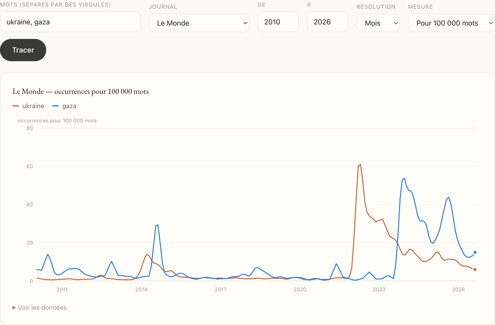
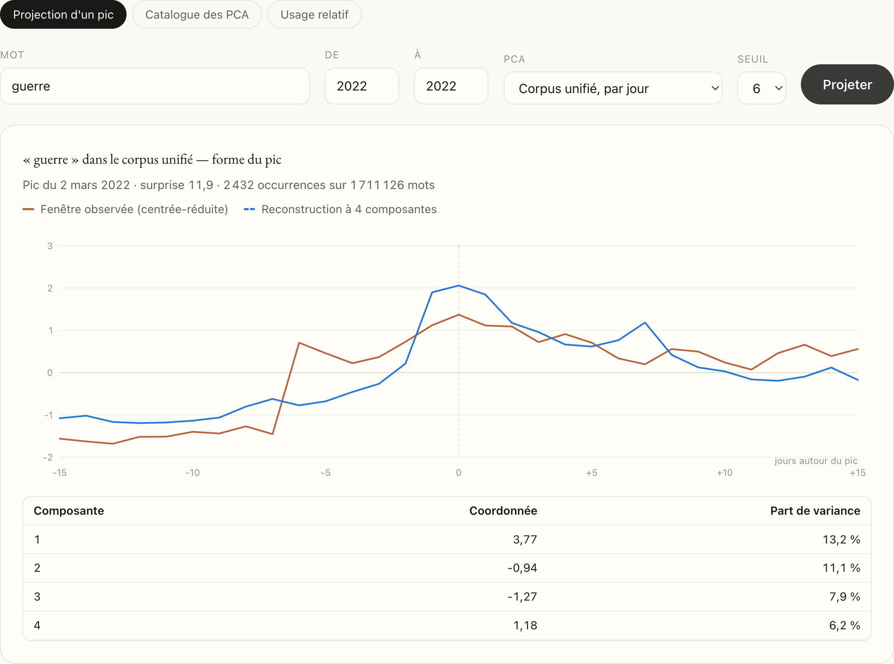
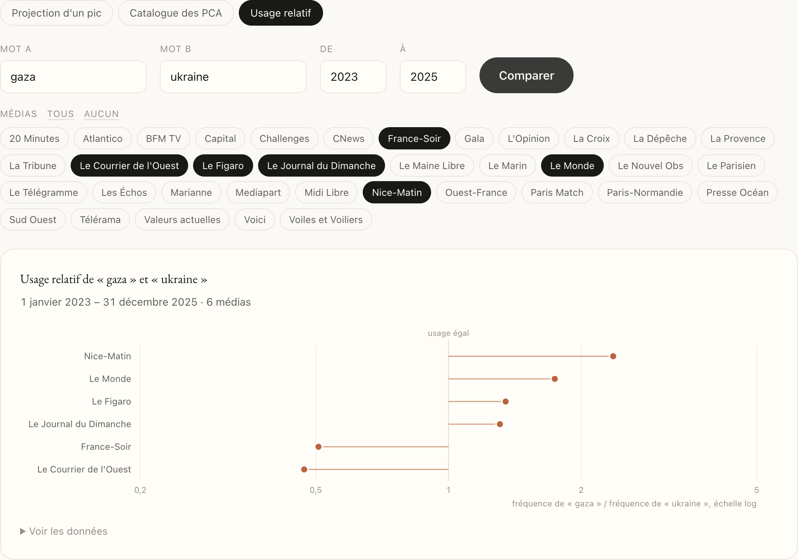

```{python}
# Toutes les figures sont calculées ici, depuis des données déjà présentes dans
# le dépôt (paper/donnees_maths/series_mots.csv, campagne_pca/data, campagne_pca/site_pca,
# campagne_pca/correlo). Aucune image sur le disque.
import sys
from pathlib import Path
sys.path.insert(0, str(Path("../..").resolve()))

import numpy as np
import pandas as pd
import matplotlib
import matplotlib.pyplot as plt
import matplotlib.dates as mdates
from matplotlib.patches import FancyBboxPatch, FancyArrowPatch

import campagne_pca.scripts.figures_lib as lib      # style matplotlib du projet
from rupture import fiches, pics
from rupture.pca import centrer, normaliser, pca as pca_fn

# rupture.fiches impose Agg à l'import : on rend la main au backend inline de
# Jupyter, sans quoi plt.show() n'insère rien dans le document.
matplotlib.use("module://matplotlib_inline.backend_inline")

ROUGE, BLEU, BLEU_CLAIR, ORANGE, VERT = "#b5312f", "#2f6ea6", "#a9c6e4", "#e8912d", "#3fa871"
ENCRE2, GRILLE, GRIS = lib.ENCRE2, lib.GRILLE, "#c9ced6"
vir = lambda x, k=1: f"{x:.{k}f}".replace(".", ",")
```

```{=typst}
#set par(justify: true)
#set text(lang: "fr")
#show figure.caption: set text(size: 8.5pt, fill: rgb("#52514e"))
#show figure: set block(above: 1.2em, below: 1.4em)
#show heading.where(level: 1): set text(size: 15pt)
#show heading.where(level: 2): set text(size: 12pt)
#show heading.where(level: 3): set text(size: 10.5pt, style: "italic")
#show heading.where(level: 1): it => [#v(0.6em) #it #v(0.3em)]

// ---------------------------------------------------------------- page de garde
#page(numbering: none)[
  #v(1.5cm)
  #align(center)[
    #text(size: 11pt)[Université Paris Cité \ UFR de Mathématiques]
    #v(0.4cm)
    #text(size: 11pt)[Master 2 Mathématiques et Informatique pour la Science des Données (MIADS)]
    #v(3cm)
    #text(size: 20pt, weight: "bold")[Rapport de stage]
    #v(0.8cm)
    #text(size: 15pt)[Mesurer la presse française en ligne : \ un corpus de 19 millions d'articles et un outil pour explorer les tendances]
    #v(2.5cm)
    #text(size: 12pt)[Elias Echikr]
    #v(2.5cm)
    #text(size: 11pt)[
      Stage effectué au Laboratoire de Probabilités, Statistique et Modélisation (LPSM) \
      Université Paris Cité, 8 place Aurélie Nemours, 75013 Paris \
      #v(0.4cm)
      Encadrants : Simon Coste (LPSM) et Benoît de Courson (London School of Economics) \
      #v(0.4cm)
      Avril à septembre 2026
    ]
  ]
]
#show outline.entry.where(level: 1): it => { v(0.5em, weak: true); strong(it) }
#outline(title: "Sommaire", depth: 2, indent: 1.2em)
#pagebreak()
```

# Remerciements {.unnumbered}

Je tiens d'abord à remercier Simon Coste et Benoît de Courson pour leur accompagnement tout au long de ce stage. Merci à Simon pour les nombreux rendez-vous, semaine après semaine : c'est à ses questions et à ses arbitrages que la partie statistique de ce rapport doit sa forme. Merci à Benoît d'avoir ouvert la voie avec Gallicagram, mis à disposition les moyens de calcul nécessaires et partagé sans compter son expérience et ses conseils.

Je remercie également toute l'équipe du master MIADS, pour la qualité de la formation et pour son écoute pendant ces deux années, et plus généralement l'équipe pédagogique de l'UFR de mathématiques d'Université Paris Cité, qui m'a accompagné tout au long de ma scolarité et m'a transmis ses connaissances. Ce rapport est aussi le fruit de leurs enseignements.

```{=typst}
#pagebreak()
```

# Contexte du stage

## La structure d'accueil

Le stage s'est déroulé d'avril à septembre 2026 au Laboratoire de Probabilités, Statistique et Modélisation (LPSM, UMR 8001), unité mixte de recherche du CNRS, de Sorbonne Université et d'Université Paris Cité. Le LPSM réunit des équipes de probabilités, de statistique mathématique et de modélisation appliquée. Le stage a été encadré par Simon Coste, maître de conférences au LPSM, en collaboration avec Benoît de Courson, postdoctorant à la London School of Economics et créateur de Gallicagram^[<https://shiny.ens-paris-saclay.fr/app/gallicagram>] [@azoulay2023gallicagram], l'outil de lexicométrie qui a servi de modèle au projet. Le projet est inspiré du papier de Cécilia Aubrun, Rudy Morel, Michael Benzaquen et Jean-Philippe Bouchaud (CFM, École polytechnique) sur les sauts de prix boursiers [@aubrun2025riding]. Ce dernier a pris connaissance des travaux sur la classification des pics d'attention lors d'une réunion et s'y est montré intéressé.

Les moyens matériels ont été fournis par les partenaires du laboratoire : un serveur de calcul dédié à la collecte du corpus, puis, à partir d'août, un accès au serveur de Gallicagram hébergé à l'ENS Paris-Saclay pour les calculs lourds.

## Le contexte : une presse qui change de mains

Depuis vingt ans, la presse française change de mains. Le mouvement n'est pas nouveau, il commence avec Robert Hersant dans les années 1970 et 1980 (*Le Figaro* en 1975, *France-Soir* en 1976), mais il s'est accéléré avec la crise économique de la presse imprimée, qui a rendu les titres bon marché et déficitaires, donc dépendants d'actionnaires capables d'absorber les pertes [@ina_magnats]. Serge Dassault reprend le groupe Socpresse et *Le Figaro* en 2004. Bernard Arnault rachète *Les Échos* en 2007, puis *Le Parisien* en 2015, *Paris Match* en octobre 2024 et le groupe de Nicolas Beytout (*L'Opinion*, *L'Agefi*) en juillet 2025 : la quasi-totalité de la presse économique française appartient désormais au groupe LVMH [@fpl2025concentration]. Xavier Niel, Pierre Bergé et Matthieu Pigasse reprennent *Le Monde* en 2010 et *Le Nouvel Observateur* en 2014. Xavier Niel prend ensuite le contrôle du groupe *Nice-Matin* (2019). Patrick Drahi rachète *Libération* (2014) et *L'Express* (2015), avant de céder le premier à un fonds de dotation financé par Daniel Kretinsky, qui détient aussi *Marianne*. Vincent Bolloré prend le contrôle du groupe Lagardère, donc du *Journal du Dimanche* et de *Paris Match*, en 2023. Rodolphe Saadé, armateur (CMA CGM), rachète *La Provence* en 2022, *La Tribune* en 2023 et le groupe BFMTV-RMC en 2024. Pierre-Édouard Stérin entre au capital de *Valeurs actuelles* en 2024. Une poignée de grandes fortunes détient ainsi, directement ou en partie, la majorité des quotidiens nationaux [@fpl2025concentration].

Ces rachats ont chaque fois soulevé la question de l'indépendance des rédactions. Les cas les plus visibles sont ceux où le nouvel actionnaire impose un changement de direction, comme au *Journal du Dimanche* en 2023 (grève de quarante jours de la rédaction), ou intervient dans le traitement d'un sujet qui le concerne, comme *Les Échos* en 2023 lors du départ de leur directeur de la rédaction [@revuemedias_echos]^[<https://larevuedesmedias.ina.fr/les-echos-bernard-arnault-milliardaire-actionnaire-rebellion>]. Le sujet a fait l'objet d'une commission d'enquête du Sénat en 2022 [@senat2022concentration]^[<https://www.senat.fr/rap/r21-593-1/r21-593-1.html>], puis des États généraux de l'information en 2023-2024 [@egi2024]. Ces travaux reposent sur des auditions, des témoignages et des cas individuels. Ils ne disposent pas d'une mesure systématique de ce que les journaux publient. C'est de ce constat qu'est né le projet, même si l'étude des rachats eux-mêmes n'a pas encore été menée.

## La question et la démarche

La question de départ, savoir si un rachat modifie ce qu'un journal publie, a guidé le choix du panel et des périodes. Elle n'a pas encore été traitée. Le stage a construit ce qui manquait pour pouvoir y répondre, et s'est concentré sur une question plus générale, l'analyse des tendances dans les médias : comment un sujet apparaît-il, sort-il de nulle part ou est-il préparé par l'actualité, s'installe-t-il ou disparaît-il, et les journaux réagissent-ils de la même façon. Y répondre suppose deux choses qui n'existaient pas au début du stage. D'abord un corpus : l'ensemble des articles publiés en ligne par un large panel de journaux, sur une longue période, dans un format qui permette de compter les mots jour par jour. Ensuite une méthode : un moyen de repérer, pour un mot ou un thème, les moments où son usage change, et de décrire la forme de ces changements.

Le résultat visé est un outil public, dans l'esprit de Gallicagram : le site agoragram.fr^[<https://agoragram.fr>], qui permet à quiconque d'explorer ces corpus et leurs tendances, et sur lequel la plupart des mécanismes développés pendant le stage ont été mis en ligne. Le rapport suit cet ordre : la section 2 présente l'instrument, la section 3 le travail statistique, la section 4 l'outil public, la section 5 tire le bilan.

# Le projet : un instrument de mesure de la presse en ligne

## L'objet mesuré

Le point de départ est un principe simple, celui de Google Books Ngram [@michel2011quantitative] et de Gallicagram [@azoulay2023gallicagram] : on ne lit pas les articles, on compte les mots. Pour un journal $j$, un mot $w$ et un jour de parution $t$, on relève le nombre d'occurrences $X^{w,j}_t$ du mot dans les articles publiés ce jour-là, ainsi que le nombre total de mots publiés $N^j_t$, appelé *exposition*. La fréquence du mot ce jour-là est

$$
f_t = 10^{5}\,\frac{X_t}{N_t},
$$

exprimée en occurrences pour 100 000 mots. C'est cette série $(X_t, N_t)_t$, une par mot et par journal, qui est l'objet de toute l'étude. Gallicagram propose exactement cette mesure sur les journaux numérisés de la Bibliothèque nationale (Gallica), mais s'arrête à la fin des années 1950 pour la plupart des titres. Le projet en est la continuation sur la presse en ligne contemporaine.

Le panel de journaux a été choisi pour encadrer les rachats évoqués plus haut et pour offrir des témoins. Il comprend les grands quotidiens nationaux (*Le Monde*, *Le Figaro*, *Les Échos*, *Libération*, *Le Parisien*, *La Croix*, *L'Opinion*), des hebdomadaires (*Le Nouvel Obs*, *Paris Match*, *Le JDD*, *Marianne*, *Valeurs actuelles*, *Challenges*, *Télérama*), des titres en ligne (*Mediapart*, *BFMTV*, *CNews*, *20 Minutes*, *Atlantico*, *France-Soir*), et la presse régionale (*Ouest-France*, *Sud Ouest*, *La Dépêche*, *Le Télégramme*, *Midi Libre*, *Nice-Matin*, *La Provence*, *Paris-Normandie*).

```{=typst}
#figure(
  table(
    columns: (auto, 1fr),
    align: (left, left),
    stroke: none,
    inset: (x: 6pt, y: 3pt),
    table.hline(stroke: 0.6pt),
    table.header([*Journal*], [*Actionnaire et date du rachat*]),
    table.hline(stroke: 0.4pt),
    [Le Monde], [Niel, Bergé, Pigasse (2010), montée de Niel depuis 2023],
    [Le Figaro], [Dassault (2004)],
    [Les Échos], [Arnault, LVMH (2007)],
    [Le Parisien], [Arnault, LVMH (2015)],
    [Libération], [Drahi (2014), puis Kretinsky],
    [Le Nouvel Obs], [Niel, Bergé, Pigasse (2014)],
    [Le JDD], [Bolloré, via Lagardère (2023)],
    [Paris Match], [Bolloré (2023), puis Arnault (2024)],
    [La Provence], [Saadé, CMA CGM (2022)],
    [La Tribune], [Saadé, CMA CGM (2023)],
    [BFMTV], [Saadé, CMA CGM (2024)],
    [L'Opinion], [Arnault, LVMH (2025)],
    [Valeurs actuelles], [Stérin et associés (2024)],
    [Nice-Matin], [Niel (2019)],
    [Marianne], [Kretinsky (2018)],
    [Ouest-France], [association à but non lucratif, témoin],
    [Sud Ouest, La Dépêche, Le Télégramme], [groupes familiaux, témoins],
    [Mediapart], [indépendant, fonds de dotation (2019)],
    table.hline(stroke: 0.6pt),
  ),
  caption: [Une partie du panel et sa situation capitalistique. Les titres sans rachat servent de témoins. Les périodes couvertes figurent au tableau 4.],
)
```

## Constituer le corpus

### Lister les articles

Un site de presse ne propose pas de liste de ses articles. Il expose en revanche, à l'intention des moteurs de recherche, des fichiers *sitemap* : un index qui renvoie vers des sous-fichiers, en général un par jour ou par mois, chacun listant les adresses (URL) des pages publiées. C'est ce mécanisme qui a été exploité en premier lieu. Quand le sitemap est absent ou limité aux articles récents, deux autres sources ont été utilisées : les pages d'archives du site elles-mêmes, paginées par rubrique ou par jour, et l'index de la Wayback Machine (archive.org), qui conserve les adresses des pages qu'elle a visitées. Chaque journal a sa propre structure, et l'essentiel de cette étape a consisté à écrire, pour chacun, une fiche de configuration décrivant où et comment trouver ses adresses. Le résultat est une liste de 35,5 millions d'URL, alimentée chaque jour par les sitemaps d'actualité des sites, qui apportent les nouveaux articles au fil de l'eau.

### Récupérer et extraire les articles

Chaque adresse est ensuite visitée pour en récupérer la page, puis l'article en est extrait. La plupart des sites (30 des 32 sites collectés page par page) décrivent leurs articles dans un bloc de métadonnées structurées (JSON-LD), qui donne le titre, l'auteur, la date et la rubrique de façon fiable. Le corps du texte est ensuite localisé dans la page par un sélecteur propre à chaque journal. Les titres payants ont été consultés avec des abonnements, de façon à obtenir les articles complets ; un article dont le texte s'avère tronqué est systématiquement rejeté, et les titres pour lesquels le texte intégral n'était pas accessible ont été écartés du panel (*L'Express*, *Le Point*).

Le pipeline tourne en continu sur un serveur. Une petite base de données garde l'état de chaque article (à traiter, réussi, échoué, à ignorer). Le débit atteint environ 280 articles par minute. Au 15 septembre 2026, 19,4 millions d'articles ont été collectés ; *Le Monde* remonte à 1944, *Les Échos* à 1991, *Le Figaro* à 2004, et la majorité des 36 médias sont couverts depuis 2008.

Une collecte de cette durée ne se surveille pas à la main. Deux passages quotidiens relèvent les sitemaps d'actualité de chaque site et versent les nouvelles adresses dans la file. Un site de suivi, régénéré chaque nuit, permet de vérifier chaque matin que la collecte avance et de repérer un incident en quelques heures plutôt qu'en quelques semaines.

### Le cadre juridique

La collecte et l'exploitation automatisées d'articles de presse relèvent de la *fouille de textes et de données*, encadrée par la directive européenne 2019/790 [@directive2019_790] et transposée en droit français à l'article L. 122-5-3 du code de la propriété intellectuelle [@cpi_l1225_3]. Cet article autorise les organismes de recherche à réaliser des copies numériques d'œuvres auxquelles ils ont accédé de manière licite, sans autorisation des auteurs, aux seules fins de la recherche scientifique ; les copies doivent être stockées avec un niveau de sécurité approprié et ne peuvent être conservées que pour les besoins de la recherche, y compris la vérification de ses résultats. Le projet s'inscrit dans ce cadre : l'accès aux articles est licite (contenus gratuits ou abonnements), le corpus est stocké sur les serveurs du laboratoire et n'est pas redistribué, et ce qui est exposé publiquement se limite à des comptages de mots agrégés par jour, dont on ne peut reconstituer aucun article.

## Des articles aux comptages

Une fois un corpus collecté, chaque article est découpé en phrases, puis en mots (les frontières de phrase sont respectées pour que les expressions de deux mots ne chevauchent pas deux phrases). Les occurrences sont ensuite agrégées par jour de parution. Pour chaque média, on obtient une base SQLite avec trois tables : les comptages d'unigrammes (un mot, un jour, un nombre d'occurrences), les comptages de bigrammes (même chose pour les paires de mots consécutifs), et les totaux $N_t$ par jour. Aucun filtre de fréquence n'est appliqué : les mots rares sont précisément ceux qui intéressent la détection de ruptures. La base du *Monde* seule pèse 17 Go pour 26 917 jours de parution, et les 36 bases 93 Go.

```{python}
#| label: fig-schema
#| fig-cap: "Les données du projet, des sites aux comptages : la file d'adresses (urls.db), les articles collectés (un CSV par média) et les bases de comptages par jour (une base SQLite par média)."
FOND, CARTE, TRAIT, TEXTE, LIEN = "#eceef1", "white", "#d5d8dd", "#5b6270", "#8a919c"
MONO = {"family": "monospace", "fontsize": 11.5, "color": TEXTE}

def carte(ax, x, y, w, h, titre, champs, couleur, cles=()):
    ax.add_patch(FancyBboxPatch((x, y), w, h, boxstyle="round,pad=0,rounding_size=0.08",
                                fc=CARTE, ec=TRAIT, lw=0.8, zorder=2))
    ax.add_patch(FancyBboxPatch((x, y + h - 0.36), w, 0.36, boxstyle="round,pad=0,rounding_size=0.08",
                                fc=couleur, ec=couleur, lw=0.8, zorder=3))
    ax.add_patch(plt.Rectangle((x, y + h - 0.36), w, 0.18, fc=couleur, ec="none", zorder=3))
    ax.text(x + w / 2, y + h - 0.18, titre, ha="center", va="center", fontsize=12.5,
            fontweight="bold", color="white", zorder=4)
    for k, champ in enumerate(champs):
        yy = y + h - 0.36 - 0.34 * (k + 0.8)
        ax.text(x + 0.16, yy, champ, ha="left", va="center", zorder=4,
                **{**MONO, "fontweight": "bold" if champ.split()[0] in cles else "normal"})
    return {"g": (x, y + h / 2), "d": (x + w, y + h / 2), "h": (x + w / 2, y + h), "b": (x + w / 2, y)}

def lien(ax, a, b, via_x=None):
    """Connecteur orthogonal de a vers b, coude vertical en via_x."""
    xa, ya = a; xb, yb = b
    xm = via_x if via_x is not None else (xa + xb) / 2
    ax.plot([xa, xm, xm, xb], [ya, ya, yb, yb], color=LIEN, lw=0.9, zorder=1,
            solid_joinstyle="round")
    for (x, y) in (a, b):
        ax.plot(x, y, "o", ms=3, color=LIEN, zorder=1)

fig, ax = plt.subplots(figsize=(9.6, 4.6))
fig.patch.set_facecolor(FOND); ax.set_facecolor(FOND)
ax.set_xlim(0, 12.4); ax.set_ylim(0, 4.7); ax.axis("off")

sites = carte(ax, 0.2, 2.3, 2.3, 1.55, "sites des journaux",
              ["sitemaps", "pages d'archives", "Wayback Machine"], "#7c8794")
urls = carte(ax, 3.0, 1.95, 2.7, 1.9, "urls.db · urls",
             ["id        INTEGER", "media     TEXT", "url       TEXT", "etat      0 1 2 4 5"],
             "#3b82c4", cles=("id",))
art = carte(ax, 6.3, 0.55, 2.4, 3.3, "articles.csv",
            ["id", "url", "titre", "auteur", "date", "section", "free", "contenu"],
            "#3fa871", cles=("id", "date"))
uni = carte(ax, 9.3, 3.1, 2.9, 1.55, "ngram.db · unigram", ["date   AAAAMMJJ", "mot", "n"], "#e8912d", cles=("date",))
big = carte(ax, 9.3, 1.55, 2.9, 1.55, "ngram.db · bigram", ["date   AAAAMMJJ", "mot", "n"], "#8b5cd6", cles=("date",))
tot = carte(ax, 9.3, 0.0, 2.9, 1.55, "ngram.db · totaux", ["date   AAAAMMJJ", "N"], "#d9463e", cles=("date",))

lien(ax, sites["d"], urls["g"])
lien(ax, urls["d"], (art["g"][0], 3.3), via_x=6.0)
for c in (uni, big, tot):
    lien(ax, (art["d"][0], 2.35), c["g"], via_x=9.0)
ax.text(2.75, 3.15, "listage", ha="center", va="bottom", fontsize=11, color=TEXTE)
ax.text(6.0, 3.42, "collecte", ha="center", va="bottom", fontsize=11, color=TEXTE)
ax.text(8.85, 2.42, "tokenisation", ha="center", va="bottom", fontsize=11, color=TEXTE, rotation=90)
fig.tight_layout(pad=0.4)
plt.show()
```

Ces bases servent deux usages. Une API, développée dans un dépôt séparé et déployée sur un premier serveur, permet de tracer la fréquence de n'importe quel mot dans n'importe quel média : c'est l'outil d'exploration, utilisé quotidiennement pendant le stage pour vérifier une intuition ou étiqueter un pic. Elle alimente aujourd'hui le site agoragram.fr, décrit en section 4. Le second usage est l'analyse statistique décrite dans la section suivante, qui lit les bases en masse pour extraire les séries de milliers de mots à la fois.

Le volume a imposé un second serveur. Le serveur de collecte, occupé en permanence par le scraping, n'avait plus la place pour les bases de bigrammes. Le second serveur, ouvert en août, a reçu une copie des corpus et des bases d'unigrammes, et les bases de bigrammes y ont été construites. Toute la chaîne d'analyse de la section 3 y a ensuite été rejouée, sur des bases plus complètes que celles du serveur de collecte.

```{=typst}
#figure(
  table(
    columns: (1fr, auto),
    align: (left, right),
    stroke: none,
    inset: (x: 6pt, y: 3pt),
    table.hline(stroke: 0.6pt),
    table.header([*Le corpus au 15 septembre 2026*], [ ]),
    table.hline(stroke: 0.4pt),
    [Médias couverts], [36],
    [Adresses d'articles listées], [35 459 255],
    [Articles collectés], [19,4 M],
    [Adresses restant en file (presque toutes Le Télégramme)], [3,7 M],
    [Débit de collecte], [≈ 280 articles / min],
    [Jours de parution, Le Monde (1944 → 2025)], [26 917],
    [Formes distinctes recensées, Le Monde], [441 081],
    [Corpus d'articles (CSV, 36 médias)], [77 Go],
    [Bases de comptages par jour (unigrammes et bigrammes, 36 médias)], [93 Go],
    table.hline(stroke: 0.6pt),
  ),
  caption: [Chiffres clés de l'instrument.],
)
```

# Des séries de fréquences aux formes des pics

Avant de chercher des ruptures dans une série de fréquences, il faut connaître son bruit. Les séries de mots sont dominées par l'actualité : un attentat, une élection, une guerre font bondir la fréquence de dizaines de mots en même temps, dans tous les journaux. Ces pics constituent l'essentiel de la variance des séries. Le travail statistique du stage a donc suivi cet ordre : un modèle du bruit (3.1), une détection des pics (3.2), une classification de leurs formes (3.3), puis leur comparaison entre journaux (3.4).

## Modéliser le bruit d'une série de mots

### Pourquoi la loi de Poisson ne suffit pas

Si chaque mot publié un jour donné était tiré indépendamment des autres, le nombre d'occurrences $X_t$ d'un mot parmi les $N_t$ mots du jour suivrait une loi de Poisson de moyenne $\lambda N_t$, dont la variance égale la moyenne. Ce n'est jamais le cas : sur nos données, le rapport variance sur moyenne va de 2 à plus de 50 selon les mots. Un mot ne s'emploie pas indépendamment de lui-même [@church1995poisson; @katz1996distribution] : un sujet d'actualité déclenche une rafale d'articles qui le répètent, et les jours sont soit très riches, soit presque vides du mot. Il faut une loi qui autorise cette surdispersion. La loi binomiale négative est le choix classique. On la paramètre par sa moyenne $m$ et un paramètre de forme $r > 0$ :

$$
f(k \mid m, r) = \frac{\Gamma(k + r)}{\Gamma(k + 1)\,\Gamma(r)}
\left(\frac{r}{r + m}\right)^{r}\left(\frac{m}{r + m}\right)^{k},
\qquad \mathbb{E}[X] = m,\quad \mathrm{Var}[X] = m + \frac{m^{2}}{r}.
$$

Quand $r \to \infty$, on retrouve la loi de Poisson. Quand $r$ est petit, la variance explose. Le paramètre $r$ dit donc comment un mot arrive dans le journal. Un mot de fond comme *europe* ou *guerre* est présent tous les jours, à peu près au même niveau : ses comptages ressemblent à une loi de Poisson et $r$ est grand, 4 à 5 dans *Le Monde*. Un mot d'événement comme *zemmour* ou *gaza* est absent des semaines entières, puis employé des dizaines de fois par jour pendant quelques jours, par rafales : sa variance est bien plus grande que sa moyenne et $r$ est petit, environ 0,3. Ajuster $r$ mot par mot revient à mesurer cette différence de régime.

### Les jours à zéro : le mélange Bernoulli et binomiale négative

Sur quatre-vingts ans, beaucoup de mots n'existent pas la plus grande partie du temps : *covid* est à zéro 92 % des jours, *ukraine* 74 %, *internet* 70 %. Une binomiale négative unique doit alors couvrir à la fois des décennies de silence et quelques années d'explosion. Son seul levier est de gonfler sa variance, et elle devient une loi qui s'attend à tout : plus aucun jour n'est surprenant. Le modèle retenu sépare deux questions : le mot apparaît-il aujourd'hui, et, s'il apparaît, combien de fois.

$$
\mathbb{P}_\theta(X_t = k) =
\begin{cases}
p & \text{si } k = 0,\\[0.4em]
(1 - p)\, f\left(k - 1 \mid \mu N_t,\ r\right) & \text{si } k \geq 1,
\end{cases}
\qquad \theta = (p, \mu, r).
$$

Une variable de Bernoulli décide de l'absence du mot. Conditionnellement à sa présence, $X_t - 1$ suit une binomiale négative de moyenne proportionnelle à l'exposition $N_t$. C'est un modèle à barrière (*hurdle model*), classique pour les données de comptage [@mullahy1986specification; @lambert1992zero; @cameron2013regression]. Sa vraisemblance se sépare. En notant $n_0$ le nombre de jours à zéro et $\mathcal{A}$ l'ensemble des jours actifs,

$$
\ell(p, \mu, r) = n_0 \log p + (T - n_0)\log(1 - p) + \sum_{t \in \mathcal{A}} \log f\left(X_t - 1 \mid \mu N_t, r\right),
$$

de sorte que $\hat p = n_0 / T$ et que $(\hat\mu, \hat r)$ s'estiment par maximum de vraisemblance sur les seuls jours actifs. Les décennies de silence n'informent plus que $p$, et la surprise d'un jour se mesure par rapport aux jours où le mot vit. Sur les mots sans jours à zéro, le modèle coïncide avec la binomiale négative simple. Sur *internet*, il fait passer la détection de 4 à 24 pics, qui dessinent la bulle de 1999-2001.

Dernière précaution, le double ajustement : la loi de fond est estimée sur tous les jours actifs, pics compris, qui la tirent vers le haut. On ajuste une première fois, on retire les jours de probabilité inférieure à $10^{-6}$, puis on réajuste sur le reste. Ce second tour ajoute quelques pics (4 à 13 % selon les mots), tous liés à de vrais événements, et n'en retire jamais.

```{python}
#| label: fig-fit
#| fig-cap: "Le mot « attentats » dans Le Monde, 1980-2024. En haut, la fréquence quotidienne, sa moyenne mobile sur 7 jours et les jours de probabilité inférieure à 10⁻⁴ sous le modèle ajusté. En bas, l'histogramme des comptages quotidiens et la densité du mélange Bernoulli-binomiale négative ajusté, moyenne des lois du jour sur les vraies expositions."
d = fiches.charger("attentats", 19800101, 20241231)
X, N = d["X_t"].to_numpy(), d["N_t"].to_numpy()
params, p, garde = pics.ajuster(X, N, "bnb", fits=2)
d["dt"] = pd.to_datetime(d["date"], format="%Y%m%d")
d["f_t"] = 1e5 * d["X_t"] / d["N_t"]
d["p_t"] = p
k, pmf = pics.densite(X, N, "bnb", params)

fig, (a1, a2) = plt.subplots(2, 1, figsize=(9.6, 5.4), height_ratios=[1.15, 1])
a1.plot(d["dt"], d["f_t"], lw=.45, color=BLEU_CLAIR, label="fréquence quotidienne")
a1.plot(d["dt"], d["f_t"].rolling(7, center=True, min_periods=1).mean(), lw=1.1, color=BLEU,
        label="moyenne mobile 7 jours")
anorm = d[d["p_t"] < 1e-4]
a1.scatter(anorm["dt"], anorm["f_t"], s=16, color=ROUGE, zorder=3,
           label=f"{len(anorm)} jours anormaux ($p_t < 10^{{-4}}$)")
a1.set_ylabel("$f_t$ (pour 100 000 mots)")
a1.xaxis.set_major_locator(mdates.YearLocator(5))
a1.xaxis.set_major_formatter(mdates.DateFormatter("%Y"))
a1.margins(x=0); a1.set_ylim(0, d["f_t"].max() * 1.1)
a1.legend(frameon=False, fontsize=8.5, loc="upper left", ncol=3)
a1.set_title("Fréquence quotidienne", fontsize=10, color=ENCRE2, loc="left")

a2.bar(np.arange(0, 61), np.bincount(X, minlength=61)[:61] / len(X), width=0.85, color=BLEU_CLAIR,
       label="comptages observés")
a2.plot(k[:61], pmf[:61], color=ROUGE, lw=2,
        label=f"modèle ajusté ($\\hat p$ = {vir(params['p0'], 2)}, $\\hat r$ = {vir(params['r_b'], 2)})")
a2.set_xlim(-0.6, 60.6); a2.set_xlabel("$X_t$ (occurrences par jour)"); a2.set_ylabel("probabilité")
a2.legend(frameon=False, fontsize=8.5)
a2.set_title("Loi des comptages", fontsize=10, color=ENCRE2, loc="left")
for ax in (a1, a2):
    ax.grid(True, axis="y", lw=.5, color=GRILLE); ax.set_axisbelow(True)
fig.tight_layout(h_pad=1.6)
plt.show()
```

## Détecter les pics

### Probabilité et surprise d'un jour

Une fois $\hat\theta$ estimé, chaque jour reçoit la probabilité d'observer, sous le modèle et pour l'exposition du jour, au moins autant d'occurrences que ce qui a été vu :

$$
p_t = \mathbb{P}_{\hat\theta}\left(X \geq X_t \mid N_t\right), \qquad s_t = -\log_{10} p_t .
$$

La quantité $s_t$ est la *surprise* du jour. Un jour est anormal quand $p_t < 10^{-4}$, soit $s_t \geq 4$. Un seuil de 6 sert quand on ne veut garder que les pics les plus nets. Le seuil est le même pour tous les mots : le nombre de pics d'un mot varie beaucoup (146 pour *guerre* sur 80 ans, 17 pour *chômage*), et c'est une information. La surprise n'est pas la fréquence. Elle est calculée sur le comptage $X_t$, en tenant compte du nombre de mots publiés ce jour-là. Pour le mot *syrienne* dans *Le Monde*, un dimanche où le journal publie peu, 7 occurrences sur 11 000 mots font une fréquence élevée, mais 7 occurrences restent un petit nombre, que le modèle peut produire par hasard : la surprise est faible. Un jour ordinaire, 38 occurrences sur 73 000 mots font une fréquence comparable, mais un tel comptage est presque impossible sous la loi ajustée : la surprise est grande. C'est cette distinction que montre la figure 3. On ne teste que l'excès d'activité, pas les absences anormales.

### Le vocabulaire

Le modèle est ajusté mot par mot, et il faut donc choisir les mots. Le recensement des unigrammes du *Monde* donne 441 081 formes distinctes. L'immense majorité sont des nombres, des coquilles ou des mots vus une poignée de fois, et les plus fréquentes sont des mots outils (*le*, *de*, *que*) qui ne disent rien de l'actualité. Ce qu'on veut suivre, ce sont les mots d'actualité, ceux dont l'usage bouge avec les événements. Le vocabulaire retenu compte 11 780 mots. Il réunit les 10 000 mots ayant le plus grand nombre de jours de présence dans *Le Monde* depuis 1944, après exclusion des mots outils, des nombres et des formes d'une lettre, et les 10 000 mots les plus fréquents sur 2000-2025, qui ajoutent 1 780 mots récents (*macron*, *ukraine*, *covid*) absents du premier classement. Le critère « jours de présence » vient du modèle : c'est le nombre de jours non nuls qui conditionne la qualité de l'ajustement. L'unité est la graphie. Une graphie n'est fusionnée avec sa forme dominante sans accent que si elle pèse moins de 1 % de celle-ci, ce qui absorbe les erreurs de numérisation sans confondre *côte* et *côté* ou *retraite* et *retraité*.

Cette question du vocabulaire est encore en travaux. Un mot qui entre dans la presse tardivement n'a ni assez de jours de présence ni assez d'occurrences sur 2000-2025 pour être retenu : *bétharram*, au cœur de l'actualité depuis 2025, n'est pas détecté par le modèle parce qu'il n'est pas dans le vocabulaire. L'objectif est d'élargir la sélection, par exemple avec des fenêtres glissantes d'un an, chacune apportant ses propres mots les plus présents.

### Un représentant par événement

Sur *Le Monde* et les 10 000 mots les plus présents, la détection rend 164 254 jours anormaux. Beaucoup se suivent à quelques jours d'écart : un événement produit une vague, pas un jour isolé. Pour la suite, chaque événement doit compter une seule fois, et la fenêtre extraite autour d'un pic ne doit pas chevaucher celle d'un voisin. On veut pouvoir étudier un pic significatif, sans pollution des pics voisins.

La solution retenue est une suppression des non-maxima, l'algorithme glouton de la détection d'objets (NMS) [@neubeck2006efficient; @bodla2017soft] : on trie les pics d'un mot par surprise décroissante, on garde le plus fort, on supprime ses voisins à moins de 31 jours de parution (la largeur d'une fenêtre), et on recommence sur les survivants. Par exemple pour *Le Monde* : 123 465 pics gardés sur 164 254 après application de l'algorithme NMS.

```{python}
#| label: fig-nms
#| fig-cap: "Le mot « syrienne » dans Le Monde, de juillet 2012 à septembre 2013. En haut, la fréquence quotidienne et les jours anormaux (bleu). En bas, la surprise de chaque jour, le seuil de détection (pointillé) et les représentants gardés par l'algorithme NMS (rouge)."
z = np.load("../../campagne_pca/data/cache_pca/lemonde.npz")
en_date = lambda a: pd.to_datetime(a.astype(str), format="%Y%m%d")
D1, D2 = pd.Timestamp("2012-07-01"), pd.Timestamp("2013-09-30")
dates_s, av, ap = en_date(z["nms_dates"]), en_date(z["nms_avant_date"]), en_date(z["nms_apres_date"])
ms, mav, map_ = (dates_s >= D1) & (dates_s <= D2), (av >= D1) & (av <= D2), (ap >= D1) & (ap <= D2)
pics_syr = pd.read_csv("../../campagne_pca/data/pics_tous_lemonde.csv").query("mot == 'syrienne'")
pics_syr = pics_syr.assign(dt=en_date(pics_syr["date"].to_numpy())).query("dt >= @D1 and dt <= @D2")
nms_syr = pd.read_csv("../../campagne_pca/data/pics_nms_lemonde.csv").query("mot == 'syrienne'")
nms_syr = nms_syr.assign(dt=en_date(nms_syr["date"].to_numpy())).query("dt >= @D1 and dt <= @D2")

fig, (a1, a2) = plt.subplots(2, 1, figsize=(9.6, 5.0), sharex=True, height_ratios=[1.1, 1])
a1.plot(dates_s[ms], z["nms_serie"][ms], lw=.8, color=BLEU_CLAIR, label="fréquence quotidienne")
a1.scatter(av[mav], z["nms_avant_ft"][mav], s=14, color=BLEU, zorder=3,
           label=f"{int(mav.sum())} jours anormaux")
a1.set_ylabel("$f_t$ (pour 100 000 mots)"); a1.set_ylim(bottom=0)
a1.legend(frameon=False, fontsize=8.5, loc="upper right", ncol=2)
a2.bar(pics_syr["dt"], pics_syr["surprise"], width=2.2, color=BLEU, label="surprise des jours anormaux")
a2.axhline(4, ls=":", lw=1, color="#9a9a94", label="seuil ($s_t = 4$)")
a2.scatter(nms_syr["dt"], nms_syr["surprise"], s=70, facecolors="none", edgecolors=ROUGE,
           linewidths=1.5, zorder=4, label=f"{len(nms_syr)} représentants après NMS")
a2.set_ylabel("surprise $s_t$"); a2.set_ylim(0, pics_syr["surprise"].max() * 1.15)
a2.legend(frameon=False, fontsize=8.5, loc="upper right", ncol=3)
a2.xaxis.set_major_locator(mdates.MonthLocator(interval=2))
a2.xaxis.set_major_formatter(mdates.DateFormatter("%m/%Y"))
for ax in (a1, a2):
    ax.margins(x=0.01); ax.grid(True, axis="y", lw=.5, color=GRILLE); ax.set_axisbelow(True)
fig.tight_layout(h_pad=1.2)
plt.show()
```

L'effet de l'algorithme NMS se mesure pendant les grands événements. Pendant le confinement, en mars et avril 2020, 4 914 pics sont détectés et 856 représentants sont gardés : le mot *virus* pique 20 fois entre février et juin 2020 et n'est compté qu'une fois, le 17 mars, le mot *masques* pique 34 fois et n'est compté qu'une fois, le 4 mai. Chaque épisode devient une seule fenêtre, celle de son jour le plus surprenant.

## La forme des pics

### Des fenêtres à la PCA

Autour de chaque pic gardé, on extrait la fenêtre de la série sur $\pm D$ jours de parution, typiquement $D = 15$ :

$$
Z_s = \left(f_{t-D}, \dots, f_{t-1}, f_t, f_{t+1}, \dots, f_{t+D}\right) \in \mathbb{R}^{2D+1},
$$

où $s = (w, t)$ désigne le pic du mot $w$ au jour $t$. Les $n$ fenêtres forment une matrice $Z \in \mathbb{R}^{n \times (2D+1)}$, une ligne par pic. Sur *Le Monde*, $n = 123\,310$. La question est celle de l'article de référence [@aubrun2025riding], transposée aux mots : existe-t-il un petit nombre de formes élémentaires de pics, et que disent-elles de l'origine de l'attention ? Y a-t-il des pics anticipés, où l'activité précède le jour du saut, et des pics exogènes, où elle le suit ?

La forme de la matrice dépend de trois réglages, qu'on choisit avant tout calcul. La *grille temporelle* : le jour de parution, ou des blocs de 3 ou 7 jours, qui lissent le rythme de parution et le bruit quotidien. La *demi-largeur* $D$ de la fenêtre. Le *seuil de surprise* des pics retenus : 4 pour un jeu large, 6 pour les pics les plus nets. Chaque combinaison donne une matrice différente, et toute l'analyse qui suit peut être rejouée pour chacune (3.3.3).

L'outil est une analyse en composantes principales (PCA) des fenêtres normalisées. Chaque ligne est d'abord centrée et réduite sur elle-même, de sorte que seule sa forme compte et non le niveau du mot :

$$
m_s = \frac{1}{2D+1}\sum_{i} Z_{s,i}, \qquad
\sigma_s^2 = \frac{1}{2D+1}\sum_{i} \left(Z_{s,i} - m_s\right)^2, \qquad
Z'_s = \frac{Z_s - m_s}{\sigma_s}.
$$

La PCA décompose ensuite la matrice centrée $Z' - \bar{Z'}$ par valeurs singulières, $Z' - \bar{Z'} = U \Sigma V^{\top}$. Les colonnes $v_1, v_2, \dots$ de $V$ sont les *composantes*, des formes temporelles de $2D+1$ valeurs, et la part de variance expliquée par la composante $k$ est $\lambda_k / \sum_j \lambda_j$ avec $\lambda_k = \Sigma_{kk}^2$. Les lignes de $U\Sigma$ sont les *projections* : les coordonnées de chaque fenêtre sur ces formes.

```{python}
#| label: fig-schema-pca
#| fig-cap: "D'une fenêtre aux composantes, sur l'exemple du pic de « guerre » du 1er mars 2022 dans le corpus unifié. À gauche, la fenêtre brute, une ligne de la matrice Z, avec sa moyenne et son écart-type. Au centre, la même fenêtre centrée et réduite, une ligne de Z'. À droite, les trois premières composantes obtenues par la PCA des 15 903 lignes de Z' (seuil 6)."
fen = np.load("../../campagne_pca/data/pics_unifie/fenetres_unifie3j.npz")
res = {}
for s_ in (4, 6):
    m_ = fen["surprise"] >= s_
    Zs, garde_ = normaliser(fen["fenetres"][m_].astype(np.float64), "z")
    comp_, var_, proj_ = pca_fn(Zs)
    signes_ = np.sign((proj_ ** 3).sum(axis=0))
    res[s_] = dict(comp=comp_ * signes_[:, None], var=var_, proj=proj_ * signes_, Z=Zs, n=len(Zs))
# orientation de lecture : la composante 2 est retournée pour que le pic pointu soit vers le haut
FLIP = {1: -1}
for s_ in res:
    for k_, f_ in FLIP.items():
        res[s_]["comp"][k_] *= f_; res[s_]["proj"][:, k_] *= f_

idx = int(np.where((fen["mot"] == "guerre") & (fen["date"] == 20220301))[0][0])
brut = fen["fenetres"][idx].astype(float); m_s, sig_s = brut.mean(), brut.std()
zs_ex = (brut - m_s) / sig_s
js = np.arange(-15, 16)

fig, (a0, a1, a2) = plt.subplots(1, 3, figsize=(9.6, 3.1), width_ratios=[1, 1, 1.05])
a0.axhspan(m_s - sig_s, m_s + sig_s, color=BLEU_CLAIR, alpha=.45, lw=0)
a0.axhline(m_s, color=BLEU, lw=1, ls="--")
a0.plot(js, brut, lw=1.6, color=ENCRE2); a0.scatter([0], [brut[15]], s=18, color=ROUGE, zorder=3)
a0.text(14.5, m_s + 0.06 * brut.max(), "$m_s$", ha="right", va="bottom", fontsize=9, color=BLEU)
a0.text(14.5, m_s + sig_s + 0.06 * brut.max(), "$m_s + \\sigma_s$", ha="right", va="bottom", fontsize=8, color=BLEU)
a0.set_title("fenêtre brute $Z_s$ (une ligne de $Z$)", fontsize=9.5, color=ENCRE2)
a0.set_ylabel("$f_t$ (pour 100 000 mots)"); a0.set_ylim(0, brut.max() * 1.25)
a1.axhline(0, color=BLEU, lw=1, ls="--")
a1.plot(js, zs_ex, lw=1.6, color=ENCRE2); a1.scatter([0], [zs_ex[15]], s=18, color=ROUGE, zorder=3)
a1.set_title("centrée-réduite $Z'_s = (Z_s - m_s)/\\sigma_s$", fontsize=9.5, color=ENCRE2)
a1.set_ylabel("z-score")
for kk, coul in enumerate((ROUGE, ORANGE, VERT)):
    c_ = res[6]["comp"][kk]
    a2.plot(js, kk * -1.0 + c_ / (np.abs(c_).max() * 1.6), lw=1.5, color=coul,
            label=f"composante {kk + 1} ({vir(res[6]['var'][kk] * 100)} %)")
a2.set_yticks([]); a2.set_ylim(-3.0, 0.9)
a2.legend(frameon=False, fontsize=7.8, loc="lower left")
a2.set_title("PCA des $n$ lignes de $Z'$ : composantes", fontsize=9.5, color=ENCRE2)
for ax in (a0, a1, a2):
    ax.axvline(0, lw=.6, color=GRILLE); ax.set_xticks([-15, 0, 15]); ax.set_xlabel("blocs de 3 jours autour du pic")
    ax.grid(True, axis="y", lw=.5, color=GRILLE); ax.set_axisbelow(True)
fig.tight_layout(w_pad=2.2)
for x in (0.345, 0.672):
    fig.patches.append(FancyArrowPatch((x - 0.012, 0.5), (x + 0.012, 0.5), transform=fig.transFigure,
                                       arrowstyle="-|>", mutation_scale=14, color=ENCRE2, lw=1.2))
plt.show()
```

### Les composantes du corpus unifié

Les résultats présentés ici sont ceux du *corpus unifié* : les 36 médias réunis en un seul journal, en sommant occurrences et expositions jour par jour ($X^w_t = \sum_j X^{w,j}_t$, $N_t = \sum_j N^j_t$), sur 2008-2026, en blocs de 3 jours et fenêtres de ±15 blocs. Il donne 38 856 fenêtres au seuil 4 et 15 903 au seuil 6, et une structure plus nette que chaque journal pris séparément.

Une composante se lit comme une dimension, pas comme une forme. Le signe d'une composante est arbitraire, et chaque fenêtre reçoit sur cet axe une coordonnée positive ou négative. Le sens de chaque axe a été fixé en regardant les fenêtres réelles qui le portent à ses deux extrémités (figure 6) et les profils moyens par tranche de coordonnée (figure 7). La composante 1 est l'axe de l'asymétrie entre l'avant et l'après : à un bout, une activité qui monte avant le saut puis s'éteint, à l'autre, un saut qui surgit sans préparation et dont le niveau reste élevé ensuite. La composante 2 est l'axe de la concentration : à un bout, un pic pointu, tenu dans un seul bloc, à l'autre, une vague large, qui monte sur plusieurs blocs et redescend lentement. La composante 3 dit si le pic commence en avance ou se prolonge : à un bout, l'activité est déjà haute le bloc qui précède le saut, à l'autre, elle reste haute le bloc qui le suit. La composante 4 distingue encore les pics tenus en un bloc de ceux étalés sur les trois blocs centraux. Les composantes 5 et 6 sont des oscillations lentes, d'une période de quelques semaines. Ce ne sont pas des saisonnalités : en blocs de trois jours, le rythme hebdomadaire n'est plus visible, et sur la grille journalière l'hypothèse a été testée et écartée, la phase de ces oscillations n'ayant aucun lien avec le jour de la semaine du pic.

```{python}
#| label: fig-composantes
#| fig-cap: "Les six premières composantes de la PCA du corpus unifié (blocs de 3 jours, fenêtres ±15 blocs), aux seuils de surprise 4 et 6. La part de variance indiquée est celle du seuil 6."
comp4, comp6 = res[4]["comp"], res[6]["comp"]
js = np.arange(-15, 16)
fig, axes = plt.subplots(2, 3, figsize=(9.6, 4.4), sharex=True)
for kk, ax in enumerate(axes.flat):
    c4 = comp4[kk] * np.sign(comp6[kk] @ comp4[kk] or 1.0)
    ax.axhline(0, lw=.6, color=GRILLE); ax.axvline(0, lw=.6, color=GRILLE)
    ax.plot(js, c4, lw=1.2, color=BLEU, ls="--", label="seuil 4" if kk == 0 else None)
    ax.plot(js, comp6[kk], lw=1.6, color=ROUGE, label="seuil 6" if kk == 0 else None)
    ax.set_title(f"composante {kk + 1} ({vir(res[6]['var'][kk] * 100)} %)", fontsize=8.5, color=ENCRE2)
    ax.set_xticks([-15, 0, 15])
    ax.grid(True, axis="y", lw=.5, color=GRILLE); ax.set_axisbelow(True)
axes[0, 0].legend(frameon=False, fontsize=8, loc="upper left")
for ax in axes[1]:
    ax.set_xlabel("blocs de 3 jours autour du pic")
fig.tight_layout()
plt.show()
```

### Faire varier les réglages

Les trois réglages de la matrice (grille, largeur de fenêtre, seuil) et le journal étudié changent ce que la PCA voit, et l'analyse a été rejouée sur une grille de configurations. Pour les comparer, on mesure à quel point la variance se concentre sur peu de composantes, par la fraction

$$
\frac{\text{nombre de composantes nécessaires pour atteindre 50 % de la variance expliquée}}{\text{nombre total de composantes}},
$$

exprimée en pourcentage. Elle vaut 100 % pour un nuage sans structure, où toutes les composantes pèsent autant, et tend vers 0 quand quelques formes suffisent. Les configurations les plus lisibles sont celles qui lissent les perturbations journalières : *Le Monde* en blocs de 7 jours, où les fréquences sont agrégées à la semaine, et le corpus unifié en blocs de 3 jours donnent les composantes les plus claires et le meilleur indicateur. Une PCA à noyau [@scholkopf1998nonlinear] a aussi été essayée : sa première composante ne dépasse jamais celle de la PCA linéaire, et le nombre de composantes nécessaires à 90 % de variance explose. Le nuage des fenêtres est un continuum d'amplitudes et de largeurs autour d'une même forme, pas une surface courbe, et la PCA linéaire a été conservée.

```{python}
#| output: asis
S = Path("../../campagne_pca/site_pca")
CONFS = [("lemonde", 0, "Le Monde, journalier, ±15 j, seuil 4"),
         ("lemonde3j", 0, "Le Monde, blocs de 3 j, ±15 blocs, seuil 4"),
         ("lemonde7j", 0, "Le Monde, blocs de 7 j, ±15 blocs, seuil 4"),
         ("optimale", 0, "Le Monde, blocs de 7 j, ±10 blocs, seuil 6"),
         ("unifie3j", 1, "Corpus unifié, blocs de 3 j, ±15 blocs, seuil 6"),
         ("etendu1j", 1, "Corpus unifié, vocabulaire étendu, journalier, ±15 j, seuil 6")]
lignes = []
for nom, i, lib_ in CONFS:
    c = np.load(S / f"{nom}.npz", allow_pickle=True)
    spec = c["spectre"][i][:2 * int(c["demi"])]
    n = int(c["n_fenetres"][i])
    k50 = int(np.searchsorted(np.cumsum(spec), 0.5) + 1)
    nf = f"{n:,}".replace(",", " ")
    lignes.append(f"  [{lib_}], [{nf}], [{vir(spec[0] * 100)}], [{vir(spec[:6].sum() * 100)}], [{k50 / len(spec) * 100:.0f}],")
cellules = "\n".join(lignes)
print(f"""```{{=typst}}
#set text(size: 9.5pt)
#figure(
  table(
    columns: (1fr, auto, auto, auto, auto),
    align: (left, right, right, right, right),
    stroke: none,
    inset: (x: 6pt, y: 3pt),
    table.hline(stroke: 0.6pt),
    table.header([*Configuration*], [*Fenêtres*], [*Comp. 1 (%)*], [*Comp. 1 à 6 (%)*], [*Part pour 50 % (%)*]),
    table.hline(stroke: 0.4pt),
{cellules}
    table.hline(stroke: 0.6pt),
  ),
  caption: [Concentration de la variance selon la configuration. La dernière colonne est la fraction des composantes nécessaires pour atteindre la moitié de la variance expliquée.],
)
#set text(size: 11pt)
```""")
```

### Archétypes et sens des composantes

La lecture concrète des composantes passe par les *archétypes* : les fenêtres réelles qui ressemblent le plus à une composante, d'un côté ou de l'autre. La ressemblance se mesure par la coordonnée de la fenêtre sur cet axe, c'est-à-dire le produit scalaire entre la fenêtre centrée-réduite et la composante : une coordonnée très positive signifie que la fenêtre a la forme de la composante, une coordonnée très négative qu'elle a la forme opposée. Les archétypes sont les fenêtres de coordonnée la plus positive et la plus négative, parmi celles d'au moins 20 occurrences au pic pour écarter les séries quasi nulles. Elles sont étiquetées grâce aux co-sauts, les autres mots qui piquent le même jour : *guerre* au 1er mars 2022 s'accompagne de *invasion*, *sanctions*, *russie*. Sur la composante 1, le côté positif réunit l'invasion de l'Ukraine et le confinement (*guerre*, *situation*, *mesures*), des sujets qui surgissent et s'installent, et le côté négatif les fins de campagne des municipales de 2008 (*présente*, *candidats*), une activité qui monte puis s'éteint le soir du vote. Sur la composante 2, le côté positif réunit des pics d'un seul bloc (*cinéma* à la mort d'Alain Delon, *paris* au soir des municipales de 2008) et le côté négatif des vagues larges (*liste* dans les semaines qui précèdent les municipales de 2020, *reprise* autour de la rentrée 2009).

```{python}
#| label: fig-archetypes
#| fig-cap: "Fenêtres archétypes du corpus unifié (blocs de 3 jours, fenêtres ±15 blocs, seuil 6) : pour chacune des quatre premières composantes, les deux pics réels de coordonnée la plus positive (à gauche) et la plus négative (à droite), parmi les fenêtres d'au moins 20 occurrences au pic. Le contexte entre parenthèses vient des co-sauts."
u = np.load("../../campagne_pca/site_pca/unifie3j.npz", allow_pickle=True)
S_ = 1                                     # seuil 6
CONTEXTES = {("guerre", 20220301): "Ukraine", ("situation", 20200320): "confinement",
             ("mesures", 20200317): "confinement", ("liste", 20200305): "électorale",
             ("conseiller", 20140307): "écoutes Sarkozy", ("reprise", 20090908): "rentrée",
             ("mandat", 20260322): "municipales", ("semaines", 20200510): "déconfinement",
             ("compte", 20130402): "Cahuzac", ("heure", 20200419): "déconfinement",
             ("possibilité", 20200419): "déconfinement", ("moyen", 20260304): "municipales",
             ("responsable", 20260223): "municipales", ("candidat", 20120422): "présidentielle",
             ("présente", 20080314): "municipales",
             ("candidats", 20080314): "municipales", ("nord", 20210523): "Nord",
             ("paris", 20080308): "municipales", ("cinéma", 20240817): "Delon",
             ("position", 20080311): "municipales", ("zone", 20110721): "euro",
             ("football", 20180714): "Coupe du monde", ("sommet", 20190823): "G7 de Biarritz",
             ("parlement", 20190525): "européennes", ("peine", 20250330): "Le Pen"}
fig, axes = plt.subplots(4, 4, figsize=(9.6, 6.6), sharex=True)
for kk in range(4):
    cotes = ("pos", "neg") if FLIP.get(kk, 1) > 0 else ("neg", "pos")
    for c in range(4):
        cote, rang = cotes[c // 2], c % 2
        ax = axes[kk, c]
        zk = u[f"arch_{cote}_z"][S_, kk, rang]
        mot, date, occ = (str(u[f"arch_{cote}_mot"][S_, kk, rang]), int(u[f"arch_{cote}_date"][S_, kk, rang]),
                          int(u[f"arch_{cote}_occ"][S_, kk, rang]))
        ax.axhline(0, lw=.6, color=GRILLE); ax.axvline(0, lw=.6, color=GRILLE)
        ax.plot(js, zk, lw=1.4, color=ROUGE if c < 2 else BLEU)
        ax.scatter([0], [zk[15]], s=16, color=ENCRE2, zorder=3)
        ctx = CONTEXTES.get((mot, date))
        nom = f"{mot} ({ctx})" if ctx else mot
        quand = pd.to_datetime(str(date)).strftime("%d/%m/%Y")
        ax.set_title(f"{nom} — {quand}\n{occ} occ. au pic", fontsize=7.8, color=ENCRE2)
        ax.grid(True, axis="y", lw=.5, color=GRILLE); ax.set_axisbelow(True)
        if c == 0:
            ax.set_ylabel(f"comp. {kk + 1} ({vir(u['variance'][S_, kk] * 100)} %)", fontsize=8.5)
for ax in axes[-1]:
    ax.set_xticks([-15, 0, 15]); ax.set_xlabel("blocs de 3 jours", fontsize=8)
fig.text(0.28, 0.995, "coordonnée la plus positive", ha="center", va="top", fontsize=9, color=ROUGE)
fig.text(0.76, 0.995, "coordonnée la plus négative", ha="center", va="top", fontsize=9, color=BLEU)
fig.tight_layout(rect=(0, 0, 1, 0.975))
plt.show()
```

La figure 7 donne la même lecture en moyenne. Pour chacune des trois premières composantes, les fenêtres sont réparties selon leur coordonnée, et trois groupes sont moyennés : les 10 % de coordonnée la plus négative, les 30 % du milieu et les 10 % de coordonnée la plus positive. Les deux groupes extrêmes sont les deux bouts de l'axe, le milieu ce qui ne le concerne pas. Sur la composante 1, on retrouve les deux régimes de l'article de référence [@aubrun2025riding] : à gauche les pics anticipés, où l'activité monte avant le saut puis s'éteint (fins de campagne : *sortant*, *étiquette*, *conseillers*), à droite les pics exogènes, apparition soudaine puis sujet qui s'installe (confinement de mars 2020 : *virus*, *précautions*, *téléphonique*). La différence entre l'activité moyenne après et avant le pic se corrèle à 0,9 avec cette coordonnée. Sur la composante 2, le groupe de droite est un pic pointu, dont le bloc du saut porte à lui seul toute la surprise, et le groupe de gauche une vague large. Sur la composante 3, le pic commence dès le bloc précédent d'un côté, se prolonge sur le bloc suivant de l'autre.

```{python}
#| label: fig-tranches
#| fig-cap: "Profils moyens des fenêtres du corpus unifié (blocs de 3 jours, seuil 6) selon leur coordonnée sur chacune des trois premières composantes : les 10 % les plus négatives, les 30 % du milieu et les 10 % les plus positives."
TITRES = ["10 % les plus négatives", "30 % du milieu", "10 % les plus positives"]
fig, axes = plt.subplots(3, 3, figsize=(8.4, 5.6), sharex=True, sharey="row")
for kk in range(3):
    tm, tn = u["tranches_moyenne"][S_, kk], u["tranches_n"][S_, kk]
    ordre = (0, 2, 4) if FLIP.get(kk, 1) > 0 else (4, 2, 0)
    for col, b in enumerate(ordre):
        ax = axes[kk, col]
        ax.axhline(0, lw=.6, color=GRILLE); ax.axvline(0, lw=.6, color=GRILLE)
        ax.plot(js, tm[b], lw=1.6, color=ROUGE)
        if kk == 0:
            ax.set_title(f"{TITRES[col]}\n{int(tn[b])} fenêtres", fontsize=8.5, color=ENCRE2)
        ax.grid(True, axis="y", lw=.5, color=GRILLE); ax.set_axisbelow(True)
        if col == 0:
            ax.set_ylabel(f"composante {kk + 1}", fontsize=8.5)
axes[0, 0].set_xticks([-15, 0, 15]); axes[2, 1].set_xlabel("blocs de 3 jours autour du pic")
fig.tight_layout()
plt.show()
```

## Comparer les journaux

Les formes de pics décrites ci-dessus sont celles du corpus unifié. Reste à savoir si les journaux réagissent de la même façon aux mêmes événements. Deux mesures répondent. Le chevauchement d'agenda est, pour chaque paire de journaux, la part des événements de l'un qui trouvent un écho dans l'autre (pic du même mot à moins de sept jours). L'écho est minoritaire partout : 21 à 24 % entre *Le Monde* et *Le Figaro*, 12 à 17 % avec *Ouest-France*, 6 à 10 % avec *Mediapart*. Il croît avec la surprise chez les généralistes (18 % à 39 % pour les pics les plus forts) mais reste plat pour *Mediapart*, dont les gros pics sont ses exclusivités. Chaque journal a donc en partie son propre agenda.

Le corrélogramme croisé porte sur six grands quotidiens à couverture continue et 16 883 pics du corpus unifié entre 2010 et mars 2024. Pour chaque couple ordonné $(A, B)$ et chaque décalage $k$ de $-15$ à $+15$ jours, on calcule la corrélation entre l'activité de $A$ au jour du pic et celle de $B$ décalée de $k$ jours (segments centrés et réduits). Il regarde le tempo : quand deux journaux couvrent le même événement, le font-ils le même jour. La réponse est oui, les calendriers sont alignés. La corrélation se concentre au jour du pic et retombe dans le bruit dès deux jours, et les quotidiens nationaux réagissent le même jour, sans retard mesurable entre eux (0,33 entre *Le Monde* et *Le Figaro*, 0,28 entre *Le Figaro* et *Les Échos*). Les régionaux sont moins liés aux nationaux (0,10 pour *Ouest-France*) et peuvent couvrir certains événements avec un jour de retard, comme *La Dépêche* derrière *Ouest-France* et *Le Figaro*. *Le Monde* apparaît lui aussi un jour après les autres, mais c'est un effet de datation, le site datant les articles au lendemain de la parution papier.

```{python}
#| label: fig-correlo
#| fig-cap: "Corrélogrammes croisés à travers 16 883 pics du corpus unifié (2010 à mars 2024). Corrélation de Pearson entre le journal en ligne au jour du pic et le journal en colonne décalé de k jours, segments centrés-réduits. Bande grise : ±1,96/√n. Sur la diagonale, la valeur 1 au décalage 0 sort du cadre."
r = pd.read_csv("../../campagne_pca/correlo/correlogrammes_six_j15.csv")
medias = list(dict.fromkeys(r["a"]))
NOMS = {"lemonde": "Le Monde", "lefigaro": "Le Figaro", "lesechos": "Les Échos",
        "ouestfrance": "Ouest-France", "la_depeche": "La Dépêche", "leparisien": "Le Parisien"}
bruit = 1.96 / np.sqrt(int(r["n"].iloc[0]))
fig, axes = plt.subplots(6, 6, figsize=(7.2, 6.4), sharex=True, sharey=True)
for i, a in enumerate(medias):
    for j, b in enumerate(medias):
        ax = axes[i, j]
        q = r[(r["a"] == a) & (r["b"] == b)]
        ax.axhspan(-bruit, bruit, color="#e6e5e1", lw=0)
        ax.axhline(0, color="#9a9a94", lw=0.5); ax.axvline(0, color="#9a9a94", lw=0.4, ls=":")
        ax.bar(q["lag"], q["pearson_seg"], width=0.8, color=ROUGE, lw=0)
        ax.tick_params(labelsize=6, length=2, pad=1.5)
        for s in ("top", "right"):
            ax.spines[s].set_visible(False)
        if i == 0:
            ax.set_title(NOMS[b], fontsize=7.5, pad=3)
        if j == 0:
            ax.set_ylabel(NOMS[a], fontsize=7.5)
        if i == 5:
            ax.set_xticks([-14, -7, 0, 7, 14])
axes[0, 0].set_ylim(-0.12, 0.36); axes[0, 0].set_yticks([0, 0.1, 0.2, 0.3])
fig.supxlabel("décalage $k$ (jours)", fontsize=7.5, y=0.01)
fig.tight_layout(h_pad=0.5, w_pad=0.4)
plt.show()
```

# Agoragram : l'outil public

Le second livrable du stage est un site public, agoragram.fr, développé dans un dépôt séparé^[<https://github.com/corto2corto/ngram-press>] et conçu comme un Gallicagram de la presse en ligne. Les fréquences de mots dans la presse sont des données d'intérêt public : elles disent de quoi les journaux parlent, depuis quand et lesquels. Le site les met à la portée de ceux qui n'ont ni les serveurs ni les compétences pour construire un tel corpus, journalistes, chercheurs, étudiants ou simples curieux.

L'architecture tient en trois briques. Une API en Flask interroge les 36 bases de comptages. Un site en Next.js, hébergé sur Vercel, en français et en anglais, dessine les résultats. Un serveur MCP (*Model Context Protocol*), relayé à l'adresse agoragram.fr/mcp, expose trois outils (`list_corpora`, `query_frequency`, `compare_usage`) aux assistants d'IA, qui peuvent ainsi interroger le corpus en langage naturel. C'est par cet outil qu'a été obtenue la liste des corpus du tableau ci-dessous.

```{=typst}
#set text(size: 9.5pt)
#figure(
  table(
    columns: (auto, auto, auto, auto),
    align: (left, left, left, left),
    stroke: none,
    inset: (x: 6pt, y: 2.6pt),
    table.hline(stroke: 0.6pt),
    table.header([*Corpus*], [*Période*], [*Corpus*], [*Période*]),
    table.hline(stroke: 0.4pt),
    [Le Monde], [1944 → 2026], [Voici], [2007 → 2026],
    [Télérama], [1950 → 2026], [Mediapart], [2008 → 2026],
    [Midi Libre, Paris Match], [1970 → 2026], [Le Nouvel Obs], [2009 → 2026],
    [Le JDD], [1990 → 2026], [La Tribune], [2010 → 2026],
    [Les Échos], [1991 → 2026], [Le Parisien], [2010 → 2026],
    [La Dépêche], [1997 → 2026], [France-Soir], [2010 → 2026],
    [La Croix], [1998 → 2026], [Atlantico], [2011 → 2026],
    [Challenges], [1999 → 2026], [L'Opinion], [2012 → 2026],
    [Ouest-France], [2001 → 2026], [CNews], [2012 → 2026],
    [Valeurs actuelles], [2003 → 2026], [Nice-Matin], [2013 → 2026],
    [Capital], [2004 → 2026], [Paris-Normandie], [2019 → 2026],
    [Le Figaro], [2004 → 2026], [Le Télégramme], [2008 → 2011],
    [20 Minutes, BFMTV, La Provence], [2006 → 2026], [Sud Ouest], [2010 → 2018],
    [Gala, Marianne], [2007 → 2026], [Groupe Ouest-France, 5 titres], [2008 → 2026],
    table.hline(stroke: 0.6pt),
  ),
  caption: [Les 36 corpus interrogeables sur agoragram.fr et leur période, telle que renvoyée par l'outil MCP le 17 septembre 2026. Le Télégramme et Sud Ouest sont en cours de complément. Les bornes de 1970 et de 1950 viennent d'articles mal datés par les sites.],
)
#set text(size: 11pt)
```

Ce que le site propose aujourd'hui, et ce qu'il produit sur trois exemples :

- **Courbes.** Jusqu'à quatre mots ou expressions de deux mots, comparés dans le temps, journal par journal, par jour, par mois ou par année, en fréquence lissée ou en occurrences brutes. C'est l'explorateur de base. La figure ci-dessous suit *ukraine* et *gaza* dans *Le Monde* depuis 2010 : l'annexion de la Crimée et la guerre de Gaza de l'été 2014, l'invasion de février 2022, où *ukraine* atteint 60 occurrences pour 100 000 mots, puis le 7 octobre 2023, où *gaza* prend le dessus et le garde.

{width=92%}

- **Projection d'un pic.** Pour un mot du jeu d'étude (10 000 mots, corpus unifié, 2008-2026), le pic le plus surprenant d'une période est projeté sur les quatre premières composantes de la PCA de la section 3.3, ce qui le situe entre les régimes anticipé et exogène. Rien n'est recalculé : les fenêtres et les composantes du stage sont gelées et servies telles quelles, si bien que le résultat est celui du rapport par construction. Ci-dessous, le pic de *guerre* en 2022, celui de l'invasion de l'Ukraine : 2 432 occurrences le 2 mars, une surprise de 11,9, et une coordonnée de 3,8 sur la composante 1, très au-dessus de la fenêtre moyenne, ce qui range ce pic du côté exogène, où l'activité suit le saut.

{width=80%}

- **Usage relatif.** Pour deux mots et une période, le rapport de leurs fréquences dans chaque média, trié : quels journaux parlent plutôt de l'un, lesquels plutôt de l'autre. Ci-dessous *gaza* contre *ukraine* sur 2023-2025 dans six médias : *Nice-Matin*, *Le Monde*, *Le Figaro* et *Le JDD* ont parlé davantage de Gaza, *France-Soir* et *Le Courrier de l'Ouest* davantage de l'Ukraine.

{width=88%}

- **Catalogue des PCA.** Les 18 analyses en composantes principales calculées pendant le stage (corpus unifié aux deux seuils, configurations par média), avec pour chacune les composantes, les profils par tranche de projection et les fenêtres archétypes.
- **API documentée.** Chaque vue correspond à une route de l'API, décrite dans une documentation Swagger, et les données de chaque figure s'exportent en CSV.

Deux vues sont en préparation : les palmarès (les mots les plus fréquents d'une période) et les évolutions (ce qui monte et ce qui descend entre deux périodes). Le précalcul des palmarès est fait, mais un classement par fréquence est le même chaque année, loi de Zipf oblige. La piste retenue est un classement par *tendance*, fondé sur un score de vraisemblance entre une période et sa référence, qui fait ressortir *retraites*, *ciaran*, *nahel* pour 2023 là où le classement par fréquence donne *maire* ou *coupe*.


# Bilan

## Réalisations

Le stage laisse deux choses, des données et de quoi les interroger. Les données sont un corpus de 19,4 millions d'articles de 36 médias, alimenté chaque jour, et ses bases de comptages de mots par jour. Pour les interroger, il y a d'un côté la chaîne d'analyse de la section 3, du modèle de comptage aux formes de pics, et de l'autre le site public de la section 4, qui en rend l'essentiel accessible sans compétence technique. Le code est organisé en modules indépendants, configurés par une fiche par média, et chaque choix est daté et justifié dans le journal de bord du projet.

## Difficultés rencontrées

Trois difficultés méritent d'être relevées, avec leur état au moment de la rédaction.

**Les changements de régime.** La détection de pics ne voit que les jours anormaux par rapport à une loi ajustée sur toute la série. Un mot qui change durablement d'échelle est absorbé par cette loi : *guerre* change d'échelle en février 2022 et ne déclenche que deux jours anormaux, et *covid*, dont la période active est elle-même une vague géante, n'en déclenche aucun. Ce problème n'est pas réglé. Deux pistes sont ouvertes. La première, discutée avec Jean-Philippe Bouchaud, consiste à n'ajuster la loi que sur le passé de chaque jour, de sorte que la surprise d'un jour se mesure par rapport à ce que le journal a écrit jusque-là, et non par rapport à un niveau moyen qui connaît déjà la suite. La seconde est un modèle de rupture, une binomiale négative segmentée avec un test de rapport de vraisemblance avant et après une date, qui dirait si un thème s'installe ou disparaît.

**Le vocabulaire figé.** Les 11 780 mots suivis sont choisis une fois pour toutes sur l'archive du *Monde*, et un mot qui entre dans la presse tardivement n'y figure pas : *bétharram* n'est pas détecté parce qu'il n'est pas dans la liste. Ce problème est en cours de traitement : la piste retenue est un vocabulaire par fenêtres glissantes d'un an, où chaque période apporte ses propres mots les plus présents, et l'union de ces listes sert de vocabulaire final.

**Les trous de couverture et la mise à jour.** Le corpus n'est pas complet partout. *Le Télégramme* s'arrête en 2011 et *Sud Ouest* en 2018 dans les bases servies par le site, 3,7 millions d'adresses restent en file de collecte, et deux périodes ont été perdues par des incidents de collecte (*Le Figaro* de mai à juillet 2026, *Valeurs actuelles* en 2025). La collecte reprend là où elle s'est arrêtée, et il ne reste qu'une question de temps pour les archives et de relance pour les deux périodes perdues. En revanche, si les articles arrivent chaque jour, les bases de comptages, elles, ont été construites une fois et ne suivent pas : un article récupéré aujourd'hui n'y entre pas. Ce point n'est pas réglé, et il fait partie des pistes futures.

## Pistes futures

Le site montre des fréquences de mots. La suite naturelle est de passer du mot au sujet, et du sujet à la proximité entre médias. Une première piste est de construire des *embeddings*, des représentations vectorielles d'articles puis de médias, calculées par exemple à partir des fréquences de vocabulaire sur une période, et d'appliquer dessus des algorithmes de voisinage, comme les $k$ plus proches voisins, pour repérer quels médias se ressemblent, sur quels sujets et à quel moment. Une seconde piste est de réunir sous une même entrée les différentes façons de nommer un même sujet, plutôt que de suivre chaque mot séparément, comme le fait Propp [@propp_lattice] pour les personnages d'un roman en résolvant la coréférence, c'est-à-dire en rattachant à une même entité ses noms, ses surnoms et ses désignations : *ultradroite* et *extrême droite*, ou les noms successifs d'une même affaire, seraient alors une seule série. Ces deux pistes s'appuient sur les bases de bigrammes, construites mais pas encore utilisées par la détection.

Côté données, la mise à jour des bases de comptages doit être synchronisée avec la collecte : quand un article est récupéré, ses mots doivent s'ajouter aux comptages du jour, sans reconstruire les bases en entier. Côté outil, les vues palmarès et évolutions restent à brancher, avec le classement par tendance plutôt que par fréquence, et les courbes de fréquence gagneraient un intervalle de confiance, puisqu'une fréquence est une proportion estimée sur $N_t$ mots et non une valeur exacte.

## Adéquation de la formation

Le master MIADS forme à la fois aux mathématiques de l'apprentissage et à l'informatique des données, et le stage a eu besoin des deux. Trois cours ont été particulièrement utiles : *Statistique en grande dimension*, *Bases de données spécialisées* et *Introduction au Machine Learning*. Le premier a donné le cadre de toute la partie statistique, de l'estimation par maximum de vraisemblance à la lecture d'un spectre de valeurs propres et à l'interprétation des composantes principales. Le deuxième a permis de concevoir l'infrastructure de la section 2, de la file d'adresses aux bases de comptages. Le troisième prépare la suite, avec les embeddings des différents médias. Le reste s'est appris pendant le stage : conduire une collecte de longue durée sur des serveurs partagés, lire la littérature sur les processus de comptage, connaître le cadre juridique de la fouille de textes, déployer un site public. Merci à l'équipe pédagogique du master pour ces enseignements.
