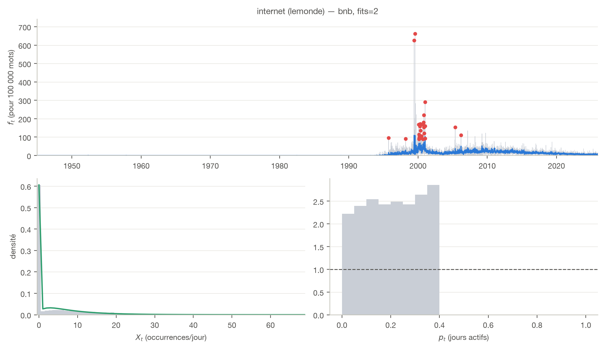
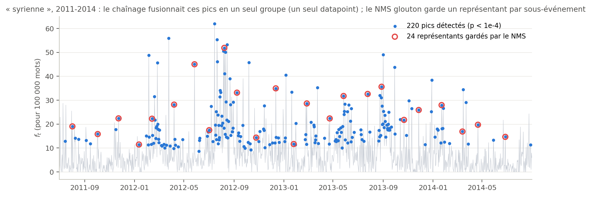
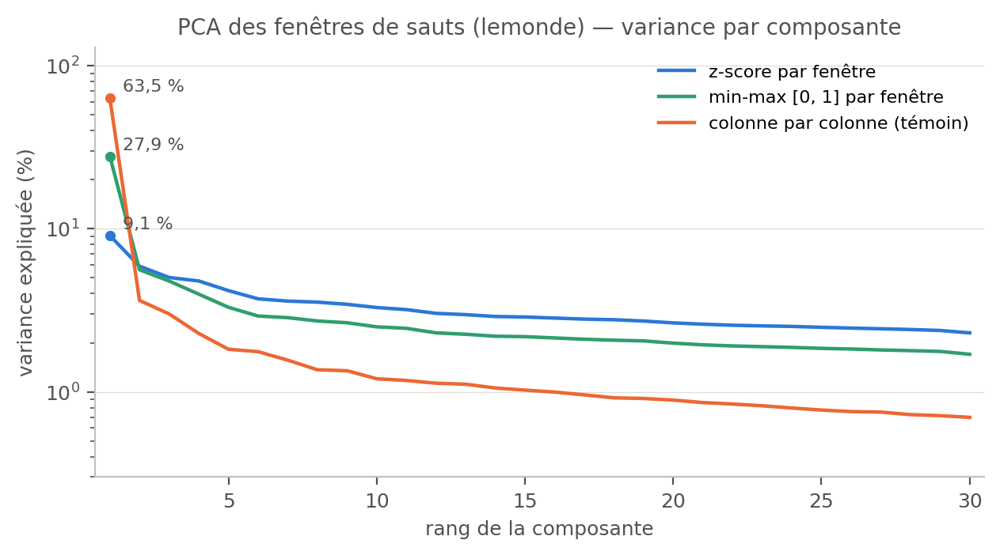
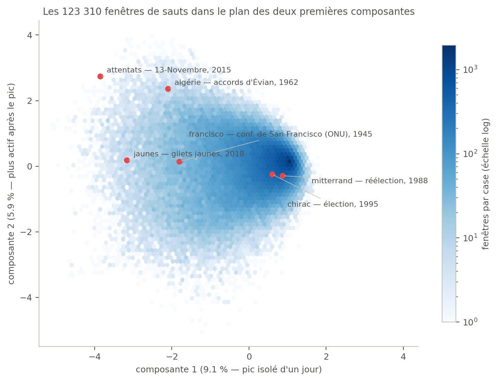
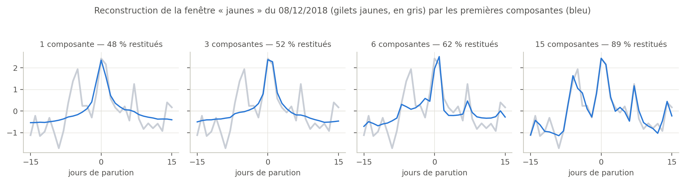
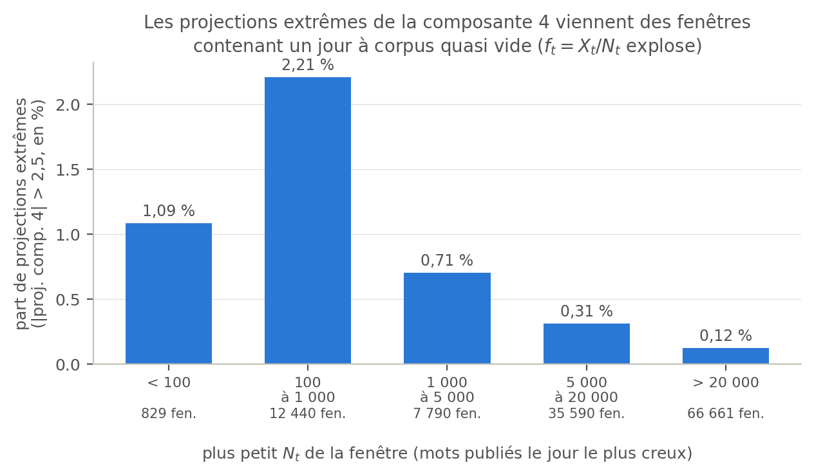
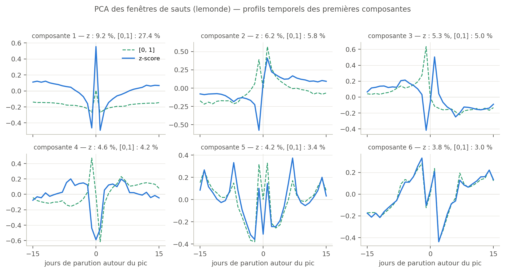
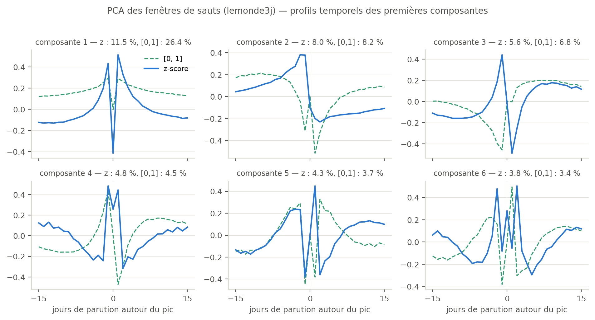

## Objectif

Question de recherche du mémoire : *les rachats de journaux français
modifient-ils la couverture thématique ?* Avant de comparer des journaux et
des dates de rachat, il faut un instrument capable de repérer et de décrire
**tous** les moments où un mot « saute » dans un journal.

La phase 3 construit cet instrument sur Le Monde (26 917 jours de parution,
décembre 1944 à 2025) : détecter les sauts de chaque mot, en faire des
*datapoints* comparables, puis chercher à l'aveugle — sans savoir quel mot
ni quelle date — quelles **formes** de sauts existent. C'est le « modèle
zéro » : les mots ne sont que des courbes, et on laisse les données parler
avant d'y remettre du sens.

## La chaîne

| # | Étape | Script | Sortie | Volume |
|---|-------|--------|--------|--------|
| 1 | Choisir le vocabulaire | `scan_vocab.py` | top-10 000 mots | 441 081 mots scannés |
| 2 | Extraire les séries | `masse.py` | matrice jours × mots | 26 917 × 10 000 |
| 3 | Détecter les pics | `pics_masse.py` | liste (mot, jour, p-valeur) | 164 254 pics |
| 4 | Dédoublonner (NMS) | `nms.py` | un représentant par événement | 123 465 gardés |
| 5 | Découper les fenêtres | `fenetres_masse.py` | matrice des fenêtres ±15 j | 123 310 × 31 |
| 6 | PCA | `pca.py` | composantes, projections | 31 × 31 |

Chaque étape lit la sortie de la précédente (scripts dans `rupture/`) ;
tout tourne sur le serveur en quelques secondes à quelques minutes. Les
choix de vocabulaire — unité = la graphie, top-10 000 par nombre de jours
actifs, fusion des doublons OCR — sont détaillés dans le journal des
21-22/07.

## Étape 3 — détection des pics

Pour chaque mot, on compte ses occurrences jour par jour : $X_t$
occurrences sur $N_t$ mots publiés. On ajuste une loi décrivant le
comportement *habituel* du mot — un mélange : probabilité $p_0$ de ne pas
apparaître, sinon une binomiale négative proportionnelle à $N_t$. Un jour
est déclaré **pic** quand le comptage observé serait quasi impossible sous
cette loi : $p_t < 10^{-4}$. On appelle **surprise** la quantité
$-\log_{10}(p_t)$ ; surprise 4 = seuil de détection, surprise 40 = jour
astronomiquement anormal.

{width=95%}

Sur les 10 000 mots : **164 254 pics**, 9 817 mots avec au moins un pic,
11 mots dont l'ajustement échoue et qui sont consignés.

## Étape 4 — un événement, un datapoint

Un événement qui dure produit des dizaines de jours-pics d'affilée ; sans
traitement, il entrerait des dizaines de fois dans l'analyse. L'idée naïve
— fusionner de proche en proche les pics rapprochés, garder le meilleur de
chaque paquet — souffre du **chaînage** : un pont de pics espacés de moins
de 31 jours soude des *années* en un seul bloc. Sur nos données, 164
groupes géants de ce type ; « syrienne » aurait fondu 760 jours de parution
(2012-2014) en un point unique.

La solution retenue est la *non-maximal suppression* gloutonne, héritée de
la détection d'objets en vision par ordinateur : trier les pics du mot par
surprise décroissante, garder le plus surprenant, supprimer ses voisins à
moins de 31 jours de parution **de lui**, recommencer. Un pic supprimé ne
supprime personne : la suppression ne se propage pas, donc pas de groupe
géant. Et 31 jours étant la largeur d'une fenêtre, deux représentants
gardés n'ont jamais de fenêtres qui se chevauchent.

{width=100%}

Contre-vérification indépendante par `scipy.signal.find_peaks` : résultat
identique sur 9 771 mots sur 9 817, les écarts restants étant des égalités
de surprise départagées différemment. Bilan : **123 465 représentants**, un
pic détecté sur quatre était un doublon de fenêtre.

## Étape 5 — mise à l'échelle des fenêtres

Autour de chaque représentant, on découpe la fenêtre des fréquences $f_t$
sur ±15 jours de parution : une courbe de 31 points, un datapoint. On ne
peut pas comparer directement la fenêtre de « guerre » et celle de
« francisco » : l'analyse ne verrait que « certains mots sont plus
fréquents que d'autres ». Chaque fenêtre est donc **normalisée sur
elle-même** en z-score — on soustrait sa moyenne, on divise par son
écart-type, il ne reste que la forme.

C'était l'objet d'une mise en garde de Benoît : l'option de normalisation
intégrée des fonctions de PCA standardise *colonne par colonne*, ce qui ne
supprime pas les écarts de niveau entre fenêtres. Vérification faite, avec
cette option la première composante capte 63,5 % de la variance et sa
projection est corrélée à 0,99 au niveau moyen brut de la fenêtre : elle
mesure « le mot est-il fréquent », pas la forme du saut. Cette variante est
conservée comme témoin négatif.

{width=85%}

## Étape 6 — quelles formes de sauts existent ?

La PCA cherche les profils temporels qui expliquent le mieux les
différences entre les 123 310 fenêtres. Deux constats.

**Le spectre est plat** : 9,2 %, 6,2 %, 5,3 %, 4,6 %, 4,2 %, 3,8 % — les
six premières composantes ne portent qu'un tiers de la variance, et il en
faut quinze pour atteindre 62 %. Le repère qui donne sa force à ce constat :
la 31e valeur propre étant nulle par construction (une fenêtre z-scorée a
une somme nulle), le nuage vit dans 30 dimensions ; un nuage **sans aucune
structure** donnerait donc 3,33 % par composante. Seules les neuf premières
passent au-dessus de cette ligne, pour un excédent total d'environ 14
points. Il n'existe pas deux ou trois formes archétypales qui résumeraient
les sauts : la diversité des fenêtres est réelle, et c'est le premier
résultat du modèle zéro.

**Les premières formes sont simples et lisibles.** Lues sur les
composantes elles-mêmes : la composante 1 oppose le jour du pic (+0,55) à
ses deux voisins immédiats (−0,46 et −0,49) — *le pic tient-il sur un seul
jour, ou déborde-t-il ?* La composante 2 est négative avant le pic (−0,58
la veille) et positive durablement après (+0,41, puis ~+0,10 jusqu'à J+15)
— *le sujet s'installe-t-il ?* La composante 3 fait l'inverse — *le sujet
se clôt-il ?*

![Les six premières composantes comme profils temporels (bleu : z-score ; vert : variante [0,1]). 1 : pic isolé d'un jour. 2 : niveau durablement plus élevé après le pic. 3 : bascule avant/après. 4 : creux la veille, rebond. 5-6 : oscillations lentes.](figures/composantes_v1.png){width=100%}

Dans le plan des deux premières composantes, les événements historiques se
placent là où on les attend : les épisodes longs et soutenus du côté
« activité durable », la masse des petits pics isolés de l'autre.

{width=88%}

Les fenêtres réelles les plus alignées sur chaque composante confirment la
lecture, et datent des jours qu'on reconnaît.

{width=92%}

{width=100%}

## Deux contrôles qui ont appris quelque chose

**L'hypothèse « rythme hebdomadaire » est fausse.** Les composantes 5-6
ressemblaient à une paire d'oscillations calées sur la semaine. Testé : la
phase de ces oscillations n'a aucun lien avec le jour de la semaine du pic
(vecteurs moyens par jour de norme 0,01-0,14, contre une dispersion de
0,80 ; idem en se restreignant à 2000-2025). Ce sont des modes oscillants
génériques.

**La composante 4 a débusqué un artefact de données.** Ses projections
extrêmes viennent de fenêtres contenant un jour à corpus quasi vide — 177
mots publiés un jour de 1994, contre 57 000 en médiane : ce jour-là, deux
occurrences suffisent à faire exploser $f_t = X_t/N_t$. 17 % des fenêtres
contiennent un jour à $N_t < 5\,000$, et la part de projections extrêmes y
est jusqu'à 18 fois plus élevée que dans les fenêtres saines.

{width=80%}

## La V2 : corriger l'artefact sans déformer le résultat

Ce second contrôle a débouché le jour même sur une V2 de l'analyse
(`rupture/pca.py`, désormais le défaut ; la V1 reste reproductible). Deux
gestes, volontairement minimaux : dans chaque fenêtre, les jours à
$N_t < 5\,000$ sont remplacés par l'interpolation linéaire des jours sains
voisins (38 532 jours corrigés dans 19 554 fenêtres) ; les 1 505 fenêtres
(1,2 %) dont le **jour central** est lui-même quasi vide sont écartées — le
pic reste statistiquement valide, la détection tenant compte de $N_t$, mais
la forme de sa fenêtre n'est pas exploitable.

Le seuil de 5 000 est posé à la frontière naturelle de la population
pathologique (321 jours < 5 000 sur 26 917, puis la pente reprend), et le
résultat n'y est pas sensible : entre 2 000 et 10 000, les premières
composantes bougent de moins de 4 degrés.

| Critère | V1 | V2 |
|---|---|---|
| Enrichissement corpus-vide de la comp. 4 | ×17,8 | ×0,5 (disparu) |
| Spectre (6 premières, %) | 9,1 / 5,9 / 5,0 / 4,8 / 4,2 / 3,7 | 9,2 / 6,2 / 5,3 / 4,6 / 4,2 / 3,8 |
| Stabilité des composantes (\|cos\| V1-V2) | — | ≥ 0,94 sur les six premières |
| Archétypes de la comp. 4 | jours à 177 mots (artefact) | « désastre », 19/03/2011 (Fukushima) |

Seule la direction qui portait l'artefact se réorganise — 18,7° d'angle,
contre moins de 3° pour les autres ; le spectre et les profils restent en
place. Les conclusions du modèle zéro sont donc robustes au nettoyage, ce
qui les consolide.

{width=100%}

## Changer d'échelle : blocs de 3 jours, puis d'une semaine

La chaîne entière a été rejouée sur des timelines agrégées
(`rupture/agreger.py`) : les jours de parution regroupés par 3, puis par 7,
consécutifs et non chevauchants — $X$ et $N$ sommés par bloc, date du bloc =
jour du milieu, même vocabulaire de 10 000 mots. Aucun autre réglage ne
change : les scripts aval tournent tels quels, et les fenêtres couvrent
±15 *blocs*, soit ±45 puis ±105 jours de parution.

| Étape | journalier | 3 jours | 7 jours |
|---|---|---|---|
| Grille | 26 917 jours | 8 972 blocs | 3 845 blocs |
| Pics détectés | 164 254 | 76 267 | 44 955 |
| Gardés après NMS | 123 465 | 49 983 | 26 784 |
| Fenêtres | 123 310 | 49 771 | 26 457 |
| Mots avec au moins un pic | 9 817 | 8 514 | 7 028 |

**L'artefact corpus-vide disparaît par construction.** Le plus petit bloc de
3 jours pèse 17 785 mots, le plus petit bloc de 7 jours 55 684 — contre un
seuil journalier de 5 000 : chaque jour pathologique est noyé dans un bloc
avec des voisins sains. Une seule version est donc livrée pour ces grilles,
tout seuil de nettoyage y donnant un résultat identique bit à bit.
L'agrégation est une troisième réponse au problème, à côté de
l'interpolation (V2) et des résidus standardisés (piste V3).

**Les formes sont les mêmes aux trois échelles.** Les composantes 1-2-3 de la
grille 3 jours retrouvent leurs homologues journalières à 0,98, 0,92 et 0,90
de cosinus, la 4 à 0,85 ; en hebdomadaire, 0,97, 0,96, 0,98 et 0,80. Seules
les composantes 5 et 6 échangent leur rang, à l'identique sur les deux
grilles agrégées. Le pic isolé, l'installation durable, la bascule
avant/après existent à l'échelle du jour comme à celle de la semaine : ces
formes ne sont pas un artefact de l'échantillonnage journalier.

**Le spectre reste plat.** 11,5 / 8,0 / 5,6 / 4,8 / 4,3 / 3,8 % en 3 jours,
11,9 / 9,1 / 6,4 / 5,3 / 4,7 / 3,8 % en hebdomadaire. Plus la timeline est
grossière, plus la variance se concentre — 33,3 %, 37,9 %, 41,2 % à $K = 6$
— mais la concentration reste modeste : toujours 8 composantes au-dessus de
l'isotropie à 3,33 %, pas de typologie des sauts à ces échelles non plus.
Les contrôles passent (corrélation de la projection 1 au niveau moyen brut :
0,28 en 3 jours, 0,23 en hebdomadaire ; le témoin « colonne par colonne »
monte, lui, à 75,9 % et 81,5 % de variance sur sa première composante).

{width=100%}

{width=92%}

{width=100%}

{width=92%}

Deux réserves. Moitié moins de datapoints en 3 jours (49 771 : les
sous-événements distants de moins de 93 jours de parution fusionnent sous le
NMS), et la phase du découpage — quel jour ouvre le premier bloc — est
arbitraire ; un contrôle en décalant le découpage de 1 et 2 jours reste à
faire. Surtout, l'agrégation agit comme un **filtre passe-bas sur la
détection elle-même** : un pic d'un seul jour se dilue dans un bloc dont le
$N$ est sept fois plus gros et peut passer sous le seuil — 2 800 mots qui
avaient des pics en journalier n'en ont plus en hebdomadaire. Les trois
grilles ne voient pas exactement la même population d'événements ; c'est un
choix d'instrument, pas un défaut.

## Limites connues et suite

Deux points notés pour plus tard : écrire la surprise en pleine précision
dans les CSV — elle est arrondie à 2 décimales, ce qui explique 45 des 46
écarts de la contre-vérification du NMS ; et une piste de V3 discutée avec
Benoît, remplir les fenêtres de **résidus standardisés** sous la loi
ajustée plutôt que de fréquences brutes, ce qui éliminerait la sensibilité
à $N_t$ par construction.

La suite du travail : les statistiques du CSV des pics — livré ici pour les
trois grilles — (co-sauts par jour, amplitudes, pics par mot) ; comparer avec
la variante « vocabulaire ≥ 1 000 jours actifs » (39 316 mots) ; puis
l'objectif réel,
refaire la chaîne sur les autres journaux et comparer les fenêtres *par
journal* autour des mêmes pics — c'est là que la question des rachats se
joue.
